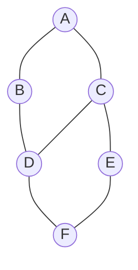

**Breadth-first search** explores a graph in **rings**: first the start vertex, then all of its
neighbors, then everything one step further out, and so on. Because it visits vertices in order
of distance, BFS finds the **shortest path in an unweighted graph** for free.

The engine is a **queue** (FIFO): dequeue a vertex, then enqueue every unvisited neighbor.

## The graph we will explore

We run BFS starting from `A` on this undirected graph. Neighbors are visited in alphabetical order.



## Watch it: BFS expands ring by ring

The **array below is the visit order**: green (`sorted`) cells are already dequeued and visited,
the orange (`highlight`) cell is the vertex we are expanding right now, and each step notes the
**queue** contents.

```walkthrough
title: BFS from A — layer by layer
code: |
  Queue q; q.add(start); visited.add(start);
  while (!q.isEmpty()) {
    int v = q.poll();          // take the front
    for (int nb : adj.get(v))  // scan neighbors
      if (!visited.contains(nb)) {
        visited.add(nb);
        q.add(nb);             // enqueue for a later ring
      }
  }
steps:
  - text: 'Start. Enqueue `A` and mark it visited. **Queue: [A]**. This is layer 0.'
    array: ['A', 'B', 'C', 'D', 'E', 'F']
    highlight: [0]
    pointers: { 0: 'start' }
    line: 1
  - text: 'Poll `A`. Its neighbors `B`, `C` are new → mark and enqueue both. **Queue: [B, C]** — that is layer 1.'
    array: ['A', 'B', 'C', 'D', 'E', 'F']
    sorted: [0]
    highlight: [1, 2]
    line: 3
  - text: 'Poll `B`. Neighbor `A` is visited; `D` is new → enqueue it. **Queue: [C, D]**.'
    array: ['A', 'B', 'C', 'D', 'E', 'F']
    sorted: [0, 1]
    highlight: [3]
    line: 4
  - text: 'Poll `C`. `A`, `D` already seen; `E` is new → enqueue. **Queue: [D, E]**. Layer 1 done.'
    array: ['A', 'B', 'C', 'D', 'E', 'F']
    sorted: [0, 1, 2]
    highlight: [4]
    line: 4
  - text: 'Poll `D`. Neighbor `F` is new → enqueue. **Queue: [E, F]** — layer 2 members are D, E; F is layer 3.'
    array: ['A', 'B', 'C', 'D', 'E', 'F']
    sorted: [0, 1, 2, 3]
    highlight: [5]
    line: 4
  - text: 'Poll `E`. Its only new-looking neighbor `F` is already queued. **Queue: [F]**.'
    array: ['A', 'B', 'C', 'D', 'E', 'F']
    sorted: [0, 1, 2, 3, 4]
    highlight: [5]
    line: 3
  - text: 'Poll `F`. All neighbors visited. Queue empty → **done**. Visit order: A, B, C, D, E, F.'
    array: ['A', 'B', 'C', 'D', 'E', 'F']
    sorted: [0, 1, 2, 3, 4, 5]
    line: 2
```

The distance from `A` recorded along the way is the **shortest number of edges**: `A`=0;
`B`,`C`=1; `D`,`E`=2; `F`=3.

## The two BFS jobs

````tabs
tabs:
  - label: Shortest path (unweighted)
    body: |
      Track a `dist[]` (and optionally a `parent[]` to rebuild the path). The first time BFS
      reaches a vertex, that distance is optimal — no shorter path can exist because BFS visits
      in increasing distance order.
      ```java
      int[] dist = new int[V];
      Arrays.fill(dist, -1);
      Queue<Integer> q = new ArrayDeque<>();
      dist[src] = 0; q.add(src);
      while (!q.isEmpty()) {
        int v = q.poll();
        for (int nb : adj.get(v))
          if (dist[nb] == -1) {          // unvisited
            dist[nb] = dist[v] + 1;
            q.add(nb);
          }
      }
      ```
  - label: Level-order
    body: |
      Process the queue **one full layer at a time** by snapshotting its size. Perfect for
      "return nodes grouped by depth" problems (and binary-tree level order).
      ```java
      while (!q.isEmpty()) {
        int size = q.size();           // this whole ring
        for (int i = 0; i < size; i++) {
          int v = q.poll();
          // ... process v at the current level ...
          for (int nb : adj.get(v))
            if (!seen[nb]) { seen[nb] = true; q.add(nb); }
        }
        level++;
      }
      ```
````

:::gotcha
Mark a vertex visited the moment you **enqueue** it, not when you dequeue it. If you wait until
dequeue, the same vertex can be enqueued several times, wrecking the O(V + E) bound and possibly
recording a wrong distance.
:::

:::senior
BFS gives shortest paths only when **every edge costs the same** (unweighted). Add varying edge
weights and a plain queue no longer visits vertices in distance order — you need **Dijkstra**
(a priority queue). BFS is Dijkstra's special case where all weights are 1.
:::

## Complexity

| Aspect | Cost | Why |
|--|:--:|--|
| **Time** | O(V + E) | Each vertex is dequeued once; each edge is examined once |
| **Space** | O(V) | The queue and `visited` set hold at most V vertices |

## Check yourself

```quiz
title: BFS check
questions:
  - q: 'What data structure drives BFS?'
    options:
      - 'A stack (LIFO)'
      - text: 'A queue (FIFO)'
        correct: true
      - 'A priority queue'
    explain: 'A FIFO queue makes BFS expand the closest vertices first, producing the ring-by-ring order.'
  - q: 'BFS finds the shortest path for free in which kind of graph?'
    options:
      - 'Any weighted graph'
      - text: 'An unweighted graph (all edges cost the same)'
        correct: true
      - 'Only in trees'
    explain: 'Because BFS visits vertices in order of edge-distance, the first time it reaches a vertex is via a shortest path — but only when all edges have equal cost.'
  - q: 'When should you mark a vertex as visited?'
    options:
      - 'When you dequeue it'
      - text: 'When you enqueue it'
        correct: true
      - 'After processing all its neighbors'
    explain: 'Marking on enqueue prevents the same vertex from being added multiple times, keeping BFS at O(V + E).'
  - q: 'BFS runs in:'
    options:
      - 'O(V^2) always'
      - text: 'O(V + E)'
        correct: true
      - 'O(E log V)'
    explain: 'Every vertex is processed once and every edge examined once, giving O(V + E) with an adjacency list.'
```

:::key
BFS = **queue + visit closest first**. Mark on enqueue, run in O(V + E), and read off the
**shortest unweighted path** as a bonus. Use the queue-size trick for **level-order** grouping.
:::
