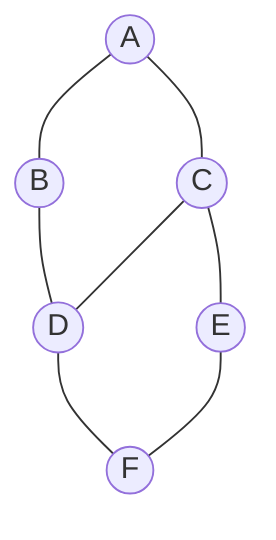

**Depth-first search** commits to a path and follows it as **deep** as it can, only backtracking
when it hits a dead end. Where BFS fans out in rings, DFS dives down one branch at a time. It is
the backbone of **connected components**, **cycle detection**, **topological sort**, and **path
finding**.

The engine is a **stack** (LIFO) — usually the implicit call stack of recursion.

## The graph we will explore

Same graph as BFS, starting from `A`, neighbors taken in alphabetical order. Watch how different
the *order* is.



## Watch it: DFS dives deep, then backtracks

The **array is the visit order**: green (`sorted`) cells are fully visited, the orange
(`highlight`) cell is the vertex we just entered. Notice the recursion **stack** noted at each step.

```walkthrough
title: DFS from A — dive and backtrack
code: |
  void dfs(int v) {
    visited.add(v);            // enter v
    for (int nb : adj.get(v))  // try each neighbor
      if (!visited.contains(nb))
        dfs(nb);               // recurse deeper
  }                            // return = backtrack
steps:
  - text: 'Enter `A`, mark visited. **Stack: [A]**. First neighbor is `B` → dive in.'
    array: ['A', 'B', 'C', 'D', 'E', 'F']
    highlight: [0]
    pointers: { 0: 'start' }
    line: 2
  - text: 'Enter `B`. **Stack: [A, B]**. B''s first unvisited neighbor is `D` → dive.'
    array: ['A', 'B', 'C', 'D', 'E', 'F']
    sorted: [0]
    highlight: [1]
    line: 4
  - text: 'Enter `D`. **Stack: [A, B, D]**. `B` is visited; next is `C` → dive deeper.'
    array: ['A', 'B', 'C', 'D', 'E', 'F']
    sorted: [0, 1]
    highlight: [3]
    line: 4
  - text: 'Enter `C`. **Stack: [A, B, D, C]**. `A`, `D` visited; `E` is new → dive.'
    array: ['A', 'B', 'C', 'D', 'E', 'F']
    sorted: [0, 1, 3]
    highlight: [2]
    line: 5
  - text: 'Enter `E`. **Stack: [A, B, D, C, E]**. `C` visited; `F` is new → dive.'
    array: ['A', 'B', 'C', 'D', 'E', 'F']
    sorted: [0, 1, 2, 3]
    highlight: [4]
    line: 5
  - text: 'Enter `F`. **Stack: [..., F]**. All of F''s neighbors are visited → dead end, **backtrack**.'
    array: ['A', 'B', 'C', 'D', 'E', 'F']
    sorted: [0, 1, 2, 3, 4]
    highlight: [5]
    line: 6
  - text: 'F, E, C, D, B, A all return in turn — the stack unwinds. **Done.** Visit order: A, B, D, C, E, F.'
    array: ['A', 'B', 'C', 'D', 'E', 'F']
    sorted: [0, 1, 2, 3, 4, 5]
    line: 6
```

DFS produced **A, B, D, C, E, F** — deep first. BFS on the same graph gave **A, B, C, D, E, F** —
wide first. Same graph, same start, completely different order.

## Recursive vs explicit stack

The recursive version is cleaner; the explicit-stack version avoids stack overflow on very deep
graphs (millions of vertices).

````tabs
tabs:
  - label: Recursive
    body: |
      The call stack *is* your stack. Elegant and the default in interviews.
      ```java
      boolean[] visited = new boolean[V];

      void dfs(int v) {
        visited[v] = true;
        // ... process v (pre-order) ...
        for (int nb : adj.get(v))
          if (!visited[nb]) dfs(nb);
      }
      ```
  - label: Explicit stack
    body: |
      Push the start; pop, visit, push unvisited neighbors. Iterative — no recursion depth limit.
      ```java
      Deque<Integer> st = new ArrayDeque<>();
      st.push(src);
      while (!st.isEmpty()) {
        int v = st.pop();
        if (visited[v]) continue;
        visited[v] = true;
        for (int nb : adj.get(v))
          if (!visited[nb]) st.push(nb);
      }
      ```
````

## What DFS is really for

| Application | Idea |
|--|--|
| **Connected components** | Run DFS from every unvisited vertex; each launch discovers one component. Count the launches. |
| **Cycle detection** | Revisiting a vertex still "in progress" on the current path means a cycle (see below). |
| **Path finding** | DFS from `src`; if it reaches `dst`, the recursion stack is a valid path (not necessarily shortest). |
| **Topological sort** | Push a vertex onto a list *after* its recursion finishes, then reverse. |

:::note
**Cycle detection differs by graph type.** In an **undirected** graph, seeing an already-visited
neighbor that is *not* the vertex you came from is a cycle. In a **directed** graph, use three
colors — white (unseen), gray (on the current recursion stack), black (finished); an edge to a
**gray** vertex is a back edge, i.e. a cycle.
:::

:::gotcha
Recursive DFS can **stack-overflow** on a long chain of vertices (deep recursion). If the graph
can be huge or path-like, switch to the explicit-stack version.
:::

:::senior
BFS vs DFS is a *strategy* choice, not a correctness one — both visit every vertex in O(V + E).
Pick **BFS** when you need the shortest unweighted path or nearest results; pick **DFS** when you
need to explore structure: components, cycles, ordering, or "does a path exist at all?".
:::

## Complexity

| Aspect | Cost | Why |
|--|:--:|--|
| **Time** | O(V + E) | Each vertex visited once; each edge examined once |
| **Space** | O(V) | Recursion/stack depth plus the `visited` array |

## Check yourself

```quiz
title: DFS check
questions:
  - q: 'What data structure underlies DFS?'
    options:
      - 'A queue (FIFO)'
      - text: 'A stack (LIFO) — often the recursion call stack'
        correct: true
      - 'A hash map'
    explain: 'DFS goes as deep as possible then backtracks; a LIFO stack (or recursion) gives exactly that behavior.'
  - q: 'How do you count connected components with DFS?'
    options:
      - 'Run one DFS and count visited vertices'
      - text: 'Loop over all vertices; each time you start a fresh DFS from an unvisited one, add one component'
        correct: true
      - 'Count the edges'
    explain: 'Each DFS launch floods exactly one component; the number of launches equals the number of components.'
  - q: 'In a **directed** graph, DFS detects a cycle when it finds an edge to a vertex that is:'
    options:
      - 'Already finished (black)'
      - text: 'Currently on the recursion stack (gray / in-progress)'
        correct: true
      - 'Never visited (white)'
    explain: 'An edge back to a gray vertex is a back edge — it closes a loop on the current path, so a cycle exists.'
  - q: 'Compared to BFS, DFS finds:'
    options:
      - 'Always the shortest path'
      - text: 'A path, but not necessarily the shortest one'
        correct: true
      - 'No path at all'
    explain: 'DFS commits to one branch at a time, so the path it returns can be far from shortest. Use BFS for shortest unweighted paths.'
```

:::key
DFS = **stack + go deep, then backtrack**. Same O(V + E) as BFS but a different order. It is the
tool for **components, cycle detection, topological sort, and path existence** — reach for BFS
instead when you specifically need shortest distances.
:::
