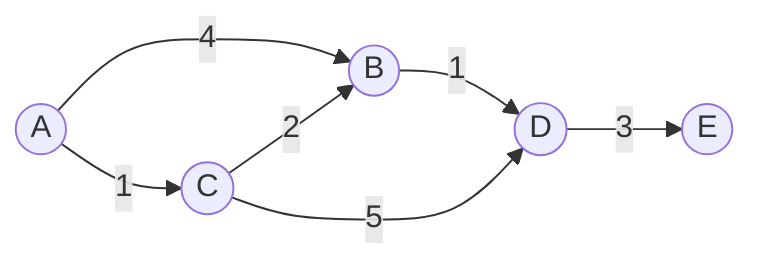

On an **unweighted** graph, BFS already gives shortest paths. Add **weights** — distances, times,
costs — and a plain queue breaks, because the fewest-edges path may not be the cheapest. Two
algorithms fix this: **Dijkstra** (fast, but needs non-negative weights) and **Bellman-Ford**
(slower, but tolerates negative edges).

Both rest on one idea — **relaxation**: if going through `u` reaches `v` cheaper than the best
known, update `dist[v] = dist[u] + weight(u, v)`.

## The weighted graph

A directed, weighted graph. We compute the cheapest cost from `A` to every vertex.



## Watch it: Dijkstra finalizes the nearest vertex

Dijkstra keeps **tentative distances** and repeatedly pulls the **closest unfinalized** vertex
from a min-priority-queue, finalizes it, and relaxes its outgoing edges. The **array is the
`dist[]` table** (`A B C D E`); green (`sorted`) = finalized, orange (`highlight`) = the vertex
being finalized this step.

```walkthrough
title: Dijkstra from A — relax and finalize
code: |
  dist[src] = 0; pq.add((0, src));
  while (!pq.isEmpty()) {
    (d, u) = pq.poll();          // closest unfinalized
    if (d > dist[u]) continue;   // stale entry
    for ((v, w) : adj[u])        // relax each edge
      if (dist[u] + w < dist[v]) {
        dist[v] = dist[u] + w;
        pq.add((dist[v], v));
      }
  }
steps:
  - text: 'Init: `dist[A] = 0`, everything else infinity. Push `(0, A)`.'
    array: ['0', 'inf', 'inf', 'inf', 'inf']
    pointers: { 0: 'A', 1: 'B', 2: 'C', 3: 'D', 4: 'E' }
    line: 1
  - text: 'Pull the min: `A` (0). **Finalize A.** Relax A->B (0+4=4) and A->C (0+1=1).'
    array: ['0', '4', '1', 'inf', 'inf']
    sorted: [0]
    highlight: [0]
    line: 6
  - text: 'Closest unfinalized is `C` (1). **Finalize C.** Relax C->B: 1+2=3 **< 4**, update B=3. Relax C->D: 1+5=6.'
    array: ['0', '3', '1', '6', 'inf']
    sorted: [0, 2]
    highlight: [2]
    line: 7
  - text: 'Closest is `B` (3). **Finalize B.** Relax B->D: 3+1=4 **< 6**, update D=4.'
    array: ['0', '3', '1', '4', 'inf']
    sorted: [0, 1, 2]
    highlight: [1]
    line: 7
  - text: 'Closest is `D` (4). **Finalize D.** Relax D->E: 4+3=7, update E=7.'
    array: ['0', '3', '1', '4', '7']
    sorted: [0, 1, 2, 3]
    highlight: [3]
    line: 7
  - text: 'Only `E` (7) remains. **Finalize E.** PQ empty → **done**. Cheapest costs from A are locked in.'
    array: ['0', '3', '1', '4', '7']
    sorted: [0, 1, 2, 3, 4]
    highlight: [4]
    line: 2
```

Notice `B` was first set to 4 (direct `A -> B`) but **improved to 3** via `A -> C -> B`. That is
relaxation finding a cheaper detour. Once a vertex is pulled from the PQ, its distance is final —
that guarantee is exactly why Dijkstra needs **non-negative** weights.

## Dijkstra vs Bellman-Ford

````tabs
tabs:
  - label: Dijkstra
    body: |
      Greedy + min priority queue. **Fastest**, but a negative edge could make an
      already-finalized vertex reachable more cheaply — which Dijkstra can never revisit — so
      **non-negative weights only**.
      ```java
      int[] dist = new int[V];
      Arrays.fill(dist, INF); dist[src] = 0;
      PriorityQueue<int[]> pq =            // {dist, node}
          new PriorityQueue<>((a, b) -> a[0] - b[0]);
      pq.add(new int[]{0, src});
      while (!pq.isEmpty()) {
        int[] top = pq.poll();
        int d = top[0], u = top[1];
        if (d > dist[u]) continue;         // outdated
        for (int[] e : adj.get(u)) {       // {v, w}
          int v = e[0], w = e[1];
          if (dist[u] + w < dist[v]) {
            dist[v] = dist[u] + w;
            pq.add(new int[]{dist[v], v});
          }
        }
      }
      ```
  - label: Bellman-Ford
    body: |
      Relax **every edge**, `V - 1` times. Slower, but handles **negative edges** — and a further
      relaxation on pass V flags a **negative cycle**.
      ```java
      int[] dist = new int[V];
      Arrays.fill(dist, INF); dist[src] = 0;
      for (int i = 1; i < V; i++)          // V-1 passes
        for (int[] e : edges) {            // {u, v, w}
          if (dist[e[0]] != INF &&
              dist[e[0]] + e[2] < dist[e[1]])
            dist[e[1]] = dist[e[0]] + e[2];
        }
      // one more pass: any relaxation => negative cycle
      for (int[] e : edges)
        if (dist[e[0]] != INF &&
            dist[e[0]] + e[2] < dist[e[1]])
          throw new IllegalStateException("negative cycle");
      ```
````

## When to use which

| | Dijkstra | Bellman-Ford |
|--|--|--|
| **Weights** | Non-negative only | Any (incl. negative) |
| **Time** | O((V + E) log V) with a heap | O(V · E) |
| **Negative cycle** | Cannot handle | **Detects** it |
| **Use when** | Weights ≥ 0 and you want speed | Some edges are negative, or you must detect a negative cycle |

:::gotcha
Do **not** run Dijkstra on a graph with negative edges. Its "once finalized, always final"
assumption fails — a later negative edge could offer a cheaper route to a vertex it already
locked in, and it will silently return wrong distances. Reach for Bellman-Ford instead.
:::

:::senior
For an **unweighted** graph, plain **BFS** already gives shortest paths in O(V + E) — do not
reach for Dijkstra. And on a **DAG**, you can beat Dijkstra: relax edges in **topological order**
in O(V + E), negative weights allowed.
:::

## Recall

```flashcards
title: Which shortest-path algorithm?
cards:
  - front: 'Unweighted graph'
    back: '**BFS** — O(V + E). Edge count = path cost, no heap needed.'
  - front: 'Non-negative weights, single source'
    back: '**Dijkstra** — O((V + E) log V) with a binary heap. Finalized vertices never revisited.'
  - front: 'Negative edges possible, single source'
    back: '**Bellman-Ford** — O(V · E). Relax all edges V − 1 times; a V-th-pass relaxation proves a negative cycle.'
  - front: 'Weighted DAG'
    back: '**Relax in topological order** — O(V + E), beats Dijkstra, negative weights fine (no cycles to bite you).'
  - front: 'All-pairs shortest paths on a small dense graph'
    back: '**Floyd-Warshall** — O(V³), a three-line triple loop; handles negative edges (not negative cycles).'
```

## Check yourself

```quiz
title: Shortest-path check
questions:
  - q: 'Dijkstra requires which condition on edge weights?'
    options:
      - text: 'All weights are non-negative'
        correct: true
      - 'All weights are integers'
      - 'All weights are distinct'
    explain: 'Once Dijkstra finalizes a vertex it never reconsiders it; a negative edge could offer a cheaper route later, breaking that guarantee.'
  - q: 'Which algorithm can detect a negative-weight cycle?'
    options:
      - 'Dijkstra'
      - text: 'Bellman-Ford'
        correct: true
      - 'BFS'
    explain: 'After V-1 relaxation passes, if any edge can still be relaxed on the V-th pass, a negative cycle exists.'
  - q: 'Dijkstra with a binary heap runs in:'
    options:
      - 'O(V^2) always'
      - text: 'O((V + E) log V)'
        correct: true
      - 'O(V · E)'
    explain: 'Each vertex is popped once and each edge can trigger a heap push, and heap operations cost log V. O(V · E) is Bellman-Ford.'
  - q: 'Your graph is unweighted and you need the shortest path. Best choice?'
    options:
      - 'Dijkstra'
      - 'Bellman-Ford'
      - text: 'BFS — O(V + E)'
        correct: true
    explain: 'With equal-cost edges, BFS already yields shortest paths and is simpler and faster than Dijkstra.'
```

:::key
Weighted shortest paths hinge on **relaxation**. **Dijkstra** (min-PQ, greedy) is fastest but
needs **non-negative** weights; **Bellman-Ford** (relax all edges V-1 times) is slower but
handles **negative edges and detects negative cycles**. Unweighted? Just use **BFS**.
:::
