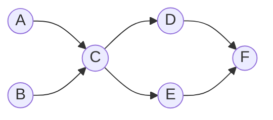

Two workhorse graph tools round out the toolkit. **Topological sort** linearizes a directed
acyclic graph (DAG) so every task appears after its prerequisites — the "what order do I build
things?" algorithm. **Union-Find** (Disjoint Set Union) answers "are these two vertices
connected?" in near-constant time, and spots cycles as it builds.

## Topological sort with Kahn's algorithm

Picture course prerequisites: to take `C` you must finish `A` and `B` first. A valid **topological
order** lists every vertex after everything that points to it. This works **only on a DAG** — a
cycle has no valid order.



**Kahn's idea:** the **in-degree** of a vertex is how many edges point *into* it. Repeatedly take
any vertex with in-degree 0 (nothing left blocking it), output it, and "remove" it by decrementing
its neighbors' in-degrees. New zeros become available.

### Watch it: in-degrees drop to zero

The **array is the in-degree of each vertex** (`A B C D E F`); green (`sorted`) = already output.
A queue holds every vertex currently at in-degree 0.

```walkthrough
title: Kahn topological sort — in-degrees dropping
code: |
  compute indegree[v] for all v;
  queue = all v with indegree 0;
  while (!queue.isEmpty()) {
    u = queue.poll(); order.add(u);
    for (v : adj[u])
      if (--indegree[v] == 0)
        queue.add(v);
  }
steps:
  - text: 'In-degrees: A,B start at 0; C=2; D,E=1; F=2. **Queue: [A, B]** (the zeros).'
    array: ['0', '0', '2', '1', '1', '2']
    pointers: { 0: 'A', 1: 'B', 2: 'C', 3: 'D', 4: 'E', 5: 'F' }
    line: 2
  - text: 'Output `A`. Decrement its neighbor `C`: 2 -> 1. Not zero yet. Order: [A].'
    array: ['0', '0', '1', '1', '1', '2']
    sorted: [0]
    highlight: [2]
    line: 6
  - text: 'Output `B`. Decrement `C`: 1 -> 0 → **enqueue C**. Order: [A, B].'
    array: ['0', '0', '0', '1', '1', '2']
    sorted: [0, 1]
    highlight: [2]
    line: 7
  - text: 'Output `C`. Decrement `D` (1->0) and `E` (1->0) → **enqueue both**. Order: [A, B, C].'
    array: ['0', '0', '0', '0', '0', '2']
    sorted: [0, 1, 2]
    highlight: [3, 4]
    line: 7
  - text: 'Output `D`. Decrement `F`: 2 -> 1. Order: [A, B, C, D].'
    array: ['0', '0', '0', '0', '0', '1']
    sorted: [0, 1, 2, 3]
    highlight: [5]
    line: 6
  - text: 'Output `E`. Decrement `F`: 1 -> 0 → **enqueue F**. Order: [A, B, C, D, E].'
    array: ['0', '0', '0', '0', '0', '0']
    sorted: [0, 1, 2, 3, 4]
    highlight: [5]
    line: 7
  - text: 'Output `F`. Queue empty → **done**. Topological order: A, B, C, D, E, F.'
    array: ['0', '0', '0', '0', '0', '0']
    sorted: [0, 1, 2, 3, 4, 5]
    line: 3
```

:::tip
**Kahn detects cycles for free.** If the output has fewer than `V` vertices, some in-degrees never
reached 0 — those vertices form a cycle, so no topological order exists. Runs in **O(V + E)**.
:::

## Union-Find (Disjoint Set Union)

Union-Find tracks a partition of vertices into disjoint sets under two operations:

- **`find(x)`** — return the *representative* (root) of `x`'s set.
- **`union(a, b)`** — merge the two sets containing `a` and `b`.

Two vertices are connected **iff** `find(a) == find(b)`. Each set is a tree; the root identifies
the set. **Path compression** flattens those trees during `find`, giving near-O(1) operations.

### Watch it: merges and path compression

The **array is `parent[]`** — index `i` points to its parent; a root points to itself. Watch sets merge.

```walkthrough
title: Union-Find on 6 elements
code: |
  int find(int x) {
    if (parent[x] != x)
      parent[x] = find(parent[x]); // path compression
    return parent[x];
  }
  void union(int a, int b) {
    parent[find(b)] = find(a);
  }
steps:
  - text: 'Start: every element is its own root. Six singleton sets.'
    array: ['0', '1', '2', '3', '4', '5']
    pointers: { 0: 'root', 1: 'root', 2: 'root', 3: 'root', 4: 'root', 5: 'root' }
    line: 1
  - text: '`union(0, 1)`: point 1''s root at 0. Set {0, 1}.'
    array: ['0', '0', '2', '3', '4', '5']
    highlight: [1]
    line: 8
  - text: '`union(2, 3)`: point 3 at 2. Set {2, 3}.'
    array: ['0', '0', '2', '2', '4', '5']
    highlight: [3]
    line: 8
  - text: '`union(0, 2)`: roots are 0 and 2 → point 2 at 0. Now {0, 1, 2, 3} is one set.'
    array: ['0', '0', '0', '2', '4', '5']
    highlight: [2]
    line: 8
  - text: '`union(4, 5)`: point 5 at 4. Set {4, 5}.'
    array: ['0', '0', '0', '2', '4', '4']
    highlight: [5]
    line: 8
  - text: '`find(3)`: 3 -> 2 -> 0. **Path compression** re-points 3 straight at root 0. Two sets remain: {0,1,2,3} and {4,5}.'
    array: ['0', '0', '0', '0', '4', '4']
    sorted: [0, 1, 2, 3]
    highlight: [3]
    line: 3
```

```java
class DSU {
  int[] parent, rank;
  DSU(int n) {
    parent = new int[n]; rank = new int[n];
    for (int i = 0; i < n; i++) parent[i] = i;
  }
  int find(int x) {
    if (parent[x] != x) parent[x] = find(parent[x]); // compress
    return parent[x];
  }
  boolean union(int a, int b) {
    int ra = find(a), rb = find(b);
    if (ra == rb) return false;       // already together -> a cycle if this was a new edge
    if (rank[ra] < rank[rb]) { int t = ra; ra = rb; rb = t; }
    parent[rb] = ra;                  // union by rank
    if (rank[ra] == rank[rb]) rank[ra]++;
    return true;
  }
}
```

:::senior
**Union-Find detects cycles in an undirected graph.** Process each edge `(u, v)`: if `find(u) ==
find(v)` *before* you union them, the two are already connected — this edge closes a cycle. This
is the core of **Kruskal's** minimum-spanning-tree algorithm. With path compression **and** union
by rank, each operation is O(α(n)) — inverse Ackermann, effectively constant.
:::

## When to reach for each

| Tool | Solves | Typical time |
|--|--|:--:|
| **Topological sort (Kahn)** | Ordering a DAG; scheduling; build/dependency order; cycle check in a **digraph** | O(V + E) |
| **Union-Find (DSU)** | Dynamic connectivity; cycle check in an **undirected** graph; Kruskal's MST | ~O(α(n)) per op |

## Check yourself

```quiz
title: Topo-sort & Union-Find check
questions:
  - q: 'Topological sort is defined only for which kind of graph?'
    options:
      - 'Any undirected graph'
      - text: 'A directed acyclic graph (DAG)'
        correct: true
      - 'A weighted graph'
    explain: 'A cycle creates a circular dependency with no valid ordering, so topological sort requires a DAG.'
  - q: 'In Kahn algorithm, which vertices go into the queue first?'
    options:
      - 'Those with the most outgoing edges'
      - text: 'Those with in-degree 0'
        correct: true
      - 'The highest-numbered vertices'
    explain: 'In-degree 0 means nothing points to the vertex — no unmet prerequisites — so it can be output immediately.'
  - q: 'Two elements a and b are in the same Union-Find set when:'
    options:
      - 'parent[a] == parent[b]'
      - text: 'find(a) == find(b)'
        correct: true
      - 'a and b are adjacent in the array'
    explain: 'Only the roots identify a set. Direct parents can differ while the roots (found via find) match.'
  - q: 'What does path compression do?'
    options:
      - 'Sorts the parent array'
      - text: 'Re-points nodes directly at the root during find, flattening the tree'
        correct: true
      - 'Deletes merged elements'
    explain: 'Flattening the tree makes future find calls near O(1); with union by rank each op is effectively constant (inverse Ackermann).'
  - q: 'How can Kahn algorithm detect that a directed graph has a cycle?'
    options:
      - text: 'Fewer than V vertices end up in the output order'
        correct: true
      - 'The queue starts empty'
      - 'An in-degree goes negative'
    explain: 'Vertices inside a cycle never reach in-degree 0, so they are never output — leaving the order short of V vertices.'
```

:::key
**Topological sort (Kahn)** = repeatedly output in-degree-0 vertices, O(V + E), and a short output
means a cycle. **Union-Find** = `find` + `union` on a forest with **path compression + union by
rank** for near-constant connectivity queries and undirected cycle detection.
:::
