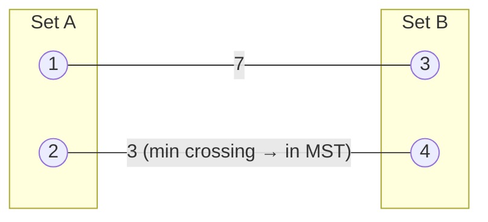

A **spanning tree** of a connected graph touches every vertex using exactly `V - 1` edges and no cycles. The **minimum** spanning tree (MST) is the one with the smallest total edge weight — the cheapest way to wire up a network, lay cable, or cluster points. Two greedy algorithms find it, both justified by one theorem.

## The cut property — why greedy works

> For any way of splitting the vertices into two groups (a **cut**), the **minimum-weight edge crossing that cut** belongs to some MST.

That's the license to be greedy: repeatedly grab the smallest safe edge and you can never regret it. Kruskal and Prim are just two orders of applying it.



## Kruskal — sort edges, union components

Sort all edges ascending; add each edge **unless it would form a cycle** (its endpoints are already connected). A [union-find](/dsa/topic/graphs/topological-sort-and-union-find) structure answers "same component?" in near-O(1).

```java
edges.sort(Comparator.comparingInt(e -> e.weight));
DSU dsu = new DSU(V);
int total = 0, used = 0;
for (Edge e : edges) {
    if (dsu.union(e.u, e.v)) {           // union returns false if already joined
        total += e.weight;
        if (++used == V - 1) break;      // tree complete
    }
}
```

- **Time O(E log E)** — dominated by the sort.
- Naturally handles a graph given as an **edge list**; great for **sparse** graphs.

## Watch it: Kruskal accepts and rejects

Four vertices A–D; the sorted edge list is the array below. Watch union-find accept the safe
edges and reject the two that would close a cycle.

```walkthrough
title: Kruskal on edges AB=1, CD=2, BC=3, AC=4, BD=5
code: |
  edges.sort(byWeight);
  DSU dsu = new DSU(V);
  int total = 0, used = 0;
  for (Edge e : edges) {
    if (dsu.union(e.u, e.v)) {   // false -> would form a cycle
      total += e.weight;
      if (++used == V - 1) break;
    }
  }
steps:
  - text: 'Every vertex starts alone: {A} {B} {C} {D}. Take `AB (1)`: A and B are in different components → **accept**. Components: {A,B} {C} {D}. total = 1.'
    array: ['AB:1', 'CD:2', 'BC:3', 'AC:4', 'BD:5']
    highlight: [0]
    line: 5
  - text: '`CD (2)`: C and D differ → **accept**. Components: {A,B} {C,D}. total = 3. Two edges used; a spanning tree needs V − 1 = 3.'
    array: ['AB:1', 'CD:2', 'BC:3', 'AC:4', 'BD:5']
    sorted: [0]
    highlight: [1]
    line: 5
  - text: '`BC (3)`: B lives in {A,B}, C in {C,D} — different → **accept**, merging everything into {A,B,C,D}. total = 6, used = 3 = V − 1 → stop early.'
    array: ['AB:1', 'CD:2', 'BC:3', 'AC:4', 'BD:5']
    sorted: [0, 1]
    highlight: [2]
    line: 7
  - text: 'Had we continued: `AC (4)` and `BD (5)` both connect vertices already in the same component — union returns false, meaning a **cycle** — rejected. MST = {AB, CD, BC}, weight 6.'
    array: ['AB:1', 'CD:2', 'BC:3', 'AC:4', 'BD:5']
    sorted: [0, 1, 2]
    highlight: [3, 4]
    line: 5
```

## Prim — grow one tree

Start from any vertex and repeatedly pull the **cheapest edge leaving the tree** into it, using a min-heap keyed on edge weight.

```java
boolean[] inTree = new boolean[V];
PriorityQueue<int[]> pq = new PriorityQueue<>((a, b) -> a[1] - b[1]); // {vertex, weight}
pq.add(new int[]{0, 0});
int total = 0;
while (!pq.isEmpty()) {
    int[] top = pq.poll();
    int u = top[0];
    if (inTree[u]) continue;             // stale heap entry — skip
    inTree[u] = true;
    total += top[1];
    for (int[] nbr : adj.get(u))         // {neighbor, weight}
        if (!inTree[nbr[0]]) pq.add(new int[]{nbr[0], nbr[1]});
}
```

- **Time O(E log V)** with a binary heap; O(E + V log V) with a Fibonacci heap.
- Works from an **adjacency list**; often preferred on **dense** graphs.

:::gotcha
Two silent failures. In Prim, forgetting the `if (inTree[u]) continue;` line breaks the
algorithm: the heap holds **stale duplicate entries** for vertices reached by several edges, and
without the skip you count a vertex's weight twice. In Kruskal, a **disconnected graph** simply
ends with `used < V - 1` — no error, just a wrong "MST". Check the edge count at the end and
report "no spanning tree exists" if it falls short.
:::

## Which to reach for

| | Kruskal | Prim |
|--|--|--|
| Idea | globally sort edges, union safe ones | grow one tree by cheapest exit |
| Needs | union-find | min-heap |
| Input shape | edge list | adjacency list |
| Best on | sparse graphs | dense graphs |
| Time | O(E log E) | O(E log V) |

:::senior
Both are greedy and both are correct by the cut property — interviewers love asking *why* greedy is safe here (it isn't for, say, shortest paths with negative edges). Also know the boundary: MST minimizes **total** weight, **not** path lengths between pairs — for that you want Dijkstra/Bellman-Ford. And on a graph with equal edge weights, any BFS tree is already minimal.
:::

## Recall

```flashcards
title: MST essentials
cards:
  - front: 'How many edges does a spanning tree of V vertices have?'
    back: 'Exactly **V − 1** — one fewer than the vertex count, and no cycles.'
  - front: 'Kruskal: mechanism and time'
    back: '**Sort edges + union-find** to reject cycle-forming edges. **O(E log E)**, best for sparse graphs / edge lists.'
  - front: 'Prim: mechanism and time'
    back: '**Grow one tree** by pulling the cheapest exit edge from a min-heap. **O(E log V)**, at home on adjacency lists / dense graphs.'
  - front: 'The cut property'
    back: 'The **minimum-weight edge crossing any cut** belongs to some MST — the theorem that licenses both greedy algorithms.'
  - front: 'Does the MST minimize the path between two vertices?'
    back: '**No** — it minimizes *total* weight. Pairwise shortest paths need Dijkstra / Bellman-Ford.'
```

## Check yourself

```quiz
title: MST check
questions:
  - q: 'The cut property guarantees that:'
    options:
      - text: 'The minimum-weight edge crossing any cut is in some MST'
        correct: true
      - 'The maximum-weight edge is never in the MST'
      - 'Every MST is unique'
    explain: 'The cut property is what makes the greedy choice safe. (The max-weight-edge claim is the related cycle property, and if all edge weights are distinct, the MST is unique.)'
  - q: 'Kruskal uses union-find in order to:'
    options:
      - 'Sort the edges'
      - text: 'Detect whether adding an edge would create a cycle (endpoints already connected)'
        correct: true
      - 'Compute shortest paths'
    explain: 'An edge is safe to add only if its endpoints are in different components; union-find answers that and merges them in near-constant time.'
  - q: 'Which algorithm is most natural when the graph is given as a sorted-friendly edge list and is sparse?'
    options:
      - text: 'Kruskal'
        correct: true
      - 'Prim'
      - 'Dijkstra'
    explain: 'Kruskal sorts edges and unions components — a perfect fit for an edge list. Prim grows from an adjacency list and tends to win on dense graphs.'
```

:::key
An **MST** connects all `V` vertices with `V-1` edges at minimum total weight. Both algorithms are greedy, licensed by the **cut property** (min edge across any cut is safe). **Kruskal** = sort edges + union-find, O(E log E), sparse/edge-list. **Prim** = grow a tree with a min-heap, O(E log V), dense/adjacency-list. MST minimizes total weight — not pairwise path distances.
:::
