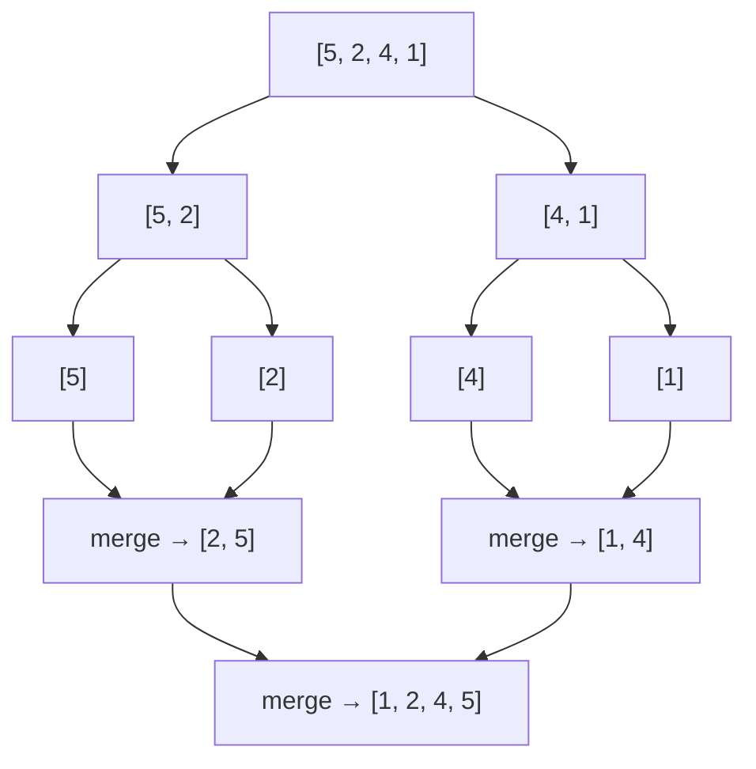

**Merge sort** is the textbook **divide-and-conquer** algorithm: split the array in half, sort each
half (recursively), then **merge** the two sorted halves back together. It has the two properties
interviewers love — a **guaranteed O(n log n)** in the *worst* case and **stability** — which is why
it powers Java's `Arrays.sort` for objects and Python's Timsort.

## The idea in three moves

1. **Divide** — cut the array into two halves.
2. **Conquer** — recursively sort each half (a single element is already sorted — the base case).
3. **Combine** — **merge** the two sorted halves into one sorted array.

All the real work happens in the merge. Splitting is trivial; combining is where order is built.

## Watch it: the merge step

Two already-sorted halves, `L = [2, 5, 8]` and `R = [1, 4, 7]`, sit side by side. A pointer `i`
scans the left, `j` scans the right; at each step we **emit the smaller front element** and advance
that pointer. Green cells have been emitted to the merged output.

```walkthrough
title: Merging [2, 5, 8] + [1, 4, 7]
code: |
  int i = 0, j = 0, k = 0;
  while (i < L.length && j < R.length) {
    if (L[i] <= R[j]) out[k++] = L[i++];
    else              out[k++] = R[j++];
  }
  while (i < L.length) out[k++] = L[i++];
  while (j < R.length) out[k++] = R[j++];
steps:
  - text: 'Left half `[2, 5, 8]` (indices 0–2) and right half `[1, 4, 7]` (indices 3–5) are each sorted. `i` fronts the left, `j` fronts the right.'
    array: [2, 5, 8, 1, 4, 7]
    pointers: { 0: 'i', 3: 'j' }
    line: 1
  - text: '`L[i]=2` vs `R[j]=1` → `1` is smaller. Emit it and advance `j`.'
    array: [2, 5, 8, 1, 4, 7]
    highlight: [0, 3]
    sorted: [3]
    pointers: { 0: 'i', 4: 'j' }
    line: 4
  - text: '`2` vs `4` → emit `2`, advance `i`. Merged so far: `[1, 2]`.'
    array: [2, 5, 8, 1, 4, 7]
    highlight: [0, 4]
    sorted: [3, 0]
    pointers: { 1: 'i', 4: 'j' }
    line: 3
  - text: '`5` vs `4` → emit `4`, advance `j`. Merged: `[1, 2, 4]`.'
    array: [2, 5, 8, 1, 4, 7]
    highlight: [1, 4]
    sorted: [3, 0, 4]
    pointers: { 1: 'i', 5: 'j' }
    line: 4
  - text: '`5` vs `7` → emit `5`, advance `i`. Merged: `[1, 2, 4, 5]`.'
    array: [2, 5, 8, 1, 4, 7]
    highlight: [1, 5]
    sorted: [3, 0, 4, 1]
    pointers: { 2: 'i', 5: 'j' }
    line: 3
  - text: '`8` vs `7` → emit `7`, advance `j`. The right half is now empty.'
    array: [2, 5, 8, 1, 4, 7]
    highlight: [2, 5]
    sorted: [3, 0, 4, 1, 5]
    pointers: { 2: 'i' }
    line: 4
  - text: 'One side drained — copy the leftover `8`. Merged in one linear O(n) sweep: `[1, 2, 4, 5, 7, 8]`.'
    array: [2, 5, 8, 1, 4, 7]
    sorted: [0, 1, 2, 3, 4, 5]
    line: 6
```

:::note
Because we take from the **left** half on a tie (`L[i] <= R[j]`), equal elements keep their
original order — this single `<=` is what makes merge sort **stable**. Flip it to `<` and you lose
stability.
:::

## The divide tree

Splitting halves the array `log₂n` times; each level does O(n) total merging work. That is where
**O(n log n)** comes from — `log n` levels × `n` work per level.



## Complexity

| Case | Time | Space | Stable? |
|--|:--:|:--:|:--:|
| Best | O(n log n) | O(n) | Yes |
| Average | O(n log n) | O(n) | Yes |
| **Worst** | **O(n log n)** | O(n) | Yes |

:::senior
Merge sort's superpower is the **guaranteed** worst case — unlike quick sort, no input degrades it
to O(n²). The price is **O(n) auxiliary space** for the merge buffer. That trade makes it the go-to
for **linked lists** (merging needs no random access and no extra array) and for **external sorting**
of data too big for RAM, where you stream sorted runs from disk.
:::

## Check yourself

```quiz
title: Merge sort check
questions:
  - q: 'What is merge sort''s **worst-case** time complexity?'
    options:
      - 'O(n²)'
      - text: 'O(n log n)'
        correct: true
      - 'O(n)'
    explain: 'The array is halved log n times and each level merges in O(n), giving O(n log n) in every case — best, average, and worst. There is no bad-input degradation.'
  - q: 'Where does merge sort do its actual sorting work?'
    options:
      - 'In the divide step, when splitting the array'
      - text: 'In the merge step, when combining two sorted halves'
        correct: true
      - 'In the base case, when it hits single elements'
    explain: 'Splitting is trivial bookkeeping; ordering is produced entirely by the linear merge that interleaves two sorted halves.'
  - q: 'Why is standard merge sort **not** in-place?'
    options:
      - text: 'The merge step needs an O(n) auxiliary buffer to combine the halves'
        correct: true
      - 'Recursion makes it use O(n) stack space'
      - 'It swaps elements across the whole array'
    explain: 'Merging two halves without clobbering unread data requires a separate output array of size n, so merge sort uses O(n) extra space.'
```
