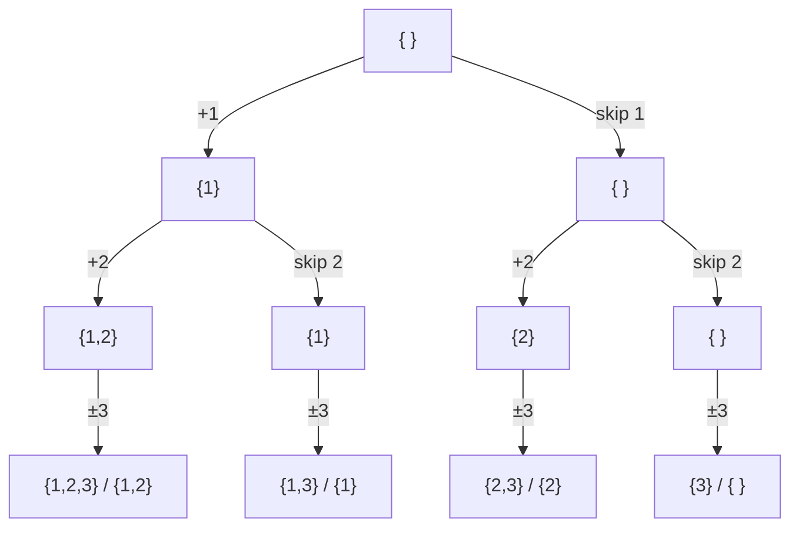

**Backtracking** explores a tree of partial solutions by depth-first search. At each step you
**choose** an option, **explore** deeper with that choice committed, then **un-choose** to
restore state before trying the next option. It is brute force with a rewind button — and the
rewind is what makes it fit on a whiteboard.

## The choose / explore / un-choose skeleton

Every backtracking solution is the same three-line dance around a recursive call:

```java
void backtrack(State s, Result path) {
  if (isComplete(path)) { record(path); return; }
  for (Choice c : choicesFrom(s)) {
    path.add(c);              // choose
    backtrack(next(s, c), path);   // explore
    path.remove(path.size() - 1);  // un-choose (BACKTRACK)
  }
}
```

The `path.remove(...)` line is the whole idea: after exploring one branch fully, we **undo**
the choice so the shared `path` is clean for the sibling branch.

## Watch it: build all subsets of `[1, 2, 3]`

At each index we make a binary choice — **include** this element or **skip** it. The `path` array
below is the partial subset being built; watch it grow on "choose" and shrink on "backtrack".

```walkthrough
title: Subsets via backtracking — path grows and rewinds
code: |
  void dfs(int i, List<Integer> path) {
    if (i == n) { output.add(copy(path)); return; }
    path.add(a[i]);        // choose: include a[i]
    dfs(i + 1, path);
    path.remove(last);     // un-choose
    dfs(i + 1, path);      // explore: skip a[i]
  }
steps:
  - text: 'Start empty at index 0. The `path` holds the subset built so far — nothing yet.'
    array: []
    line: 1
  - text: '**Choose** to include `1`. Push it onto `path` and recurse deeper.'
    array: [1]
    highlight: [0]
    line: 3
  - text: '**Choose** to include `2`. Path is now `[1, 2]`.'
    array: [1, 2]
    highlight: [1]
    line: 3
  - text: '**Choose** to include `3`. Path `[1, 2, 3]` — index reached the end, so **record** this subset.'
    array: [1, 2, 3]
    highlight: [2]
    line: 2
  - text: '**Un-choose** `3` (backtrack). Then explore the *skip 3* branch → records `[1, 2]`.'
    array: [1, 2]
    pointers: { 1: 'undo 3' }
    line: 5
  - text: '**Backtrack** again, popping `2`. Path is `[1]` — now explore skipping `2`.'
    array: [1]
    pointers: { 0: 'undo 2' }
    line: 5
  - text: 'Include `3` on this branch → records `[1, 3]`. Backtracking systematically visits every subset.'
    array: [1, 3]
    highlight: [1]
    line: 6
  - text: 'Popping all the way back to `[]` and taking every *skip* branch eventually records the empty set. **8 subsets total** — 2³.'
    array: []
    sorted: []
    line: 6
```

## The decision tree you are walking

Backtracking is a depth-first traversal of this tree. Each level fixes one element's fate;
each **leaf** is a complete subset. The tree has 2³ = 8 leaves.



## Permutations: choose from what is left

Subsets make a yes/no choice per element. **Permutations** instead choose *which unused element
comes next*, marking elements used on the way down and freeing them on backtrack.

````tabs
tabs:
  - label: Permutations
    body: |
      Try each unused element in this slot, then release it.
      ```java
      void perms(List<Integer> path, boolean[] used) {
        if (path.size() == n) { output.add(copy(path)); return; }
        for (int i = 0; i < n; i++) {
          if (used[i]) continue;
          used[i] = true; path.add(a[i]);   // choose
          perms(path, used);                 // explore
          used[i] = false; path.remove(last);// un-choose
        }
      }
      ```
  - label: N-Queens
    body: |
      Place one queen per row; a placement is a choice, an attack is a pruned branch.
      ```java
      void solve(int row, int[] cols) {
        if (row == n) { record(cols); return; }
        for (int c = 0; c < n; c++) {
          if (!safe(row, c, cols)) continue;  // PRUNE
          cols[row] = c;          // choose
          solve(row + 1, cols);   // explore
          cols[row] = -1;         // un-choose
        }
      }
      ```
````

:::key
The pattern is always **choose → explore → un-choose**. The un-choose step must perfectly
reverse the choose step (pop the list, clear the `used` flag, reset the board cell). Forgetting
it corrupts sibling branches — the #1 backtracking bug.
:::

:::senior
**Pruning** is what separates a passing solution from a TLE. In N-queens the `safe()` check cuts
whole subtrees before exploring them. Good backtracking rejects invalid partial states as early
as possible instead of only checking at the leaves.
:::

## Complexity

Backtracking's cost is roughly the **number of nodes in the decision tree** times the work per
node. It is exponential — you are enumerating a combinatorial space — but pruning shrinks the
effective tree dramatically.

| Problem | Choices per level | Leaves | Time |
|--|:--:|:--:|:--:|
| Subsets of n | include / skip | 2ⁿ | O(n · 2ⁿ) |
| Permutations of n | pick an unused | n! | O(n · n!) |
| Combinations C(n, k) | take / leave | C(n,k) | O(k · C(n,k)) |
| N-Queens | n columns, pruned | ≤ n! | O(n!) worst, far less pruned |

## Check yourself

```quiz
title: Backtracking check
questions:
  - q: 'What is the purpose of the "un-choose" step (e.g. `path.remove(last)`)?'
    options:
      - text: 'Restore state so the next sibling branch starts clean'
        correct: true
      - 'Free memory to avoid a heap overflow'
      - 'Speed the recursion up by skipping branches'
    explain: 'The shared `path` / `used` state must be reverted after exploring a branch, or the next choice inherits stale data from the branch you just finished.'
  - q: 'How many subsets does a set of n distinct elements have?'
    options:
      - 'n!'
      - text: '2ⁿ'
        correct: true
      - 'n²'
    explain: 'Each element is independently included or excluded — a binary choice made n times, giving 2ⁿ subsets.'
  - q: 'In N-queens, checking `safe()` before placing a queen is an example of:'
    options:
      - 'Memoization'
      - text: 'Pruning — cutting invalid subtrees early'
        correct: true
      - 'Tabulation'
    explain: 'Rejecting an invalid partial state before recursing avoids exploring an entire doomed subtree, the core optimization in backtracking.'
```

```flashcards
title: Backtracking recall
cards:
  - front: 'The three-step backtracking mantra'
    back: '**Choose → Explore → Un-choose.** Commit a choice, recurse, then reverse the choice.'
  - front: 'Subsets vs permutations — the choice at each level'
    back: 'Subsets: *include or skip* this element (2ⁿ). Permutations: *pick an unused* element for this slot (n!).'
  - front: 'What makes backtracking beat plain brute force?'
    back: '**Pruning** — rejecting invalid partial solutions early cuts whole subtrees before they are explored.'
```

:::key
Backtracking = DFS over a decision tree with **choose / explore / un-choose**. Reach for it on
subsets, permutations, combinations, N-queens, sudoku, and word-search. Prune invalid branches
early; always undo a choice before trying the next.
:::
