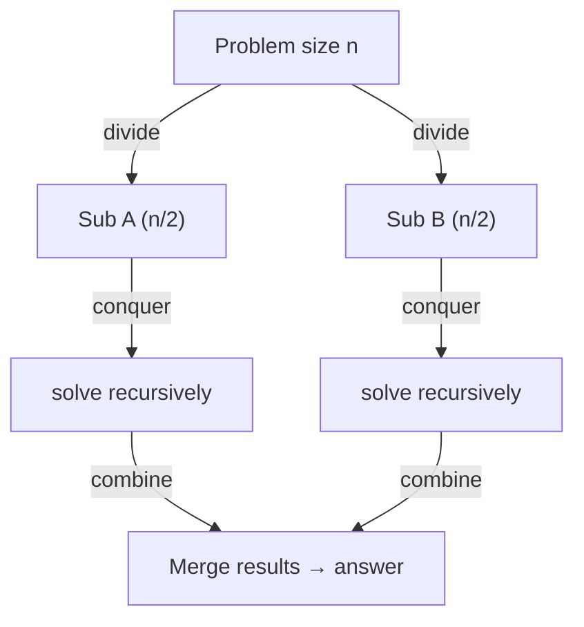

**Divide & conquer** solves a problem in three moves: **divide** it into smaller independent
subproblems of the same type, **conquer** each by recursion, then **combine** the sub-answers
into the full answer. Merge sort, quicksort, binary search, and fast exponentiation are all this
pattern — and their running times all fall out of the same recurrence machinery.

## The three phases



The base case stops the recursion when a subproblem is trivial (size 0 or 1). The **combine**
step is usually where the real work — and the interesting complexity — lives.

## Watch it: merge sort splits then merges

Merge sort divides the array until each piece is a single element (already sorted), then merges
sorted runs back together. Watch the array settle as merges complete.

```walkthrough
title: Merge sort — divide down, merge up
code: |
  void sort(int[] a, int lo, int hi) {
    if (lo >= hi) return;              // base: size 1
    int mid = (lo + hi) / 2;
    sort(a, lo, mid);                  // conquer left
    sort(a, mid + 1, hi);              // conquer right
    merge(a, lo, mid, hi);             // combine
  }
steps:
  - text: 'Start unsorted. Divide the array in half, then each half in half, until singletons.'
    array: [5, 2, 8, 1]
    line: 3
  - text: 'Left half `[5, 2]` splits into `[5]` and `[2]` — each a size-1 base case, trivially sorted.'
    array: [5, 2, 8, 1]
    highlight: [0, 1]
    line: 2
  - text: '**Merge** `[5]` and `[2]` → `[2, 5]`. The combine step orders them.'
    array: [2, 5, 8, 1]
    sorted: [0, 1]
    line: 6
  - text: 'Right half merges `[8]` and `[1]` → `[1, 8]`.'
    array: [2, 5, 1, 8]
    sorted: [2, 3]
    highlight: [2, 3]
    line: 6
  - text: 'Final **merge** of `[2, 5]` and `[1, 8]`: compare fronts, take the smaller each time.'
    array: [1, 2, 5, 8]
    sorted: [0, 1, 2, 3]
    pointers: { 0: 'merged' }
    line: 6
```

## Recurrence relations & the Master Theorem

The runtime of a divide & conquer algorithm is captured by a **recurrence**:

```
T(n) = a · T(n / b) + f(n)
```

- **a** — how many subproblems you recurse on
- **b** — the factor by which each subproblem shrinks
- **f(n)** — the cost to divide and combine at this level

The **Master Theorem** compares the recursion's branching cost `n^(log_b a)` against the combine
cost `f(n)`. Whichever dominates wins:

| Case | Condition | Result | Intuition |
|--|--|:--:|--|
| 1 | f(n) grows slower than n^(log_b a) | T(n) = Θ(n^(log_b a)) | leaves dominate |
| 2 | f(n) ≈ n^(log_b a) | T(n) = Θ(n^(log_b a) · log n) | balanced — log n levels |
| 3 | f(n) grows faster | T(n) = Θ(f(n)) | root/combine dominates |

## Reading real algorithms

````tabs
tabs:
  - label: Merge sort
    body: |
      Two halves (a=2, b=2), linear merge (f(n)=n). `n^(log₂2)=n` matches `n` → **Case 2**.
      ```java
      // T(n) = 2·T(n/2) + O(n)  →  Θ(n log n)
      sort(lo, mid);
      sort(mid + 1, hi);
      merge(lo, mid, hi);   // O(n) combine
      ```
  - label: Binary search
    body: |
      One half (a=1, b=2), O(1) combine. `n^(log₂1)=n⁰=1` → **Case 2** → log n.
      ```java
      // T(n) = 1·T(n/2) + O(1)  →  Θ(log n)
      if (a[mid] == target) return mid;
      if (a[mid] < target) return search(mid + 1, hi);
      else return search(lo, mid - 1);
      ```
````

:::note
**Divide & conquer vs dynamic programming:** both split problems recursively, but D&C
subproblems are **independent** (the two merge-sort halves never overlap). DP is for
**overlapping** subproblems — the same sub-answer is needed many times, so you cache it. If your
recursion recomputes the same input, you have a DP problem, not a D&C one.
:::

:::senior
Quicksort is D&C with the work in the **divide** (partition) step and a trivial combine — the
opposite of merge sort. Its recurrence is T(n) = T(k) + T(n−1−k) + O(n); a balanced pivot gives
Θ(n log n), but a worst-case pivot degrades to T(n) = T(n−1) + O(n) = **Θ(n²)**.
:::

## Complexity of the classics

| Algorithm | Recurrence | Time |
|--|--|:--:|
| Binary search | T(n) = T(n/2) + O(1) | O(log n) |
| Merge sort | T(n) = 2T(n/2) + O(n) | O(n log n) |
| Quicksort (avg) | T(n) = 2T(n/2) + O(n) | O(n log n) |
| Quicksort (worst) | T(n) = T(n−1) + O(n) | O(n²) |
| Fast exponentiation | T(n) = T(n/2) + O(1) | O(log n) |

## Check yourself

```quiz
title: Divide & conquer check
questions:
  - q: 'In T(n) = a·T(n/b) + f(n), what does `f(n)` represent?'
    options:
      - 'The number of subproblems'
      - text: 'The cost to divide and combine at each level'
        correct: true
      - 'The depth of the recursion'
    explain: '`a` is the number of subproblems and `b` the shrink factor; `f(n)` is the non-recursive work — splitting the input and merging the results.'
  - q: 'Merge sort is T(n) = 2T(n/2) + O(n). Why is it O(n log n)?'
    options:
      - text: 'There are log n levels and each does O(n) merging work'
        correct: true
      - 'Because merging is O(log n)'
      - 'Because it uses O(n) extra space'
    explain: 'Halving gives log₂n levels; every level merges a total of n elements, so O(n) × log n = O(n log n) — Master Theorem Case 2.'
  - q: 'The key difference between divide & conquer and dynamic programming is:'
    options:
      - 'D&C uses recursion, DP never does'
      - text: 'D&C subproblems are independent; DP subproblems overlap and are cached'
        correct: true
      - 'DP is always faster'
    explain: 'Both recurse, but DP exists precisely because subproblems repeat — caching (memo/table) avoids recomputing them. D&C halves never overlap.'
```

:::key
Divide & conquer = **divide → conquer → combine** on *independent* subproblems. Model the cost as
T(n) = a·T(n/b) + f(n) and apply the Master Theorem. When subproblems *overlap*, switch to
dynamic programming.
:::
