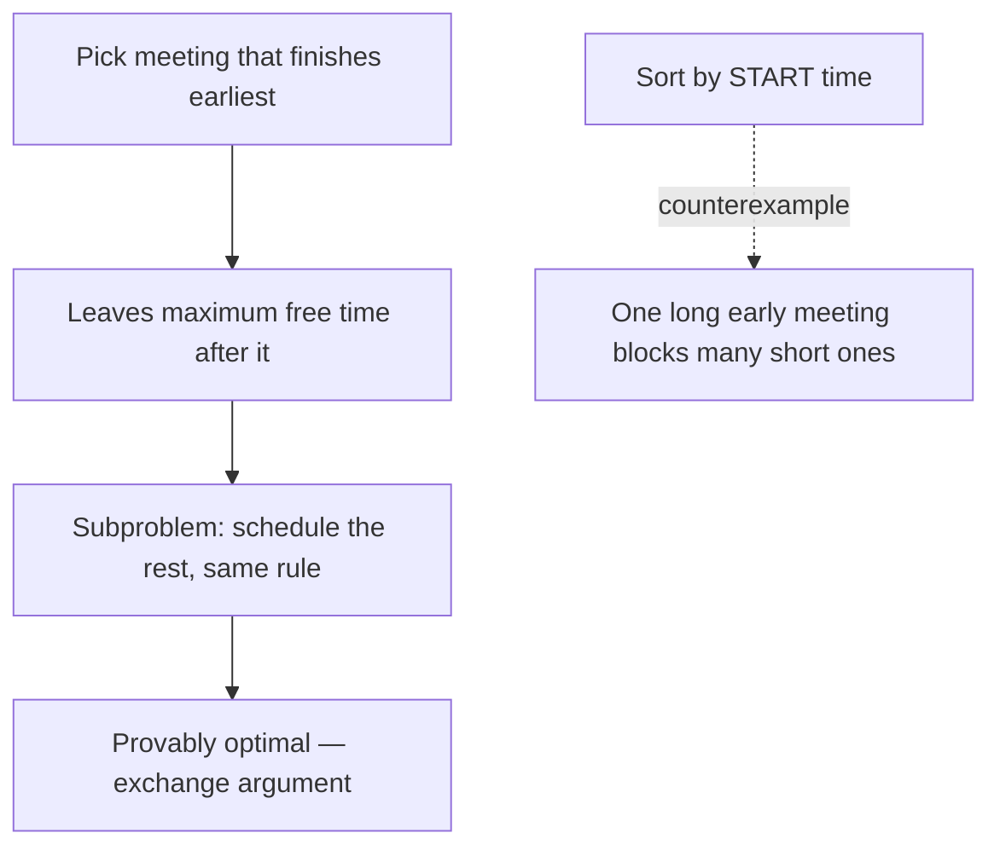

A **greedy algorithm** builds a solution by repeatedly taking the choice that looks best *right
now*, never reconsidering. When it works it is gloriously simple and fast — often just a sort
plus a single pass. The catch: it only produces a *globally* optimal answer for problems with a
special structure. Proving that structure exists is the real work.

## When greedy is correct

Greedy is provably optimal only when two properties hold:

| Property | Meaning |
|--|--|
| **Greedy-choice property** | A globally optimal solution can be reached by making locally optimal choices — the greedy pick is always part of *some* optimal answer. |
| **Optimal substructure** | An optimal solution contains optimal solutions to its subproblems. |

Optimal substructure alone is not enough (DP problems have it too). The greedy-choice property
is the extra ingredient that lets you commit to a choice without exploring alternatives.

## Watch it: interval scheduling (activity selection)

Goal: attend the **maximum number of non-overlapping meetings**. The winning greedy rule is
counter-intuitive — sort by **finish time**, then always take the next meeting that starts after
the last one you accepted. Finishing earliest leaves the most room for the rest.

```walkthrough
title: Interval scheduling — sort by end time, greedily pick
code: |
  sort(intervals, by END time ascending);
  int lastEnd = -INF, count = 0;
  for (Interval iv : intervals) {
    if (iv.start >= lastEnd) {   // no overlap
      count++;                   // GREEDY: take it
      lastEnd = iv.end;
    }
  }
steps:
  - text: 'Meetings sorted by finish time. Cells show each end time. Nothing picked yet.'
    array: [3, 4, 6, 8]
    line: 1
  - text: 'First meeting ends at `3`. It starts after `-∞`, so **take it**. `lastEnd = 3`.'
    array: [3, 4, 6, 8]
    sorted: [0]
    pointers: { 0: 'take' }
    line: 5
  - text: 'Next ends at `4` but its start (`3`) is `>= lastEnd`? Say it starts at 3 — take it. `lastEnd = 4`.'
    array: [3, 4, 6, 8]
    sorted: [0, 1]
    highlight: [1]
    line: 6
  - text: 'Next ends at `6`; suppose it starts at `2` — **overlaps** `lastEnd = 4`. Skip it.'
    array: [3, 4, 6, 8]
    sorted: [0, 1]
    pointers: { 2: 'skip' }
    line: 3
  - text: 'Last ends at `8`, starts at `5` `>= 4` → **take it**. Picked 3 meetings — the maximum possible.'
    array: [3, 4, 6, 8]
    sorted: [0, 1, 3]
    highlight: [3]
    line: 5
```

## Why "earliest finish" is the right greedy



The proof is an **exchange argument**: any optimal schedule's first meeting can be swapped for
the earliest-finishing one without reducing the count, so a greedy solution is at least as good.

## Where greedy FAILS — and DP is required

Greedy is seductive but wrong for many problems. **Coin change** is the classic trap.

````tabs
tabs:
  - label: Greedy works (US coins)
    body: |
      With coins {1, 5, 10, 25}, always taking the largest coin ≤ remaining is optimal.
      ```java
      // Make 30¢: take 25, then 5  →  2 coins ✓ optimal
      for (int coin : sortedDesc)
        while (amount >= coin) { amount -= coin; count++; }
      ```
  - label: Greedy FAILS (odd coins)
    body: |
      With coins {1, 3, 4}, greedy is NOT optimal — you need DP.
      ```java
      // Make 6:  greedy takes 4, then 1, 1  →  3 coins ✗
      //          optimal is 3 + 3           →  2 coins ✓
      // No greedy rule finds this; DP explores combinations.
      ```
````

:::gotcha
Greedy giving a valid answer does **not** mean it gives the *optimal* answer. Always test your
greedy rule against a small adversarial case (like coins {1, 3, 4} making 6) before trusting it.
When greedy fails, the fallback is almost always **dynamic programming** — it considers all
combinations instead of committing early.
:::

:::senior
Interview tell: if a problem asks for a *count/selection* and a simple sort-then-scan gives the
answer, suspect greedy and try to justify it with an exchange argument. If a locally optimal
choice can be "undone" by a better global arrangement (coin change, knapsack, edit distance),
it is a **DP** problem wearing a greedy disguise.
:::

## Classic greedy problems

| Problem | Greedy rule | Optimal? |
|--|--|:--:|
| Interval scheduling | earliest finish time first | ✓ |
| Fractional knapsack | highest value/weight ratio first | ✓ |
| Huffman coding | merge two lowest-frequency nodes | ✓ |
| Dijkstra's shortest path | expand nearest unvisited node | ✓ |
| **0/1 knapsack** | ratio-greedy | ✗ needs DP |
| **Coin change (arbitrary coins)** | largest coin first | ✗ needs DP |

## Check yourself

```quiz
title: Greedy check
questions:
  - q: 'For maximum non-overlapping interval scheduling, which sort key is correct?'
    options:
      - 'Earliest start time'
      - text: 'Earliest finish time'
        correct: true
      - 'Shortest duration'
    explain: 'Finishing earliest frees the most time for remaining meetings. Sorting by start or duration both have counterexamples.'
  - q: 'Which property distinguishes a greedy-solvable problem from a DP problem?'
    options:
      - 'Optimal substructure'
      - text: 'The greedy-choice property'
        correct: true
      - 'Overlapping subproblems'
    explain: 'Both greedy and DP problems have optimal substructure. Only greedy problems also have the greedy-choice property — a local optimum is always part of a global optimum.'
  - q: 'With coins {1, 3, 4}, greedy makes 6 as 4+1+1 (3 coins). What does this show?'
    options:
      - 'Greedy is always optimal'
      - text: 'Greedy can be suboptimal; DP finds 3+3 (2 coins)'
        correct: true
      - 'The coin set is invalid'
    explain: 'Greedy commits to the largest coin and misses 3+3. DP explores all combinations and finds the true minimum — this is why coin change is a DP staple.'
```

:::key
Greedy = commit to the locally best choice, never backtrack. It is optimal **only** with the
greedy-choice property (prove it with an exchange argument). Fast when it applies (interval
scheduling, Huffman, Dijkstra); when a local choice can be beaten globally (0/1 knapsack, general
coin change), use **dynamic programming** instead.
:::
