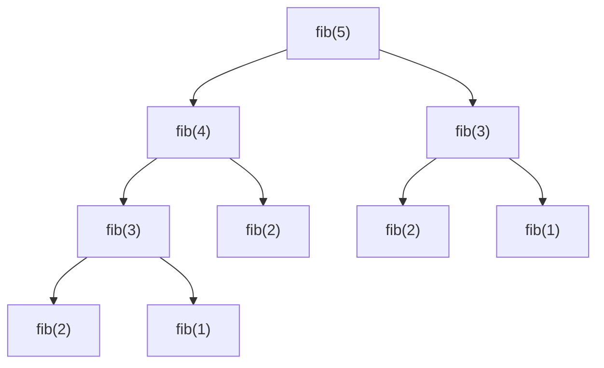

**Dynamic programming (DP)** solves a problem by combining answers to smaller subproblems — but
unlike divide & conquer, those subproblems **overlap**, so you compute each one *once* and reuse
the stored answer. That single idea collapses many exponential brute forces into polynomial time.

## The two prerequisites

A problem is DP-solvable when it has both:

| Property | Meaning |
|--|--|
| **Overlapping subproblems** | The same subproblem is solved many times by a naive recursion. |
| **Optimal substructure** | The optimal answer is built from optimal answers to subproblems. |

If subproblems *don't* repeat, plain divide & conquer suffices. The repetition is what you exploit.

## Why naive Fibonacci is a disaster

`fib(n) = fib(n-1) + fib(n-2)` recomputes the same values exponentially often. Look at the call
tree for `fib(5)` — `fib(2)` is computed **three** times, `fib(3)` twice:



That is **O(2ⁿ)** calls. DP stores each `fib(i)` the first time and returns the cached value
after — reducing the whole tree to **O(n)** distinct computations.

## Watch it: fill the Fibonacci DP table

Tabulation builds `dp[]` bottom-up. Each cell depends on the **two cells to its left**
(`dp[i] = dp[i-1] + dp[i-2]`) — watch the pointers mark those dependencies as each cell fills.

```walkthrough
title: Fibonacci by tabulation — dp[i] = dp[i-1] + dp[i-2]
code: |
  int[] dp = new int[n + 1];
  dp[0] = 0; dp[1] = 1;              // base cases
  for (int i = 2; i <= n; i++)
    dp[i] = dp[i - 1] + dp[i - 2];   // combine two neighbors
  return dp[n];
steps:
  - text: 'Seed the base cases: `dp[0] = 0`, `dp[1] = 1`. The rest are unknown (shown as 0).'
    array: [0, 1, 0, 0, 0, 0, 0]
    sorted: [0, 1]
    line: 2
  - text: 'Compute `dp[2] = dp[1] + dp[0] = 1 + 0 = 1`. Pointers mark the two dependencies.'
    array: [0, 1, 1, 0, 0, 0, 0]
    highlight: [2]
    pointers: { 0: 'i-2', 1: 'i-1' }
    line: 4
  - text: '`dp[3] = dp[2] + dp[1] = 1 + 1 = 2`. Each cell reuses already-stored answers — no recomputation.'
    array: [0, 1, 1, 2, 0, 0, 0]
    highlight: [3]
    pointers: { 1: 'i-2', 2: 'i-1' }
    line: 4
  - text: '`dp[4] = dp[3] + dp[2] = 2 + 1 = 3`.'
    array: [0, 1, 1, 2, 3, 0, 0]
    highlight: [4]
    pointers: { 2: 'i-2', 3: 'i-1' }
    line: 4
  - text: '`dp[5] = dp[4] + dp[3] = 3 + 2 = 5`.'
    array: [0, 1, 1, 2, 3, 5, 0]
    highlight: [5]
    pointers: { 3: 'i-2', 4: 'i-1' }
    line: 4
  - text: '`dp[6] = dp[5] + dp[4] = 5 + 3 = 8`. Table complete — one left-to-right pass, **O(n)**.'
    array: [0, 1, 1, 2, 3, 5, 8]
    sorted: [0, 1, 2, 3, 4, 5, 6]
    line: 5
```

## Top-down vs bottom-up

The same recurrence, two implementations. **Memoization** recurses and caches on the way back;
**tabulation** iterates and fills a table forward.

````tabs
tabs:
  - label: Memoization (top-down)
    body: |
      Write the natural recursion, add a cache. Solves only the subproblems it actually needs.
      ```java
      long[] memo;                 // -1 = not computed
      long fib(int n) {
        if (n < 2) return n;
        if (memo[n] != -1) return memo[n];   // cache hit
        return memo[n] = fib(n - 1) + fib(n - 2);
      }
      ```
      Pros: mirrors the recurrence, lazy. Cons: recursion stack (risk of overflow for large n).
  - label: Tabulation (bottom-up)
    body: |
      Solve smallest subproblems first, build up to the answer. No recursion.
      ```java
      long fib(int n) {
        if (n < 2) return n;
        long[] dp = new long[n + 1];
        dp[0] = 0; dp[1] = 1;
        for (int i = 2; i <= n; i++)
          dp[i] = dp[i - 1] + dp[i - 2];
        return dp[n];
      }
      ```
      Pros: no stack, easy to optimize space. Cons: must compute in dependency order.
  - label: Space-optimized
    body: |
      Fibonacci only needs the last two values — drop the array to O(1) space.
      ```java
      long fib(int n) {
        long a = 0, b = 1;
        for (int i = 2; i <= n; i++) {
          long c = a + b;
          a = b; b = c;
        }
        return n < 2 ? n : b;
      }
      ```
      Whenever `dp[i]` depends only on the last `k` cells, you can roll the array down to O(k).
````

:::tip
**Rolling array** trick: if `dp[i]` reads only a fixed window of previous cells, keep just those
cells instead of the whole table. Fibonacci → 2 variables; many grid DPs → one previous row.
This is a common interview follow-up: "now do it in O(1) / O(n) space."
:::

## The dramatic complexity win

| Approach | Time | Space | Note |
|--|:--:|:--:|--|
| Naive recursion | O(2ⁿ) | O(n) stack | recomputes everything |
| Memoization | **O(n)** | O(n) + stack | cache each `fib(i)` once |
| Tabulation | **O(n)** | O(n) | forward table fill |
| Rolling variables | **O(n)** | **O(1)** | keep last two only |

For n = 50, naive Fibonacci makes ~40 *billion* calls (`2·F(51)−1`); DP makes 50. That is the whole point.

:::senior
DP interview recipe: **(1)** define the state — what does `dp[i]` / `dp[i][j]` *mean*? **(2)**
write the recurrence (transition) between states. **(3)** identify base cases. **(4)** decide
iteration order so dependencies are ready. **(5)** optimize space if the follow-up demands it.
Nail step 1 and the rest usually falls out.
:::

## Check yourself

```quiz
title: Dynamic programming check
questions:
  - q: 'What TWO properties must a problem have to be solvable by DP?'
    options:
      - 'Sorted input and a greedy choice'
      - text: 'Overlapping subproblems and optimal substructure'
        correct: true
      - 'Independent subproblems and a base case'
    explain: 'Overlapping subproblems make caching worthwhile; optimal substructure lets you build the answer from subproblem answers. Independent subproblems would be plain divide & conquer.'
  - q: 'How do memoization and tabulation differ?'
    options:
      - 'Memoization is O(n), tabulation is O(2ⁿ)'
      - text: 'Memoization is top-down recursion + cache; tabulation is bottom-up iteration'
        correct: true
      - 'Only tabulation gives the correct answer'
    explain: 'They implement the same recurrence. Top-down recurses lazily and caches; bottom-up fills a table in dependency order. Both are O(n) for Fibonacci.'
  - q: 'Why is naive recursive Fibonacci O(2ⁿ)?'
    options:
      - text: 'It recomputes the same subproblems exponentially many times'
        correct: true
      - 'Addition is exponential'
      - 'It uses too much memory'
    explain: 'Each call spawns two more and there is no caching, so `fib(k)` is recomputed across many branches — the call tree grows exponentially. Caching collapses it to O(n).'
```

```flashcards
title: DP recall
cards:
  - front: 'DP vs divide & conquer'
    back: 'Both split recursively. DP subproblems **overlap** (cache them); D&C subproblems are **independent**.'
  - front: 'Memoization vs tabulation'
    back: 'Memoization = top-down recursion with a cache (lazy). Tabulation = bottom-up table fill (iterative, no stack).'
  - front: 'The 5-step DP recipe'
    back: '1) Define state, 2) write transition, 3) base cases, 4) iteration order, 5) optimize space.'
```

:::key
DP = cache answers to **overlapping subproblems** with **optimal substructure**. Fibonacci goes
from O(2ⁿ) to O(n) by storing each `fib(i)` once. Top-down = memoized recursion; bottom-up =
tabulation. Reduce space with a rolling array when each cell needs only a small window of the last.
:::
