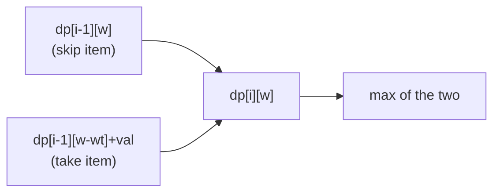

Most DP interview questions are variations on a handful of templates. Learn the **state** and
**recurrence** for each, and new problems become "which pattern is this?" This page maps five
classics and then fills a real DP table cell by cell.

## The pattern cheat sheet

| Problem | State: `dp[...]` means | Recurrence | Time |
|--|--|--|:--:|
| **Coin change (min)** | fewest coins to make amount `i` | `dp[i] = min(dp[i - c] + 1)` over coins `c` | O(amount · coins) |
| **0/1 Knapsack** | best value using items ≤ `i`, capacity `w` | `dp[i][w] = max(dp[i-1][w], dp[i-1][w-wt] + val)` | O(n · W) |
| **LCS** | longest common subseq of prefixes `i`, `j` | match: `dp[i-1][j-1]+1`; else `max(dp[i-1][j], dp[i][j-1])` | O(n · m) |
| **LIS** | longest increasing subseq **ending at** `i` | `dp[i] = max(dp[j] + 1)` for `j < i, a[j] < a[i]` | O(n²) |
| **Unique grid paths** | ways to reach cell `(r, c)` | `dp[r][c] = dp[r-1][c] + dp[r][c-1]` | O(r · c) |

Notice the shared skeleton: define what a cell *means*, express it via *smaller* cells, seed base
cases, fill in dependency order.

## Watch it: fill the coin-change table

Coins `{1, 3, 4}`, target **6**. `dp[i]` = fewest coins summing to `i`. Each cell tries every
coin and takes the best already-computed subresult. This is the problem greedy gets *wrong*
(greedy: 4+1+1 = 3 coins) — DP finds the true optimum **3+3 = 2 coins**.

```walkthrough
title: Coin change (min coins) — coins {1,3,4}, amount 6
code: |
  int[] dp = new int[amount + 1];
  fill(dp, INF); dp[0] = 0;             // base: 0 coins make 0
  for (int i = 1; i <= amount; i++)
    for (int c : coins)
      if (c <= i)
        dp[i] = min(dp[i], dp[i - c] + 1);
  return dp[amount];
steps:
  - text: 'Base case: `dp[0] = 0` — zero coins make amount 0. Cells 1..6 start at ∞ (shown as 0).'
    array: [0, 0, 0, 0, 0, 0, 0]
    sorted: [0]
    line: 2
  - text: '`dp[1]`: only coin 1 fits → `dp[0] + 1 = 1`.'
    array: [0, 1, 0, 0, 0, 0, 0]
    highlight: [1]
    pointers: { 0: 'i-1' }
    line: 6
  - text: '`dp[2]`: coin 1 → `dp[1] + 1 = 2`. (Coins 3,4 too big.)'
    array: [0, 1, 2, 0, 0, 0, 0]
    highlight: [2]
    pointers: { 1: 'i-1' }
    line: 6
  - text: '`dp[3]`: coin 1 gives `dp[2]+1 = 3`, but coin 3 gives `dp[0]+1 = 1`. Take the min → **1**.'
    array: [0, 1, 2, 1, 0, 0, 0]
    highlight: [3]
    pointers: { 0: 'i-3', 2: 'i-1' }
    line: 6
  - text: '`dp[4]`: coin 4 → `dp[0]+1 = 1` beats coin 1 (`dp[3]+1=2`) and coin 3 (`dp[1]+1=2`). → **1**.'
    array: [0, 1, 2, 1, 1, 0, 0]
    highlight: [4]
    pointers: { 0: 'i-4' }
    line: 6
  - text: '`dp[5]`: coin 1 → `dp[4]+1 = 2`; coin 4 → `dp[1]+1 = 2`; coin 3 → `dp[2]+1 = 3`. Min → **2**.'
    array: [0, 1, 2, 1, 1, 2, 0]
    highlight: [5]
    pointers: { 1: 'i-4', 4: 'i-1' }
    line: 6
  - text: '`dp[6]`: coin 3 → `dp[3]+1 = 2` (that is 3+3!). Beats coin 1 (`dp[5]+1=3`) and coin 4 (`dp[2]+1=3`). Answer → **2**.'
    array: [0, 1, 2, 1, 1, 2, 2]
    sorted: [0, 1, 2, 3, 4, 5, 6]
    pointers: { 3: 'i-3' }
    line: 7
```

## 2-D DP: the grid & the knapsack

Many patterns need a **2-D table** because the state has two dimensions (item index × capacity,
or prefix `i` × prefix `j`). The fill order still follows the dependencies.



````tabs
tabs:
  - label: 0/1 Knapsack
    body: |
      Each item: take it (if it fits) or skip it. `dp[i][w]` = best value with first `i` items in capacity `w`.
      ```java
      for (int i = 1; i <= n; i++)
        for (int w = 0; w <= W; w++) {
          dp[i][w] = dp[i - 1][w];                 // skip item i
          if (wt[i] <= w)
            dp[i][w] = Math.max(dp[i][w],
                       dp[i - 1][w - wt[i]] + val[i]);  // take it
        }
      // answer: dp[n][W]
      ```
  - label: LCS
    body: |
      Longest common subsequence of two strings. Match extends the diagonal; mismatch drops one char.
      ```java
      for (int i = 1; i <= n; i++)
        for (int j = 1; j <= m; j++)
          dp[i][j] = (a[i-1] == b[j-1])
            ? dp[i-1][j-1] + 1
            : Math.max(dp[i-1][j], dp[i][j-1]);
      // answer: dp[n][m]
      ```
  - label: LIS (O(n²))
    body: |
      `dp[i]` = length of longest increasing subsequence ending at index `i`.
      ```java
      Arrays.fill(dp, 1);
      for (int i = 0; i < n; i++)
        for (int j = 0; j < i; j++)
          if (a[j] < a[i])
            dp[i] = Math.max(dp[i], dp[j] + 1);
      // answer: max over dp[]
      ```
      A patience-sorting + binary search variant does LIS in **O(n log n)**.
````

:::senior
Spotting the state is the skill. Ask: *"What is the smallest set of parameters that fully
describes a subproblem?"* One parameter → 1-D array (coin change, LIS, house robber). Two
parameters → 2-D table (knapsack, LCS, edit distance, grid). The recurrence is just how one cell
reads its neighbors, and the fill order guarantees those neighbors are ready.
:::

:::tip
Grid-path and knapsack rows depend only on the **previous row**, so you can compress the 2-D
table to a single 1-D array — O(W) instead of O(n·W) space. For 0/1 knapsack, iterate the inner
capacity loop **backwards** so you don't reuse an item within the same row.
:::

## Complexity at a glance

| Pattern | Table shape | Time | Space (optimized) |
|--|:--:|:--:|:--:|
| Coin change | 1-D | O(amount · coins) | O(amount) |
| LIS (DP) | 1-D | O(n²) | O(n) |
| Unique paths | 2-D | O(r · c) | O(c) with rolling row |
| 0/1 Knapsack | 2-D | O(n · W) | O(W) with rolling row |
| LCS / edit distance | 2-D | O(n · m) | O(min(n, m)) |

## Check yourself

```quiz
title: DP patterns check
questions:
  - q: 'For min coin change, what does `dp[i]` represent?'
    options:
      - 'The number of ways to make amount i'
      - text: 'The fewest coins that sum to amount i'
        correct: true
      - 'The largest coin usable for amount i'
    explain: 'The min-coins variant stores the minimum count; `dp[i] = min over coins c of dp[i - c] + 1`. (A different variant counts the number of ways.)'
  - q: 'In 0/1 knapsack, `dp[i][w] = max(dp[i-1][w], dp[i-1][w-wt]+val)`. The first term means:'
    options:
      - text: 'Skip item i — reuse the best value without it'
        correct: true
      - 'Take item i twice'
      - 'Reset capacity to zero'
    explain: '`dp[i-1][w]` is the answer ignoring item i (skip). The second term takes item i, freeing `wt` capacity and adding `val`. The max chooses the better option.'
  - q: 'Which classic DP most naturally uses a 1-D table indexed by "subsequence ending at i"?'
    options:
      - 'Longest common subsequence'
      - text: 'Longest increasing subsequence'
        correct: true
      - '0/1 knapsack'
    explain: 'LIS defines `dp[i]` as the longest increasing subsequence ending at index i — a single index parameter, so a 1-D array. LCS and knapsack need two dimensions.'
```

```flashcards
title: DP pattern recall
cards:
  - front: 'Coin change (min) recurrence'
    back: '`dp[i] = min over coins c ≤ i of dp[i - c] + 1`, base `dp[0] = 0`.'
  - front: '0/1 knapsack recurrence'
    back: '`dp[i][w] = max(dp[i-1][w], dp[i-1][w - wt[i]] + val[i])` — skip vs take.'
  - front: 'LCS on a match vs mismatch'
    back: 'Match: `dp[i-1][j-1] + 1`. Mismatch: `max(dp[i-1][j], dp[i][j-1])`.'
  - front: '1-D vs 2-D DP — how to decide'
    back: 'Count the parameters that define a subproblem. One → 1-D array; two → 2-D table.'
```

:::key
Every classic DP reduces to **state → recurrence → base case → fill order**. Coin change, LIS,
house robber are 1-D; knapsack, LCS, grid paths, edit distance are 2-D. Identify what a cell
*means*, express it from smaller cells, and compress space with a rolling row when a cell only
reads the previous row.
:::
