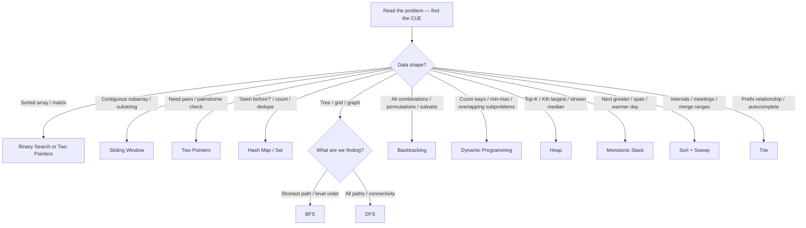

Interviewers rarely ask you to invent an algorithm. They ask you to **recognize which known
pattern fits** — then apply it cleanly. Almost every problem statement leaks a **cue** (a word,
a constraint, a shape) that points straight at the right technique. Train the reflex and you
solve in minutes instead of flailing.

## The cue → technique decision tree

Read the problem, find the strongest cue, and follow the branch.



## The cue → pattern → example master table

Keep this beside you while practicing. The **cue words** are what to hunt for in the prompt.

| Cue in the problem | Technique | Classic example |
|--|--|--|
| "**sorted** array", "find target", "rotated sorted" | **Binary Search** | Search in Rotated Sorted Array |
| "pair that sums to", "**palindrome**", "reverse in place" | **Two Pointers** | Two Sum II, Valid Palindrome |
| "**contiguous** subarray/substring", "window", "longest/shortest with condition" | **Sliding Window** | Longest Substring Without Repeat |
| "**seen before?**", "count occurrences", "group by", "dedupe", "anagram" | **Hash Map / Set** | Two Sum, Group Anagrams |
| "**shortest** path (unweighted)", "level by level", "minimum steps" | **BFS** | Word Ladder, Rotting Oranges |
| "**all paths**", "islands", "connected components", "flood fill" | **DFS / Union-Find** | Number of Islands |
| "**all** combinations / permutations / subsets", "generate every" | **Backtracking** | Subsets, Permutations, N-Queens |
| "**count ways**", "min/max cost", "can you reach", "overlapping subproblems" | **Dynamic Programming** | Coin Change, Edit Distance |
| "**top K**", "K largest/smallest", "**Kth** element", "median of stream" | **Heap** | Kth Largest, Merge K Lists |
| "**next greater**", "next warmer", "largest rectangle", "span" | **Monotonic Stack** | Daily Temperatures |
| "**intervals**", "meetings", "merge/overlap ranges" | **Sort + Sweep** | Merge Intervals |
| "**prefix**", "autocomplete", "starts-with", "dictionary of words" | **Trie** | Implement Trie |
| "cycle", "in-place with O(1) space", "fast/slow" | **Two Pointers (fast/slow)** | Linked List Cycle |

:::key
The fastest way to a solution is to **name the pattern out loud**: *"'longest substring' plus
'contiguous' is a sliding-window cue."* Interviewers score pattern recognition heavily — it
proves you have seen the shape before and know the O(n) path, not just the O(n²) brute force.
:::

## Constraints are cues too

The **input size** in the prompt tells you the *required* complexity — work backwards from it.

| Constraint (`n`) | Budget you have | Likely target |
|--|--|--|
| n ≤ 12 | huge per element | O(n!) / O(2ⁿ) — **backtracking**, permutations |
| n ≤ 25 | very large | O(2ⁿ) subsets, meet-in-the-middle |
| n ≤ 5,000 | ~n² fine | O(n²) DP, nested loops |
| n ≤ 10⁵ | ~1s | **O(n log n)** or O(n) — sort, sliding window, heap |
| n ≤ 10⁶ | tight | **O(n)** / O(log n) — hashing, two pointers |

:::senior
When a problem gives `n ≤ 20`, it is practically *shouting* "exponential is acceptable — think
backtracking or bitmask DP." When it gives `n ≤ 10⁶`, it is ruling out anything worse than
linear. Reading the constraint first often reveals the pattern before you finish the prompt.
:::

## Recall drills

```flashcards
title: Cue → pattern recall
cards:
  - front: '"Longest **contiguous** substring with at most K distinct chars"'
    back: '**Sliding Window** — "contiguous" + "longest with a condition".'
  - front: '"Find the **Kth largest** element in a stream"'
    back: '**Heap** — a size-K min-heap keeps the K largest seen so far.'
  - front: '"For each day, find the **next warmer** day"'
    back: '**Monotonic Stack** — "next greater/warmer" is the signature cue.'
  - front: '"Return **all** subsets of the array"'
    back: '**Backtracking** — "all combinations/subsets" ⇒ exhaustive generation.'
  - front: '"Search a value in a **rotated sorted** array in O(log n)"'
    back: '**Binary Search** — "sorted" + "O(log n)".'
  - front: '"Minimum number of steps to reach the exit in a maze"'
    back: '**BFS** — shortest path on an unweighted grid.'
  - front: 'Constraint says `n ≤ 20`. What family should you consider?'
    back: '**Backtracking / bitmask** — exponential is affordable at n ≤ 20.'
  - front: '"Count the number of **ways** to make change for an amount"'
    back: '**Dynamic Programming** — "count ways" + overlapping subproblems.'
```

## Check yourself

```quiz
title: Pattern-recognition check
questions:
  - q: '"Find the length of the **longest contiguous subarray** whose sum is ≤ K." Which pattern?'
    options:
      - text: 'Sliding Window'
        correct: true
      - 'Binary Search'
      - 'Backtracking'
    explain: '"Contiguous subarray" plus "longest with a condition" is the classic sliding-window signature.'
  - q: '"Return **all permutations** of a list of distinct integers." Which pattern?'
    options:
      - 'Dynamic Programming'
      - text: 'Backtracking'
        correct: true
      - 'Heap'
    explain: '"All permutations/combinations/subsets" means exhaustive generation — backtracking builds and prunes each candidate.'
  - q: 'The constraints say `1 ≤ n ≤ 100000` with a 1-second limit. What complexity should you aim for?'
    options:
      - 'O(n²) is fine'
      - text: 'O(n) or O(n log n)'
        correct: true
      - 'O(2ⁿ)'
    explain: 'At n = 10⁵, O(n²) is ~10¹⁰ ops and times out. The constraint points at a linear or linearithmic solution.'
  - q: '"For each element, find the **next greater** element to its right." Which pattern?'
    options:
      - 'Two Pointers'
      - text: 'Monotonic Stack'
        correct: true
      - 'Sliding Window'
    explain: '"Next greater / next warmer / span" problems are solved in O(n) with a monotonic (decreasing) stack.'
```

:::key
Interview problem-solving is 80% **pattern recognition**: find the strongest cue (a word, a
data shape, or a constraint), map it to a technique with the table above, then apply it. Master
the mapping and most "hard" problems collapse into "oh, that is just a sliding window."
:::
