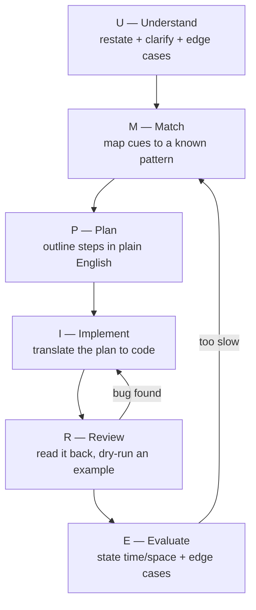

The candidates who pass are not the ones who blurt out code fastest — they are the ones who
follow a **visible, repeatable process**. A framework stops you from freezing, shows your
reasoning, and catches bugs before the interviewer does. The industry-standard method is
**UMPIRE**.

## The UMPIRE framework



| Step | What you do | What to say out loud |
|--|--|--|
| **U**nderstand | Restate the problem; ask about input range, types, duplicates, empties | *"So I'm given... Can the array be empty? Are values unique?"* |
| **M**atch | Spot the cue, name the pattern | *"'Contiguous subarray' — this smells like a sliding window."* |
| **P**lan | Sketch the algorithm in words / pseudocode **before** coding | *"I'll expand right, shrink left when the sum exceeds K..."* |
| **I**mplement | Write clean code, narrating as you go | *"I'll track a running sum and the best length."* |
| **R**eview | Re-read line by line; dry-run a small example | *"Let me trace [1,2,3] with K=3..."* |
| **E**valuate | State complexity and edge-case behavior | *"O(n) time, O(1) space; handles empty and all-negative."* |

:::tip
**Never jump to code.** Spend the first 3–5 minutes on U and M. Interviewers explicitly grade
communication and approach — a correct answer with no explanation scores worse than a partial
answer with clear reasoning.
:::

## Always start with the brute force

State the naive solution first — it proves you understand the problem and gives you a correctness
baseline to optimize from.

````tabs
tabs:
  - label: 1 — Brute force
    body: |
      Say it, even if it is O(n²). It buys thinking time and shows correctness.
      ```java
      // Two Sum, brute force — check every pair
      for (int i = 0; i < n; i++)
        for (int j = i + 1; j < n; j++)
          if (a[i] + a[j] == target)
            return new int[]{i, j};
      // O(n²) time, O(1) space
      ```
  - label: 2 — Optimize
    body: |
      Now apply a pattern. "Seen before?" ⇒ hash map.
      ```java
      Map<Integer, Integer> seen = new HashMap<>();
      for (int i = 0; i < n; i++) {
        int need = target - a[i];
        if (seen.containsKey(need))
          return new int[]{seen.get(need), i};
        seen.put(a[i], i);
      }
      // O(n) time, O(n) space
      ```
````

## Watch it: UMPIRE on "Two Sum"

Here is the whole framework applied to one problem, step by step.

```walkthrough
title: UMPIRE — Two Sum (target = 9)
code: |
  Map<Integer, Integer> seen = new HashMap<>();
  for (int i = 0; i < n; i++) {
    int need = target - a[i];
    if (seen.containsKey(need))
      return new int[]{seen.get(need), i};
    seen.put(a[i], i);
  }
steps:
  - text: '**U**nderstand: given `[2,7,11,15]`, target 9, return indices of the pair. Clarify: exactly one solution? Yes.'
    array: [2, 7, 11, 15]
    line: 1
  - text: '**M**atch: "find a pair" + unsorted ⇒ the "seen before?" cue ⇒ **hash map**, one pass.'
    array: [2, 7, 11, 15]
    line: 1
  - text: '**I**mplement: i = 0, x = 2. need = 9 - 2 = 7. Not seen yet. Store {2 → 0}.'
    array: [2, 7, 11, 15]
    highlight: [0]
    pointers: { 0: 'i' }
    line: 6
  - text: 'i = 1, x = 7. need = 9 - 7 = 2. **2 is in the map!** Return [0, 1].'
    array: [2, 7, 11, 15]
    highlight: [0, 1]
    sorted: [0, 1]
    pointers: { 1: 'i' }
    line: 5
  - text: '**R**eview + **E**valuate: dry-run confirms [0,1]. **O(n) time, O(n) space.** Edge cases: empty array → no pair; handled by the loop never entering.'
    array: [2, 7, 11, 15]
    sorted: [0, 1]
    line: 4
```

## Edge cases to raise every time

Naming edge cases during **U** and checking them during **R** is free credibility.

| Category | Ask / test |
|--|--|
| **Empty** | empty array/string, `null` input |
| **Single element** | n = 1 |
| **Duplicates** | repeated values — do they matter? |
| **Extremes** | all negative, all equal, already sorted, max size |
| **Boundaries** | first/last index, target absent, overflow on large sums |

:::gotcha
The most common interview bug is the **off-by-one**: `<=` vs `<` in a loop, or `mid = (lo + hi)/2`
overflowing for huge `lo + hi` (use `lo + (hi - lo)/2`). The Review step exists precisely to catch
these by dry-running a tiny example.
:::

## Check yourself

```quiz
title: Framework check
questions:
  - q: 'What should you do BEFORE writing any code?'
    options:
      - 'Start typing the optimal solution immediately'
      - text: 'Understand the problem, clarify edge cases, and match it to a pattern'
        correct: true
      - 'Ask the interviewer for the answer'
    explain: 'UMPIRE front-loads Understand and Match. Clarifying and picking an approach first prevents freezing and shows structured thinking.'
  - q: 'Why state the brute-force solution even when you can see the optimal one?'
    options:
      - 'To waste time'
      - text: 'It confirms you understand the problem and gives a correctness baseline to optimize from'
        correct: true
      - 'Because interviewers prefer O(n²) answers'
    explain: 'Verbalizing the brute force demonstrates understanding, earns partial credit, and frames the optimization ("can I remove the inner loop with a hash map?").'
  - q: 'In UMPIRE, what does the "R" step involve?'
    options:
      - text: 'Reviewing the code by re-reading it and dry-running a small example'
        correct: true
      - 'Rewriting everything from scratch'
      - 'Requesting a new problem'
    explain: 'Review = trace your code on a concrete tiny input to catch off-by-one and logic bugs before the interviewer runs it.'
  - q: 'Which is the safe way to compute the midpoint in binary search?'
    options:
      - 'mid = (lo + hi) / 2'
      - text: 'mid = lo + (hi - lo) / 2'
        correct: true
      - 'mid = (lo + hi) >> 2'
    explain: 'lo + hi can overflow for large indices. lo + (hi - lo)/2 is equivalent but never overflows.'
```

:::key
Follow **UMPIRE** every time: **U**nderstand (clarify + edge cases) → **M**atch (cue → pattern)
→ **P**lan (words first) → **I**mplement → **R**eview (dry-run) → **E**valuate (state O(time),
O(space)). Talk through every step — process and communication are graded as heavily as the code.
:::
