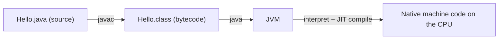

Java is a **general-purpose, object-oriented, statically-typed** programming language first released by Sun Microsystems in 1995 (now owned by Oracle). It was designed around one famous promise:

> **Write Once, Run Anywhere (WORA)** — compile your code once, and it runs on any device that has a Java Virtual Machine.

This page explains *how* that promise works and the vocabulary you'll use for the rest of your career.

## Why Java is still everywhere

Three decades on, Java powers enterprise backends, Android apps, big-data tools (Spark, Kafka, Hadoop), and high-frequency trading systems. It stays relevant because of:

- **Portability** — the same `.class` file runs on Windows, Linux, and macOS.
- **A world-class JVM** — decades of optimization in JIT compilation and garbage collection.
- **Backward compatibility** — code from 2005 still compiles today.
- **A massive ecosystem** — Spring, Hibernate, Maven, and millions of libraries.

:::tip
"Java" usually means *the language*, but the **JVM** is the real superpower. Languages like Kotlin, Scala, and Clojure also run on the JVM and interoperate with Java.
:::

## How Java runs: source → bytecode → machine

Unlike C (compiled straight to machine code) or Python (interpreted line by line), Java takes a **hybrid** path. You compile to an intermediate format called **bytecode**, and the JVM executes it.



1. You write `Hello.java`.
2. The **compiler** (`javac`) turns it into `Hello.class` — platform-independent **bytecode**.
3. The **JVM** loads that bytecode and executes it, using a **Just-In-Time (JIT)** compiler to turn hot paths into fast native code at runtime.

Because step 2 produces portable bytecode and only step 3 is platform-specific, the *same compiled file* runs anywhere a JVM exists.

## JDK vs JRE vs JVM

This trio confuses every beginner — and shows up in interviews constantly.

| Term | Stands for | Contains | You use it to… |
|------|-----------|----------|----------------|
| **JVM** | Java Virtual Machine | The execution engine | *Run* bytecode |
| **JRE** | Java Runtime Environment | JVM + standard libraries | *Run* Java apps |
| **JDK** | Java Development Kit | JRE + compiler & tools | *Build* Java apps |

```text
┌─────────────────────────── JDK ───────────────────────────┐
│  javac, jar, javadoc, jdb …                                │
│   ┌──────────────────── JRE ────────────────────┐          │
│   │  Core libraries (java.lang, java.util …)     │          │
│   │   ┌──────────── JVM ────────────┐            │          │
│   │   │  ClassLoader, JIT, GC        │            │          │
│   │   └──────────────────────────────┘            │          │
│   └────────────────────────────────────────────────┘        │
└────────────────────────────────────────────────────────────┘
```

:::note
As a developer you install the **JDK**. It includes everything below it.
:::

## Editions and versions

- **Java SE** (Standard Edition) — the core language and libraries. This is what you learn here.
- **Java EE / Jakarta EE** — enterprise APIs (servlets, JPA) layered on top.
- **Java ME** — a stripped-down edition for embedded devices.

Java ships a new version every **6 months**, with a **Long-Term Support (LTS)** release every 2 years (it was ~3 years before Java 21). LTS versions (8, 11, 17, 21, 25…) are what companies run in production.

:::senior
In interviews, know your version history at a high level: **Java 8** (2014) introduced lambdas & streams — the biggest leap ever. **Java 17** and **Java 21** are the current enterprise LTS workhorses, adding records, sealed classes, pattern matching, and virtual threads.
:::

## What the JVM gives you for free

The language syntax is only half the story — the runtime does heavy lifting that C programmers do by hand:

- **Automatic memory management.** You create objects with `new`; the **garbage collector (GC)** reclaims them once nothing references them. There is no `free()` and no `delete` — which eliminates entire bug classes (use-after-free, double-free, most memory leaks) at the cost of some CPU overhead and occasional pause time.
- **Runtime safety.** Array accesses are bounds-checked, invalid casts throw `ClassCastException`, and bytecode is **verified** before it runs — a malformed `.class` file is rejected instead of corrupting memory.
- **Adaptive optimization.** The JVM profiles your running program and JIT-compiles the *hot* methods with aggressive tricks — inlining, loop unrolling, escape analysis — that a static compiler can't do because it never sees real runtime behaviour.

## Common misconceptions (interview bait)

- **"Java is interpreted, so it's slow."** Wrong on both counts. Execution starts interpreted, but hot paths are JIT-compiled to native code; steady-state server throughput is competitive with C++. Java's real cost is **startup and warm-up time**, which is why CLI tools and serverless functions sometimes use GraalVM native images instead.
- **"Java and JavaScript are related."** Only by a 1995 marketing deal. Different languages, different runtimes, nothing shared.
- **"The same JVM runs everywhere."** Backwards — each OS/CPU gets its **own** JVM build. What's portable is the *bytecode*; WORA = portable `.class` files + platform-specific JVMs that all implement the same specification.
- **"Statically typed just means more typing."** It means the compiler proves type correctness *before* the program runs: `int x = "hello"` is a compile error, not a production incident. IDEs exploit this for reliable refactoring and autocomplete.

```quiz
title: Check yourself
questions:
  - q: 'What actually makes "write once, run anywhere" work?'
    options:
      - 'The compiler produces native machine code for every OS at build time'
      - text: 'The compiler produces portable bytecode, and each platform ships its own JVM that executes it'
        correct: true
      - 'The JVM re-reads your `.java` source line by line on each platform'
    explain: 'Portability lives in the `.class` bytecode. The JVM itself is platform-specific — you download a different build for Linux, macOS, or Windows — but every JVM implements the same spec, so the same bytecode runs on all of them.'
  - q: 'You need to **compile** Java code on a fresh machine. What must you install?'
    options:
      - 'A JRE — it contains everything Java'
      - 'Just a JVM'
      - text: 'A JDK — only it includes the `javac` compiler'
        correct: true
    explain: 'JDK ⊃ JRE ⊃ JVM. The JRE and JVM can only *run* already-compiled bytecode; the compiler and dev tools (`javac`, `jar`, `javadoc`) ship only with the JDK.'
  - q: 'What does the JVM do with a method that runs thousands of times?'
    options:
      - 'Keeps interpreting it — bytecode can only be interpreted'
      - text: 'JIT-compiles it to optimized native machine code at runtime'
        correct: true
      - 'Sends it back to `javac` for recompilation'
    explain: 'HotSpot profiles execution and compiles hot methods to native code with inlining and escape analysis — this is why long-running Java servers get *faster* after warm-up.'
```

## What's next

Now that you know what Java *is*, the next step is writing and running your first program — and seeing the compile-and-run cycle for yourself.

:::key
Java compiles to **bytecode** (`javac`), and a platform-specific **JVM** runs it with interpretation + JIT compilation — that's WORA. Install the **JDK** (it contains the JRE, which contains the JVM). GC and bytecode verification give you memory safety for free; the price is warm-up time, not steady-state speed.
:::
