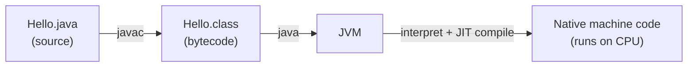

Java is a **general-purpose, object-oriented, statically-typed** programming language first released by Sun Microsystems in 1995 (now owned by Oracle). It was designed around one famous promise:

> **Write Once, Run Anywhere (WORA)** — compile your code once, and it runs on any device that has a Java Virtual Machine.

This page explains *how* that promise works and the vocabulary you'll use for the rest of your career.

## Why Java is still everywhere

Three decades on, Java powers enterprise backends, Android apps, big-data tools (Spark, Kafka, Hadoop), and high-frequency trading systems. It stays relevant because of:

- **Portability** — the same `.class` file runs on Windows, Linux, and macOS.
- **A world-class JVM** — decades of optimization in JIT compilation and garbage collection.
- **Backward compatibility** — code from 2005 still compiles today.
- **A massive ecosystem** — Spring, Hibernate, Maven, and millions of libraries.

:::tip
"Java" usually means *the language*, but the **JVM** is the real superpower. Languages like Kotlin, Scala, and Clojure also run on the JVM and interoperate with Java.
:::

## How Java runs: source → bytecode → machine

Unlike C (compiled straight to machine code) or Python (interpreted line by line), Java takes a **hybrid** path. You compile to an intermediate format called **bytecode**, and the JVM executes it.



1. You write `Hello.java`.
2. The **compiler** (`javac`) turns it into `Hello.class` — platform-independent **bytecode**.
3. The **JVM** loads that bytecode and executes it, using a **Just-In-Time (JIT)** compiler to turn hot paths into fast native code at runtime.

Because step 2 produces portable bytecode and only step 3 is platform-specific, the *same compiled file* runs anywhere a JVM exists.

## JDK vs JRE vs JVM

This trio confuses every beginner — and shows up in interviews constantly.

| Term | Stands for | Contains | You use it to… |
|------|-----------|----------|----------------|
| **JVM** | Java Virtual Machine | The execution engine | *Run* bytecode |
| **JRE** | Java Runtime Environment | JVM + standard libraries | *Run* Java apps |
| **JDK** | Java Development Kit | JRE + compiler & tools | *Build* Java apps |

```text
┌─────────────────────────── JDK ───────────────────────────┐
│  javac, jar, javadoc, jdb …                                │
│   ┌──────────────────── JRE ────────────────────┐          │
│   │  Core libraries (java.lang, java.util …)     │          │
│   │   ┌──────────── JVM ────────────┐            │          │
│   │   │  ClassLoader, JIT, GC        │            │          │
│   │   └──────────────────────────────┘            │          │
│   └────────────────────────────────────────────────┘        │
└────────────────────────────────────────────────────────────┘
```

:::key
As a developer you install the **JDK**. It includes everything below it.
:::

## Editions and versions

- **Java SE** (Standard Edition) — the core language and libraries. This is what you learn here.
- **Java EE / Jakarta EE** — enterprise APIs (servlets, JPA) layered on top.
- **Java ME** — a stripped-down edition for embedded devices.

Java ships a new version every **6 months**, with a **Long-Term Support (LTS)** release every 2 years (it was ~3 years before Java 21). LTS versions (8, 11, 17, 21, 25…) are what companies run in production.

:::senior
In interviews, know your version history at a high level: **Java 8** (2014) introduced lambdas & streams — the biggest leap ever. **Java 17** and **Java 21** are the current enterprise LTS workhorses, adding records, sealed classes, pattern matching, and virtual threads.
:::

## What's next

Now that you know what Java *is*, the next step is writing and running your first program — and seeing the compile-and-run cycle for yourself.
