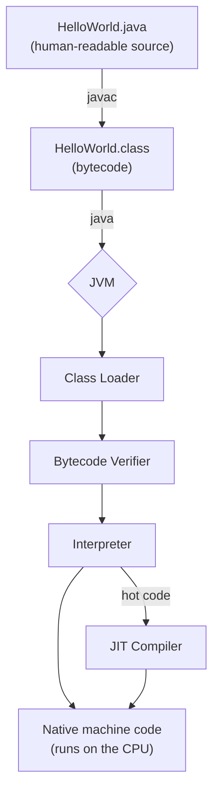
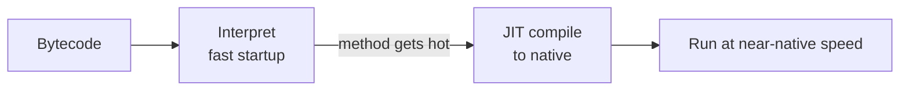

You've compiled and run a program. But what actually happens between `javac` and `java`? Understanding this pipeline is what separates someone who *uses* Java from someone who *understands* it — and it's a staple of interviews.

## The big picture

Java doesn't compile straight to machine code like C, and it isn't interpreted line-by-line like classic Python. It takes a **hybrid** path through an intermediate format called **bytecode**.



The key insight: `javac` produces **portable** bytecode, and only the JVM is platform-specific. That single design choice is what makes "write once, run anywhere" possible.

## What is bytecode?

Bytecode is the **instruction set of the JVM** — a compact, platform-neutral binary format. Where your CPU understands x86 or ARM instructions, the JVM understands opcodes like `iload`, `iadd`, and `invokevirtual`. Each opcode fits in a single byte (hence the name), and the JVM is a **stack machine**: instructions push and pop values on an operand stack rather than using CPU registers.

Crucially, bytecode is **not** tied to any operating system or chip. The same bytes describe the program whether it eventually runs on a Mac laptop or a Linux server.

## Inspecting bytecode with `javap`

You don't have to take this on faith. The JDK ships `javap`, a disassembler. Given this method:

```java
public class Add {
    public static void main(String[] args) {
        int sum = 2 + 3;
        System.out.println(sum);
    }
}
```

Run `javac Add.java` then `javap -c Add` to see the bytecode:

```text
public static void main(java.lang.String[]);
  Code:
     0: iconst_5          // 2 + 3 was folded to the constant 5
     1: istore_1          // store it in local variable 'sum'
     2: getstatic     #7  // System.out
     5: iload_1           // load 'sum'
     6: invokevirtual #13 // println(int)
     9: return
```

Notice the compiler already pre-computed `2 + 3` into `5` (constant folding). Reading bytecode demystifies what the language "really" does.

## Interpreter vs JIT

When the JVM starts, it **interprets** bytecode — reading and executing each opcode one at a time. This gives fast startup but is slower per instruction.

Meanwhile the JVM **profiles** your running code. When a method or loop becomes "hot" (executed many times), the **Just-In-Time (JIT) compiler** translates that bytecode into optimized native machine code, which then runs at near-C speed. Java actually uses *tiered compilation* — a quick **C1** compiler first, then the heavily optimizing **C2** compiler for the hottest paths.



This is why a long-running Java server often gets *faster* after warming up: the JIT has had time to optimize the hot paths.

## Class loading, briefly

The JVM loads classes **lazily** — a `.class` is read only when first needed. **Class loaders** do this in a hierarchy (bootstrap → platform → application) using a **parent-delegation model**: each loader first asks its parent, so core classes like `java.lang.String` are always loaded by the trusted bootstrap loader and can't be spoofed. After loading, the class is **linked** — which comprises **verification** (rejecting malformed or unsafe bytecode), **preparation** (default-initializing static fields), and **resolution** — and is finally **initialized** (running its `static` blocks).

:::gotcha
Bytecode is **not** encrypted or secure — it's trivial to decompile back into readable Java. Never embed passwords, API keys, or secrets in your code thinking the `.class` file hides them.
:::

:::senior
The interpreter-plus-JIT model trades startup time for peak throughput, which hurts short-lived programs and serverless functions. The modern answer is **Ahead-of-Time (AOT)** compilation: **GraalVM Native Image** compiles a Java app to a standalone native binary that starts in milliseconds with a tiny memory footprint — at the cost of losing some runtime dynamism. Knowing this trade-off signals real depth in an interview.
:::

## Write once, run anywhere — for real

Now the famous slogan makes mechanical sense. Your `HelloWorld.class` contains the *same bytes* everywhere. The platform-specific part is the **JVM**: there's a different JVM build for Windows, macOS, and Linux, and each one knows how to turn that universal bytecode into instructions its own CPU understands.

:::key
- `javac` compiles source to **portable bytecode** (`.class`); the **JVM** runs it — only the JVM is platform-specific.
- Bytecode is a compact, stack-based instruction set; inspect it with `javap -c`.
- The JVM **interprets** first for fast startup, then **JIT-compiles** hot code to native for speed.
- Class loaders load classes lazily and verify them before use, using parent delegation.
:::
