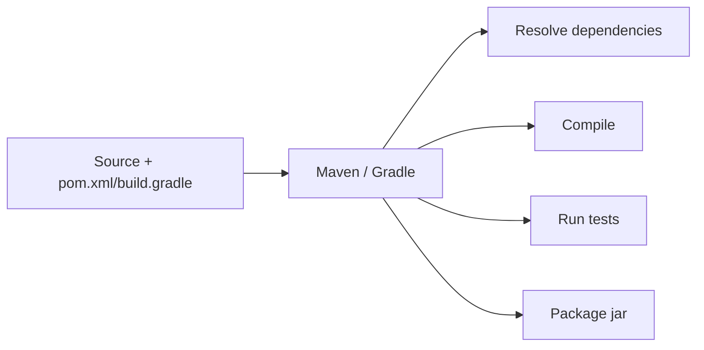

You've met `javac` and `java`. The JDK ships a whole toolbox around them. This topic covers the tools you'll reach for daily — and how real projects scale past running `javac` by hand.

## `javac` and `java` flags worth knowing

You can drive both commands much further than the defaults. A few flags pay for themselves immediately:

| Command | Flag | What it does |
|---------|------|--------------|
| `javac` | `-d out` | Write `.class` files into an `out/` directory instead of cluttering your source folder |
| `javac` | `--release 21` | Compile against exactly the Java 21 API and bytecode level |
| `javac` | `-Xlint:all` | Turn on all compiler warnings — catch sketchy code early |
| `java` | `-cp <path>` | Set the classpath (where to find classes and jars) |
| `java` | `-jar app.jar` | Run an executable jar's declared main class |
| `java` | `-Dkey=value` | Define a system property readable via `System.getProperty` |
| `java` | `-Xmx512m` | Cap the heap at 512 MB |

```bash
javac -d out --release 21 -Xlint:all src/HelloWorld.java
java -cp out HelloWorld
```

## JShell: the Java REPL

Since Java 9, the JDK includes **JShell**, a Read-Eval-Print Loop. It's the fastest way to try an idea — no class, no `main`, no compile step.

```text
$ jshell
jshell> int x = 6 * 7;
x ==> 42

jshell> "hello".toUpperCase()
$2 ==> "HELLO"

jshell> /vars      // list everything you've defined
jshell> /exit
```

:::tip
JShell is ideal for learning and for quickly checking "what does this method return?" without writing a throwaway file. Type an expression, press Enter, and see the result instantly.
:::

## Packaging with `jar`

A real application is many `.class` files. The `jar` tool bundles them (plus resources) into a single archive — really just a ZIP file with a `META-INF/MANIFEST.MF` describing it.

```bash
# Bundle everything in out/ into an executable jar
jar --create --file app.jar --main-class HelloWorld -C out .

# Run it — the manifest's Main-Class tells java where to start
java -jar app.jar
```

The `--main-class` flag records the entry point in the manifest, so `java -jar app.jar` knows which `main` to call.

## The classpath

The **classpath** answers one question for the JVM: *where do I look for classes and jars?* Forget to include something on it and you get the dreaded `ClassNotFoundException` or `NoClassDefFoundError`.

```bash
# Multiple entries: ':' on macOS/Linux, ';' on Windows
java -cp "out:libs/gson.jar" com.example.App
```

If you don't pass `-cp`, the classpath defaults to the current directory (`.`).

:::gotcha
The classpath separator is OS-specific: a **colon** `:` on macOS/Linux but a **semicolon** `;` on Windows. Copy-pasting a classpath between operating systems is a classic source of "it works on my machine" failures.
:::

### A teaser: the module path

Java 9 introduced the **module system** (JPMS) and, with it, the **module path** (`--module-path` / `-p`). Where the classpath is a flat free-for-all of classes, a *module* declares exactly what it exports and what it requires in a `module-info.java`. It brings stronger encapsulation and reliable configuration. Most application code still runs on the classpath; you'll meet modules properly later.

## How real projects actually run

Here's the honest truth: **professionals rarely type `javac` and `java` by hand.** Real projects have dozens of dependencies, multiple source folders, and test suites. **Build tools** handle all of it:



- **Maven** — declarative XML (`pom.xml`); conventions over configuration; huge ecosystem.
- **Gradle** — flexible scripts (Groovy/Kotlin); fast incremental builds; the standard for Android.

Both download libraries automatically from repositories like **Maven Central**, then invoke `javac` for you under the hood. You still benefit from knowing the raw tools — when a build breaks, understanding the classpath and `javac` is what lets you debug it.

:::senior
A build tool's most valuable job is **transitive dependency management**: pulling in your libraries' libraries and resolving version conflicts. Doing that manually with a hand-built classpath is unmaintainable past a couple of jars — which is exactly why every serious Java project uses Maven or Gradle.
:::

```quiz
title: Check yourself
questions:
  - q: 'A colleague sends you `java -cp "out;libs/gson.jar" com.example.App` and it fails on your Mac with `ClassNotFoundException`. Most likely cause?'
    options:
      - 'The jar must be listed before the class directory'
      - text: 'The classpath separator is Windows-style — on macOS/Linux it must be `:` not `;`'
        correct: true
      - '`-cp` only accepts a single entry'
    explain: 'Classpath entries are separated by `;` on Windows and `:` on Unix-likes. With the wrong separator the whole string is treated as one bogus path, so nothing is found.'
  - q: 'What makes `java -jar app.jar` know which class to start?'
    options:
      - 'The first `.class` file added to the archive'
      - text: 'The `Main-Class` attribute in `META-INF/MANIFEST.MF`'
        correct: true
      - 'The JVM scans the jar for any `public static void main`'
    explain: 'A jar is a ZIP with a manifest. `jar --main-class HelloWorld` records `Main-Class: HelloWorld` there; without it, `java -jar` fails with "no main manifest attribute". Note: with `-jar`, any `-cp` flag is ignored — the jar''s manifest `Class-Path` rules.'
  - q: 'You want to check what `"abc".substring(1, 2)` returns without creating a file. Fastest tool?'
    options:
      - text: '`jshell` — type the expression, see the result'
        correct: true
      - '`javap -c` on a scratch class'
      - '`java -e ''"abc".substring(1,2)''`'
    explain: 'JShell (Java 9+) is the JDK''s REPL — no class, no `main`, no compile step. `java` has no `-e` expression flag.'
```

## What's next

You can now build, run, experiment with, and package Java code, and you know where the industrial-strength tooling takes over. From here you move into the language itself — variables, types, and the building blocks of every program.

:::key
- `javac -d out --release 21` and `java -cp ...` cover most day-to-day compiling and running.
- **JShell** is a no-boilerplate REPL — the fastest way to experiment.
- `jar` packages classes into one archive; `java -jar app.jar` runs it via the manifest's `Main-Class`.
- The **classpath** tells the JVM where to find classes (`:` separator on Unix, `;` on Windows); the **module path** is its stronger, encapsulated successor.
- Real projects use **Maven** or **Gradle** to manage dependencies and call the tools for you.
:::
