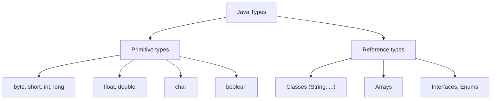

A **variable** is a named box that holds a value. Java is **statically typed**: every variable has a type fixed at compile time, and the compiler checks that you never put the wrong kind of value in the box.

```java
int age = 30;          // a whole number
double price = 19.99;  // a decimal number
boolean active = true; // true or false
String name = "Ada";   // a sequence of characters
```

## The two families of types

Every Java type is either a **primitive** or a **reference** type.



## The 8 primitive types

Primitives hold the value **directly** (on the stack, inside a method) — there is no object overhead.

| Type | Size | Range / Notes | Default |
|------|------|---------------|---------|
| `byte` | 8-bit | −128 … 127 | `0` |
| `short` | 16-bit | −32,768 … 32,767 | `0` |
| `int` | 32-bit | ~±2.1 billion (most common) | `0` |
| `long` | 64-bit | very large; suffix `L` | `0L` |
| `float` | 32-bit | decimal, suffix `f` | `0.0f` |
| `double` | 64-bit | decimal (default for decimals) | `0.0d` |
| `char` | 16-bit | a single Unicode character | `'\u0000'` |
| `boolean` | JVM-dependent | `true` / `false` | `false` |

```java
long worldPopulation = 8_000_000_000L; // underscores improve readability
float pi = 3.14f;
char grade = 'A';
```

:::gotcha
`int` overflows silently! `Integer.MAX_VALUE + 1` wraps around to `Integer.MIN_VALUE` — no error is thrown. Use `long` or `Math.addExact()` when overflow matters.
:::

## Reference types

Everything that isn't a primitive is a **reference type**: `String`, arrays, your own classes, collections. The variable holds a **reference** (a pointer) to an object living on the **heap**.

```java
String name = "Ada";        // 'name' references a String object
int[] scores = {90, 85, 77}; // 'scores' references an array object
```

The difference matters enormously for **equality** and **null**:

```java
String a = new String("hi");
String b = new String("hi");
a == b;        // false — different objects (compares references)
a.equals(b);   // true  — same characters (compares content)
```

:::key
Use `==` for primitives and `.equals()` for objects. Mixing these up is the #1 beginner bug.
:::

```quiz
title: Check yourself — equality
questions:
  - q: 'Given `String a = new String("hi"); String b = new String("hi");`, what does `a == b` evaluate to?'
    options:
      - 'true'
      - text: 'false'
        correct: true
      - 'a compile error'
    explain: '`new String(...)` allocates two **distinct objects**, so `==` (reference comparison) is `false`. `a.equals(b)` would be `true` because the characters match.'
  - q: 'Which operator compares the **contents** of two objects?'
    options:
      - '`==`'
      - text: '`.equals()`'
        correct: true
    explain: 'Use `.equals()` for object content; reserve `==` for primitives and deliberate reference-identity checks.'
```

## Default values vs local variables

Fields (instance/class variables) get **default values** automatically. **Local variables do not** — the compiler forces you to initialize them.

```java
class Demo {
    int count;          // defaults to 0
    void run() {
        int x;
        System.out.println(x); // ❌ compile error: x might not be initialized
    }
}
```

## `var` — local type inference (Java 10+)

You can let the compiler infer the type of **local** variables. The variable is still statically typed — `var` is *not* dynamic typing.

```java
var message = "hello";        // inferred as String
var numbers = new ArrayList<Integer>(); // inferred as ArrayList<Integer>
var total = 0;                // inferred as int
```

:::tip
Use `var` when the type is obvious from the right-hand side (it reduces noise). Avoid it when it hurts readability, e.g. `var result = process();` hides what `result` is.
:::

## Autoboxing: primitives ↔ wrappers

Each primitive has a **wrapper class** (`int`→`Integer`, `double`→`Double`…) so it can live in collections and be `null`. Java converts automatically:

```java
List<Integer> list = new ArrayList<>();
list.add(5);        // autoboxing: int 5 → Integer.valueOf(5)
int first = list.get(0); // unboxing: Integer → int
```

:::gotcha
Unboxing a `null` wrapper throws `NullPointerException`:
```java
Integer maybe = null;
int n = maybe; // 💥 NullPointerException at runtime
```
Also beware `==` on wrappers: it compares references, and only the cache range −128…127 is shared.
:::

:::senior
Wrapper objects cost memory (an `Integer` is ~16 bytes vs 4 for an `int`) and add GC pressure. In hot, numeric-heavy code, prefer primitives and primitive-specialized streams (`IntStream`) over `Stream<Integer>`.
:::
