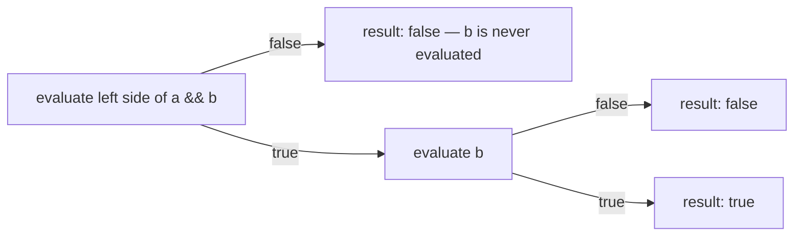

An **operator** takes one or more values (**operands**) and produces a new value. A combination of operators and operands is an **expression**, and every expression has a type and evaluates to a single result.

## Arithmetic operators

The five arithmetic operators work on numeric types:

| Operator | Meaning | Example |
|----------|---------|---------|
| `+` | addition | `7 + 2` → `9` |
| `-` | subtraction | `7 - 2` → `5` |
| `*` | multiplication | `7 * 2` → `14` |
| `/` | division | `7 / 2` → `3` |
| `%` | remainder (modulo) | `7 % 2` → `1` |

```java
int a = 7, b = 2;
System.out.println(a / b);   // 3   — integer division truncates toward zero
System.out.println(a % b);   // 1   — what's left over
System.out.println(7.0 / 2); // 3.5 — one double operand → double result
```

**Integer division throws away the fractional part** (it does not round). The result type follows the widest operand: `int / int` is always an `int`, but if either side is `double`, the result is `double`.

:::gotcha
Integer division by zero throws `ArithmeticException`, but **floating-point** division by zero does *not* — it yields `Infinity` or `NaN`:
```java
int x = 1 / 0;       // 💥 ArithmeticException
double y = 1.0 / 0;  // Infinity (no exception)
double z = 0.0 / 0;  // NaN
```
The `%` sign follows the **dividend** (left side): `-7 % 3` is `-1`, while `7 % -3` is `1`.
:::

## Relational and equality operators

These compare two values and produce a `boolean`: `<`, `<=`, `>`, `>=`, `==`, `!=`. Use `==`/`!=` for primitives; for objects, `==` compares references, so use `.equals()` for content.

## Logical operators

`&&` (and), `||` (or), and `!` (not) operate on booleans and **short-circuit**: evaluation stops as soon as the result is known.

```java
if (user != null && user.isActive()) { ... } // isActive() only runs if user != null
```

Because `&&` stops at the first `false` and `||` stops at the first `true`, the right side may never run — handy for guarding against null or skipping expensive checks. The non-short-circuiting `&` and `|` always evaluate both sides (rarely what you want for control logic).



That skipped evaluation is *observable*: if the right side has a side effect (increments a counter, calls a method), short-circuiting means it silently doesn't happen. That's exactly why `if (user != null && user.isActive())` can never throw an NPE — and why `check() & log()` (single `&`) behaves differently from `check() && log()`.

## Bitwise operators and shifts

These manipulate the individual bits of integer types:

| Operator | Name | Effect |
|----------|------|--------|
| `&` | AND | 1 if both bits are 1 |
| `\|` | OR | 1 if either bit is 1 |
| `^` | XOR | 1 if the bits differ |
| `~` | NOT | flips every bit |
| `<<` | left shift | multiply by 2ⁿ |
| `>>` | signed right shift | divide by 2ⁿ (keeps the sign) |
| `>>>` | unsigned right shift | shifts in zeros |

```java
int flags = 0b0101;       // 5
flags = flags | 0b0010;   // 7  — set a bit
flags = flags & ~0b0001;  // 6  — clear a bit
System.out.println(8 >> 1);    // 4
System.out.println(-8 >>> 28); // 15 — zero-fill, ignores sign
```

The difference between `>>` and `>>>` only shows up for **negative** numbers: `>>` copies the sign bit, `>>>` fills with zeros. There is no `<<<` — left shift never needs to distinguish.

:::senior
Shift counts are taken **modulo the operand width**: for `int` only the low 5 bits of the count are used (so `x << 33` equals `x << 1`); for `long`, the low 6 bits. This trips up people writing generic bit-twiddling code who expect a large shift to zero the value.
:::

## Ternary (conditional) operator

The only operator with three operands — a compact `if/else` that *produces a value*:

```java
int max = (a > b) ? a : b;
String label = (n == 1) ? "item" : "items";
```

## Assignment and compound assignment

`=` assigns. The compound forms (`+=`, `-=`, `*=`, `/=`, `%=`, `&=`, `|=`, `^=`, `<<=`, `>>=`, `>>>=`) combine an operation with assignment.

```java
int total = 0;
total += 5;   // total = total + 5
```

:::gotcha
Compound assignment performs a **hidden narrowing cast**, so it compiles where the long form does not:
```java
byte b = 10;
b += 5;       // OK — an implicit (byte) cast is inserted
b = b + 5;    // ❌ compile error: int can't auto-narrow to byte
```
:::

## Increment and decrement

`++` and `--` add or subtract 1. **Pre-fix** (`++i`) changes the value *then* yields it; **post-fix** (`i++`) yields the old value *then* changes it.

```java
int i = 5;
System.out.println(i++); // prints 5, then i becomes 6
System.out.println(++i); // i becomes 7, then prints 7
```

## Operator precedence

When an expression mixes operators, **precedence** decides what binds first (and **associativity** breaks ties). From highest to lowest:

| Level | Operators | Associativity |
|-------|-----------|---------------|
| Postfix | `expr++` `expr--` | left |
| Unary | `++expr` `--expr` `+` `-` `!` `~` | right |
| Multiplicative | `*` `/` `%` | left |
| Additive | `+` `-` | left |
| Shift | `<<` `>>` `>>>` | left |
| Relational | `<` `<=` `>` `>=` `instanceof` | left |
| Equality | `==` `!=` | left |
| Bitwise | `&` then `^` then `\|` | left |
| Logical | `&&` then `\|\|` | left |
| Ternary | `? :` | right |
| Assignment | `=` `+=` `-=` … | right |

```java
int r = 2 + 3 * 4;                    // 14, not 20 — '*' before '+'
boolean ok = a > 0 && b > 0 || c > 0; // && binds tighter than ||
```

:::tip
You don't need to memorize the whole table. When in doubt, **add parentheses** — they make intent obvious and cost nothing at runtime.
:::

## Check your understanding

A quick self-test on precedence and the evaluation-order traps.

```quiz
title: Operators & precedence
questions:
  - q: 'What does `System.out.println(2 + 3 * 4);` print?'
    options:
      - '20'
      - text: '14'
        correct: true
      - '24'
    explain: '`*` binds tighter than `+`, so `3 * 4` runs first — `2 + 12` = `14`. Precedence, not reading order, decides.'
  - q: 'Given `int i = 5;`, what does `System.out.println(i++ + ++i);` print?'
    options:
      - '10'
      - '11'
      - text: '12'
        correct: true
      - '13'
    explain: '`i++` yields `5` (i becomes `6`); then `++i` makes i `7` and yields `7`. So `5 + 7 = 12`.'
  - q: 'What is the value of `-7 % 3` in Java?'
    options:
      - '1'
      - text: '-1'
        correct: true
      - '2'
      - '-2'
    explain: 'The result of `%` takes the sign of the **left** operand (the dividend), so `-7 % 3` is `-1`.'
```

:::key
- `/` between two ints truncates toward zero; `%`'s sign follows the left operand.
- `&&`/`||` **short-circuit** — use them to guard against null and skip wasted work.
- `>>` preserves the sign bit; `>>>` fills with zeros; there is no `<<<`.
- Compound assignment (`+=`) hides a narrowing cast.
- Pre vs post: `++i` updates then returns; `i++` returns then updates.
- When precedence is unclear, parenthesize.
:::
