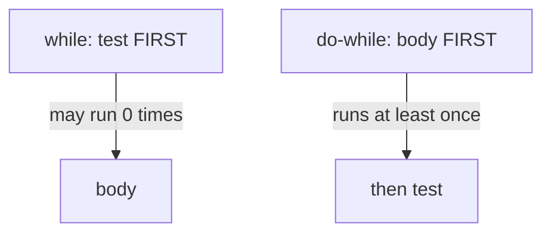

**Control flow** statements decide *which* code runs and *how many times*. Without them a program would execute top to bottom exactly once. Java groups them into **branches** (choose a path) and **loops** (repeat a path).

## if / else

The workhorse of branching. The condition must be a `boolean` — Java has no "truthy" numbers like C.

```java
if (score >= 90) {
    grade = 'A';
} else if (score >= 80) {
    grade = 'B';
} else {
    grade = 'C';
}
```

:::gotcha
A stray single `=` inside a condition is a classic bug in many languages. In Java `if (x = 5)` simply **won't compile** unless `x` is a `boolean`, because `=` returns the assigned value, not a comparison. The compiler protects you here.
:::

## switch — classic statement vs modern expression

The **classic switch statement** matches a value against `case` labels and **falls through** into the next case unless you `break`. Forgetting `break` is a notorious source of bugs.

```java
switch (day) {
    case 6:
    case 7:
        type = "weekend";
        break;            // without this, execution falls into 'default'
    default:
        type = "weekday";
}
```

**Switch expressions** (standard since Java 14) fix this. The arrow (`->`) form has **no fall-through**, can return a value, and the compiler checks that every case is covered:

```java
String type = switch (day) {
    case 6, 7 -> "weekend";   // multiple labels, comma-separated
    default   -> "weekday";
};
```

When an arm needs multiple statements, use a block and `yield` to produce its value:

```java
int hours = switch (day) {
    case 6, 7 -> 0;
    default -> {
        int base = 8;
        yield base;   // 'yield' returns a value out of a block
    }
};
```

| | Classic statement | Switch expression |
|--|-------------------|-------------------|
| Label syntax | `case x:` | `case x ->` |
| Fall-through | yes (needs `break`) | no |
| Produces a value | no | yes (assignable) |
| Exhaustiveness | not checked | checked |

:::senior
Arrow switches over an `enum` are checked for **exhaustiveness**: cover every constant and you can drop `default`. Add a new enum constant later and the compiler flags every switch you forgot to update — a powerful refactoring safety net you lose the moment you add a needless `default`.
:::

## Loops

Java has four looping constructs.

### for

Best when you know the bounds. The three parts are *init; condition; update*:

```java
for (int i = 0; i < 5; i++) {
    System.out.println(i); // 0 1 2 3 4
}
```

### Enhanced for (for-each)

Iterates over arrays and anything `Iterable`. Cleaner when you don't need the index:

```java
for (String name : names) {
    System.out.println(name);
}
```

### while

Checks the condition **before** each pass — may run zero times:

```java
while (!queue.isEmpty()) {
    process(queue.poll());
}
```

### do-while

Checks the condition **after** each pass — always runs **at least once**:

```java
int attempt = 0;
do {
    attempt++;
} while (!connected && attempt < 3);
```



## break, continue, and labels

`break` exits the nearest enclosing loop or switch; `continue` skips to the next iteration.

```java
for (int n : numbers) {
    if (n < 0) continue;  // skip negatives, keep looping
    if (n > 100) break;   // stop the loop entirely
    sum += n;
}
```

To break out of **nested** loops, label the outer loop and `break label;`:

```java
outer:
for (int i = 0; i < rows; i++) {
    for (int j = 0; j < cols; j++) {
        if (grid[i][j] == target) {
            found = true;
            break outer;   // exits BOTH loops at once
        }
    }
}
```

:::tip
Labeled `break` is the clean alternative to a `found` flag re-checked in every loop header. Use it sparingly — deep nesting is often a sign to extract the search into its own method and `return` instead.
:::

## Check your understanding

Test the fall-through rules and how switch expressions differ.

```quiz
title: Switch & fall-through
questions:
  - q: 'A classic `switch (day)` with `day = 6` has `case 6:` print `six `, `case 7:` print `seven `, and `default:` print `other` — with **no** `break` anywhere. What is printed?'
    options:
      - 'six '
      - 'six seven '
      - text: 'six seven other'
        correct: true
      - 'six other'
    explain: 'With no `break`, a classic `switch` **falls through**: once `case 6` matches, every following body runs too — `six seven other`.'
  - q: 'In an arrow-form switch expression like `case 6, 7 -> "weekend";`, what happens after the matching arm runs?'
    options:
      - 'It falls through to the next case unless you add `break`'
      - text: 'Control leaves the switch immediately — there is no fall-through'
        correct: true
      - 'You must write `break` to exit'
      - 'It runs `default` as well'
    explain: 'The arrow form has **no** fall-through — the matched arm runs and the switch is done. No `break` is needed (and `break` is not allowed there).'
  - q: 'Why can an arrow `switch` *expression* over an `enum` that handles every constant omit `default`?'
    options:
      - '`default` is not allowed in switch expressions'
      - text: 'The compiler checks exhaustiveness, so covering every constant is enough'
        correct: true
      - 'Enums always supply a default arm'
      - 'It cannot — `default` is mandatory'
    explain: 'Arrow switch expressions are checked for **exhaustiveness**. Cover every enum constant and `default` is optional — and a needless `default` silences the compiler when you later add a new constant.'
```

:::key
- Conditions must be `boolean`; Java has no truthy/falsy values.
- Classic `switch` falls through (needs `break`); arrow `switch` doesn't and can return a value via `yield`.
- `while` tests *before* (0+ runs); `do-while` tests *after* (1+ runs).
- `continue` skips one iteration; `break` exits the loop; labeled `break` exits nested loops.
:::
