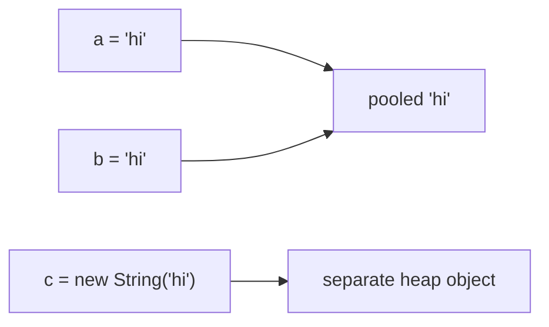

A `String` is a sequence of characters and the most-used type in Java. It is a **reference type**, but Java gives it special syntax (literals and `+`) that makes it feel built-in.

## Strings are immutable

Once created, a `String`'s contents **never change**. Every method that seems to modify a string actually returns a **new** one:

```java
String s = "hello";
s.toUpperCase();         // returns "HELLO" — but the result is thrown away
System.out.println(s);   // still "hello"
s = s.toUpperCase();     // reassign to keep the new string
```

Immutability buys thread-safety, safe use as `HashMap` keys (the hash can be cached), and security. The cost: careless concatenation creates garbage (see below).

## The string pool and intern()

String **literals** are **interned** — the JVM keeps one shared copy in a special area called the **string pool**, so two identical literals are the *same object*. A string built with `new` always creates a *distinct* object on the heap.

```java
String a = "hi";
String b = "hi";
String c = new String("hi");

a == b;         // true  — same pooled object
a == c;         // false — c is a separate heap object
a == c.intern();// true  — intern() returns the pooled copy
```



## == vs .equals()

This is the #1 beginner trap. `==` compares **references** (are these the same object?); `.equals()` compares **contents** (do they hold the same characters?).

```java
String x = new String("java");
String y = new String("java");
System.out.println(x == y);      // false — two distinct objects
System.out.println(x.equals(y)); // true  — same characters
```

:::gotcha
**Always** compare string contents with `.equals()`. Relying on `==` may *appear* to work for literals (thanks to pooling) and then break the moment a string comes from user input, a file, or `new`. Bonus: write `"admin".equals(role)` rather than `role.equals("admin")` so a `null` `role` returns `false` instead of throwing `NullPointerException`.
:::

## Common methods

| Method | Returns |
|--------|---------|
| `length()` | number of chars |
| `charAt(i)` | the char at index `i` |
| `substring(a, b)` | chars in range `[a, b)` |
| `indexOf("x")` | first index, or `-1` if absent |
| `toUpperCase()` / `toLowerCase()` | recased copy |
| `trim()` / `strip()` | whitespace removed (`strip` is Unicode-aware) |
| `replace(a, b)` | copy with replacements |
| `split(regex)` | a `String[]` |
| `contains` / `startsWith` / `endsWith` | `boolean` |
| `isEmpty()` / `isBlank()` | length 0 / only whitespace |

```java
"  Hello, World ".strip(); // "Hello, World"
"a,b,c".split(",");        // ["a", "b", "c"]
"banana".indexOf("na");    // 2
```

:::note
A Java `char` is a 16-bit UTF-16 code unit, so characters outside the Basic Multilingual Plane (many emoji, some CJK) occupy **two** chars — `"😀".length()` is `2`. Use `codePointCount` / `codePoints()` when you need true character counts.
:::

## Concatenation: + vs StringBuilder

A single `a + b` is fine — the compiler optimizes it. But concatenating **in a loop** is a performance trap: every `+` builds a brand-new string, copying everything accumulated so far.

```java
// O(n²): allocates and discards a new String every iteration
String csv = "";
for (String s : items) csv += s + ",";

// O(n): one growable buffer, mutated in place
StringBuilder sb = new StringBuilder();
for (String s : items) sb.append(s).append(',');
String csv2 = sb.toString();
```

:::senior
`StringBuilder` is mutable and **not** thread-safe (use the slower `StringBuffer` only if you genuinely share it across threads — rare). For a *fixed* number of pieces, prefer the readable options: `String.join(",", list)`, plain `"a" + "b"`, or `String.format`. Reach for `StringBuilder` specifically for loops and conditional assembly.
:::

## Text blocks (Java 15+)

A **text block** is a multi-line string literal delimited by `"""`. No more `\n` soup or `+` ladders:

```java
String json = """
    {
        "name": "Ada",
        "active": true
    }
    """;
```

The compiler strips the common leading indentation (measured from the least-indented content line and the closing `"""`), so the text lines up in your editor without leading spaces leaking into the value.

## Formatting

`String.format` builds a string from a template; the instance method `formatted` does the same on an existing string:

```java
String msg  = String.format("%s scored %d (%.1f%%)", name, 87, 87.0);
String same = "%s = %d".formatted("x", 42);
```

Common specifiers: `%s` (any value), `%d` (integer), `%f` (float, `%.2f` for 2 decimals), `%n` (platform newline), `%%` (a literal percent).

## Check your understanding

A few `==` vs `.equals()` and string-pool traps.

```quiz
title: == vs .equals() and the pool
questions:
  - q: 'What does this print? `String a = "hi", b = "hi"; System.out.println(a == b);`'
    options:
      - text: 'true'
        correct: true
      - 'false'
      - 'compile error'
    explain: 'Both are string **literals**, so they share one pooled object — `==` is `true`. Even so, prefer `.equals()`; this only works thanks to pooling.'
  - q: 'And this? `String a = "hi"; String c = new String("hi"); System.out.println(a == c);`'
    options:
      - 'true'
      - text: 'false'
        correct: true
      - 'compile error'
    explain: '`new String(...)` always builds a **distinct** heap object, so `==` (a reference comparison) is `false`. `a.equals(c)` would be `true`.'
  - q: 'Which expression compares `role` to `"admin"` **without** risking a `NullPointerException` when `role` is `null`?'
    options:
      - '`role == "admin"`'
      - '`role.equals("admin")`'
      - text: '`"admin".equals(role)`'
        correct: true
      - '`role.intern() == "admin"`'
    explain: 'Calling `.equals()` on the non-null literal — `"admin".equals(role)` — returns `false` for a `null` `role` instead of throwing. `role.equals(...)` throws on `null`, and `==` compares references.'
```

## Flashcards — common String methods

Flip each card to recall what these everyday methods return.

```flashcards
title: String methods
cards:
  - front: '`"hello".charAt(1)`'
    back: 'The character at index `1` (indexing is 0-based): `e`.'
  - front: '`"hello".substring(1, 3)`'
    back: '`"el"` — characters in the range `[1, 3)`; the end index is **exclusive**.'
  - front: '`"hello".indexOf("l")`'
    back: '`2` — the index of the first match, or `-1` if the substring is absent.'
  - front: '`"  hi  ".strip()`'
    back: '`"hi"` — leading and trailing whitespace removed. `strip()` is Unicode-aware; `trim()` is the older ASCII-only version.'
  - front: '`"a,b,c".split(",")`'
    back: 'A `String[]`: `["a", "b", "c"]` — split on the given regex.'
  - front: '`"hello".replace("l", "L")`'
    back: '`"heLLo"` — a **new** string with every match replaced (Strings are immutable).'
```

:::key
- Strings are **immutable** — methods return *new* strings.
- Literals are **pooled**, but always compare with `.equals()`, never `==`.
- Use `StringBuilder` for concatenation in loops; `+` or `String.join` otherwise.
- Text blocks (`"""`) give clean multi-line literals with auto-stripped indentation.
- `String.format` / `formatted` build strings from `%s`, `%d`, `%.2f`, … templates.
:::
