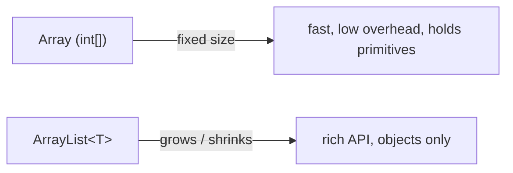

An **array** is a fixed-size, indexed container holding elements of a **single type**. It's the most primitive collection in Java — fast and compact — but its length is locked at creation.

## Declaration and initialization

```java
int[] a = new int[5];                           // 5 ints, all 0
int[] b = {10, 20, 30};                          // literal — length inferred as 3
String[] names = new String[]{"Ada", "Linus"};  // explicit form
```

Put the brackets after the **type**, not the variable: `int[] a` is idiomatic (`int a[]` compiles but is discouraged). Indices run from `0` to `length - 1`.

:::gotcha
Reading or writing outside the bounds throws `ArrayIndexOutOfBoundsException` at runtime — there is no silent buffer overrun like in C. The valid range is always `0 .. length-1`, so `a[a.length]` is *always* out of bounds.
:::

## Default values

`new` zero-initializes every element, so a fresh array is never "garbage":

| Element type | Default |
|--------------|---------|
| numeric (`int`, `double`, …) | `0` / `0.0` |
| `boolean` | `false` |
| `char` | `'\u0000'` (the null character) |
| reference (`String`, objects) | `null` |

## length and iteration

Arrays expose a `length` **field** (not a method — no parentheses):

```java
int[] xs = {4, 8, 15, 16};
for (int i = 0; i < xs.length; i++) System.out.println(xs[i]); // index form
for (int x : xs) System.out.println(x);                        // for-each form
```

Use the indexed `for` when you need the position or want to assign elements; the for-each form is cleaner for read-only traversal.

## Multidimensional and jagged arrays

A "2-D array" is really an **array of arrays**:

```java
int[][] grid = new int[2][3];   // 2 rows × 3 columns, all 0
int[][] table = {
    {1, 2, 3},
    {4, 5, 6}
};
System.out.println(table[1][2]); // 6
```

Because each row is an independent array, rows can have **different lengths** — a *jagged* array:

```java
int[][] jagged = new int[3][];   // 3 rows, each still null
jagged[0] = new int[]{1};
jagged[1] = new int[]{1, 2};
jagged[2] = new int[]{1, 2, 3};
```

## The Arrays utility class

`java.util.Arrays` supplies the operations arrays lack as built-in methods:

| Call | Does |
|------|------|
| `Arrays.sort(a)` | sorts in place |
| `Arrays.fill(a, v)` | sets every element to `v` |
| `Arrays.copyOf(a, n)` | resized copy (pads with defaults or truncates) |
| `Arrays.equals(a, b)` | element-by-element comparison |
| `Arrays.toString(a)` | readable `[1, 2, 3]` string |
| `Arrays.binarySearch(a, k)` | index of `k` — array must be **sorted** |

```java
int[] a = {5, 3, 1, 4, 2};
Arrays.sort(a);                         // {1, 2, 3, 4, 5}
System.out.println(Arrays.toString(a)); // [1, 2, 3, 4, 5]
int i = Arrays.binarySearch(a, 4);      // 3
```

:::gotcha
Printing an array directly gives gibberish like `[I@1b6d3586` (the type signature + hash), because arrays don't override `toString()`. Use `Arrays.toString(a)` — and `Arrays.deepToString(grid)` for nested arrays. Likewise use `Arrays.equals(a, b)`, never `==`, to compare contents.
:::

## Varargs

A method can accept a variable number of arguments with `...`. Inside the method, the parameter simply **is an array**:

```java
static int sum(int... nums) {        // nums is an int[]
    int total = 0;
    for (int n : nums) total += n;
    return total;
}
sum(1, 2, 3);          // 6
sum();                 // 0 — zero arguments is allowed
sum(new int[]{1, 2});  // you can also pass an array directly
```

The varargs parameter must be **last** in the parameter list, and a method may declare only one.

## Array vs ArrayList



| | Array | `ArrayList` |
|--|-------|-------------|
| Size | fixed at creation | dynamic |
| Holds primitives | yes (`int[]`) | no — boxed (`Integer`) |
| Get size | `length` field | `size()` method |
| Access | `a[i]` | `list.get(i)` |
| Add / remove | manual copy | `add` / `remove` |

:::senior
Prefer `List<T>` (e.g. `ArrayList`) for almost all application code — it resizes, has a rich API, and plays well with streams and generics. Reach for raw arrays when you need primitive storage without boxing overhead, a fixed buffer in hot code, or to interface with APIs that demand them (`String[] args`, `byte[]` I/O).
:::

```quiz
title: Check yourself
questions:
  - q: 'What happens with `int[][] j = new int[3][]; j[0][0] = 1;`?'
    options:
      - 'It works — rows default to length 0'
      - text: '`NullPointerException` — the three rows are `null` until you assign arrays to them'
        correct: true
      - 'Compile error — jagged arrays need explicit row sizes'
    explain: '`new int[3][]` allocates only the outer array; each row is a reference defaulting to `null`. You must do `j[0] = new int[5];` before touching `j[0][0]`.'
  - q: 'What does `System.out.println(new int[]{1, 2, 3});` print?'
    options:
      - '`[1, 2, 3]`'
      - text: 'Something like `[I@1b6d3586` — type signature plus hash'
        correct: true
      - '`{1, 2, 3}`'
    explain: 'Arrays don''t override `toString()`, so you get `Object`''s default. Use `Arrays.toString(a)` — and `Arrays.deepToString` for nested arrays.'
  - q: 'You call `Arrays.binarySearch(a, key)` on an **unsorted** array. What do you get?'
    options:
      - 'It sorts a copy first, then searches — always correct'
      - '`-1` whenever the key exists but is out of place'
      - text: 'An undefined result — binary search''s contract requires a sorted array'
        correct: true
    explain: 'Binary search halves the range assuming order; on unsorted data the result is unspecified (it may "find" nothing that exists, or return a wrong index). Sort first, or use a linear scan.'
  - q: 'Which expression gets an array''s element count?'
    options:
      - '`a.length()`'
      - text: '`a.length`'
        correct: true
      - '`a.size()`'
    explain: '`length` is a **field** on arrays (no parentheses). `length()` is a method on `String`; `size()` is a method on collections. Mixing these up is a classic compile-error trio.'
```

:::key
- Arrays are **fixed-size**, single-type, and zero-indexed; `length` is a *field*, not a method.
- `new` fills elements with defaults (`0`, `false`, `'\u0000'`, `null`).
- A 2-D array is an array of arrays, so rows may be **jagged**.
- Use `Arrays.toString` / `equals` / `sort` / `copyOf` / `binarySearch` — never `==` or a bare `println` on an array.
- Varargs (`int...`) is just an array parameter, and it must come last.
- Prefer `ArrayList` / `List` unless you specifically need a primitive or fixed array.
:::
