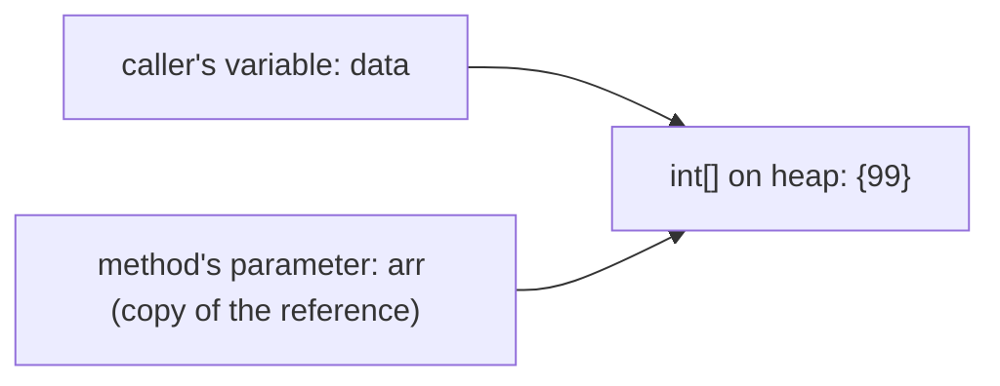
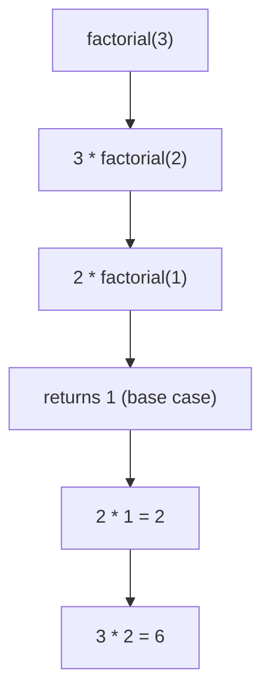

A **method** is a named, reusable block of code that takes inputs (**parameters**), runs statements, and optionally returns a value. Methods are how you decompose a program into small, testable pieces.

## Declaration

```java
//  modifiers   return-type  name(parameters)
    public static int add(int x, int y) {
        return x + y;   // 'return' hands a value back and exits the method
    }
```

A `void` method returns nothing. The **parameters** are the variables in the signature; the **arguments** are the actual values supplied at the call site.

## Overloading

Several methods can share a **name** as long as their **parameter lists** differ (in number, types, or order). The compiler chooses the match at **compile time** from the argument types:

```java
static int    max(int a, int b)        { return a > b ? a : b; }
static double max(double a, double b)   { return a > b ? a : b; }
static int    max(int a, int b, int c)  { return max(max(a, b), c); }
```

:::gotcha
The **return type alone** cannot distinguish overloads. Two methods that differ only in return type (`int f()` vs `double f()`) won't compile — from a call like `f();` the compiler couldn't tell which you meant.
:::

## Pass-by-value — the whole truth

Java is **always pass-by-value**: a method receives a **copy** of each argument. The subtlety is *what* gets copied.

- For a **primitive**, the value itself is copied. Changing the parameter never affects the caller.
- For an **object**, the **reference** (the pointer) is copied. The original and the copy point at the *same object*, so you can **mutate** that object through either — but **reassigning** the parameter only repoints the local copy.

```java
static void tryChange(int n, int[] arr) {
    n = 99;             // changes the local copy only
    arr[0] = 99;        // mutates the shared array — caller SEES this
    arr = new int[]{0}; // repoints local copy only — caller does NOT see this
}

int x = 1;
int[] data = {1};
tryChange(x, data);
// x    == 1      (primitive copy left the original untouched)
// data == {99}   (the object was mutated, but the reassignment was not seen)
```



:::senior
"Java is pass-by-reference for objects" is a persistent myth. It is pass-by-value *of a reference*. The proof: a method can neither swap two of the caller's variables nor null out the caller's reference. If it could, Java would be pass-by-reference — it can't, so it isn't.
:::

## Varargs

`type... name` lets a method take any number of arguments (it's an array inside the method):

```java
static String join(String sep, String... parts) {
    return String.join(sep, parts);
}
join("-", "a", "b", "c"); // "a-b-c"
```

The varargs parameter must be last, and a method may have only one.

## Recursion

A **recursive** method calls itself, shrinking the problem until it reaches a **base case** that stops the recursion. Each call gets its own **stack frame** with its own parameters:

```java
static long factorial(int n) {
    if (n <= 1) return 1;        // base case
    return n * factorial(n - 1); // recursive case
}
```



:::gotcha
Omit the base case (or fail to progress toward it) and the call stack grows until you hit a `StackOverflowError`. Java performs **no** tail-call optimization, so very deep recursion is risky — prefer a loop when the depth could be large.
:::

## Scope

A variable exists only within the **block** (`{ }`) where it is declared. Parameters are scoped to their method; a loop variable to its loop:

```java
void f() {
    int outer = 1;
    if (outer == 1) {
        int inner = 2;   // visible only inside this if-block
    }
    // 'inner' is not visible here — compile error if referenced
}
```

## Static vs instance methods

| | `static` method | instance method |
|--|-----------------|-----------------|
| Belongs to | the **class** | an **object** |
| Called via | `ClassName.method()` | `object.method()` |
| Has access to `this` | no | yes |
| Can see instance fields | no (class state only) | yes |

```java
class Counter {
    int count = 0;                              // instance field
    void increment() { count++; }               // instance method — needs an object
    static int square(int n) { return n * n; }  // static — no object needed
}

Counter.square(4);     // 16 — no instance required
Counter c = new Counter();
c.increment();         // needs the object 'c'
```

:::tip
Make a method `static` when it neither reads nor writes instance state — it's then a pure function of its arguments. Utility helpers like `Math.max` and `Integer.parseInt` are static for exactly this reason: clearer intent and no object to construct.
:::

## Check your understanding

Three variations on the same call — they expose what pass-by-value really copies.

```quiz
title: Pass-by-value
questions:
  - q: 'What does this print? `static void f(int n) { n = 99; }` called as `int x = 1; f(x); System.out.println(x);`'
    options:
      - '99'
      - text: '1'
        correct: true
      - '0'
      - 'compile error'
    explain: 'Java copies the **primitive** value, so reassigning `n` changes only the local copy — the caller still sees `x` as `1`.'
  - q: 'What does this print? `static void f(int[] a) { a[0] = 99; }` called as `int[] data = {1}; f(data); System.out.println(data[0]);`'
    options:
      - text: '99'
        correct: true
      - '1'
      - '0'
      - 'compile error'
    explain: 'The reference is copied, but both copies point at the **same** array. Mutating `a[0]` changes the shared object, so the caller sees `99`.'
  - q: 'And this? `static void f(int[] a) { a = new int[]{99}; }` called as `int[] data = {1}; f(data); System.out.println(data[0]);`'
    options:
      - '99'
      - text: '1'
        correct: true
      - '0'
      - 'compile error'
    explain: 'Reassigning the parameter `a` repoints only the **local** copy of the reference; the caller still sees the original array, so `data[0]` is `1`. This is exactly why Java is pass-by-value, not pass-by-reference.'
```

## Watch the call stack

Step through `factorial(4)` to watch frames stack up and then unwind. Each box is the `n` value of one stack frame; the highlighted box is the active (top) frame.

```walkthrough
title: factorial(4) — the recursion call stack
code: |
  static long factorial(int n) {
      if (n <= 1) return 1;        // base case
      return n * factorial(n - 1); // recursive case
  }
steps:
  - text: 'Call `factorial(4)`. Its frame holds `n = 4`. Since `4 > 1`, it must compute `4 * factorial(3)`, so it pauses and recurses.'
    array: [4]
    highlight: [0]
    pointers: { 0: 'top' }
    line: 3
  - text: '`factorial(3)` is pushed on top. `3 > 1`, so it needs `3 * factorial(2)` and pauses too.'
    array: [4, 3]
    highlight: [1]
    pointers: { 1: 'top' }
    line: 3
  - text: '`factorial(2)` is pushed. `2 > 1`, so it needs `2 * factorial(1)` and pauses.'
    array: [4, 3, 2]
    highlight: [2]
    pointers: { 2: 'top' }
    line: 3
  - text: '`factorial(1)` is pushed. Now `n <= 1`, so the **base case** returns `1` immediately — no further recursion.'
    array: [4, 3, 2, 1]
    highlight: [3]
    pointers: { 3: 'top' }
    line: 2
  - text: 'Unwinding begins. With `factorial(1) = 1`, the `factorial(2)` frame computes `2 * 1 = 2`, returns, and pops.'
    array: [4, 3, 2]
    highlight: [2]
    sorted: [2]
    pointers: { 2: 'returns 2' }
    line: 3
  - text: '`factorial(3)` resumes: `3 * 2 = 6`, returns, and its frame pops.'
    array: [4, 3]
    highlight: [1]
    sorted: [1]
    pointers: { 1: 'returns 6' }
    line: 3
  - text: '`factorial(4)` resumes: `4 * 6 = 24`, returns. The stack is empty — the final answer is **24**.'
    array: [4]
    highlight: [0]
    sorted: [0]
    pointers: { 0: 'returns 24' }
    line: 3
```

:::key
- Java is **pass-by-value** always; for objects the *reference* is copied, so you can mutate the object but not reassign the caller's variable.
- **Overloading** = same name, different parameter list; return type alone can't distinguish.
- Recursion needs a **base case** and progress toward it, or you get a `StackOverflowError`.
- Variables are scoped to their enclosing `{ }` block.
- `static` methods belong to the class (no `this`); instance methods act on an object.
:::
