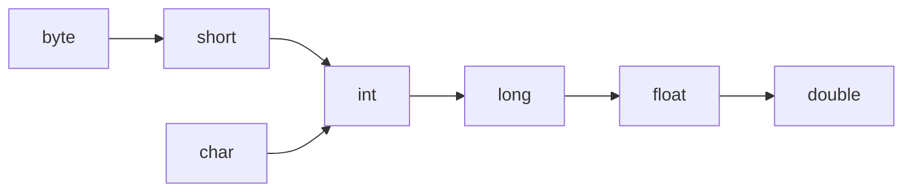

A **conversion** changes a value from one type to another. Java performs some conversions **automatically** (when they're always safe) and requires an explicit **cast** for the rest (when information could be lost).

## Widening vs narrowing

**Widening** moves to a type that can hold every possible value of the source — it's automatic and lossless. **Narrowing** moves to a smaller type and *can* lose data, so you must request it with a cast `(type)`.



```java
int i = 100;
double d = i;        // widening — implicit, always safe
double pi = 3.99;
int n = (int) pi;    // narrowing — explicit cast required; n == 3
```

| Direction | Example | Cast needed? |
|-----------|---------|--------------|
| Widening | `int → long → double` | no (implicit) |
| Narrowing | `double → int`, `long → int`, `int → byte` | yes (explicit) |

:::gotcha
Casting `double` to `int` **truncates** toward zero — it does *not* round. `(int) 3.99` is `3`, and `(int) -3.99` is `-3`. Use `Math.round()` when you actually want rounding.
:::

## Overflow and truncation

A narrowing cast simply **keeps the low-order bits** and discards the rest, which can flip the value entirely:

```java
int big = 300;
byte b = (byte) big;     // 300 doesn't fit in a byte (-128..127) → 44
long l = 10_000_000_000L;
int x = (int) l;         // overflows the int range → 1410065408
```

Arithmetic that *stays* within `int`/`long` can also overflow silently — it wraps around with no exception:

```java
int max = Integer.MAX_VALUE; // 2_147_483_647
System.out.println(max + 1); // -2147483648 — wraps to MIN_VALUE
```

:::senior
Use `Math.addExact`, `Math.multiplyExact`, etc. when a silent overflow would be a correctness bug (money, sizes, IDs) — they throw `ArithmeticException` instead of wrapping. For values that genuinely exceed `long`, switch to `BigInteger` / `BigDecimal`.
:::

## Numeric promotion in expressions

In arithmetic, operands smaller than `int` are **promoted to `int`** before the operation. If any operand is `long`, `float`, or `double`, everything is promoted to the widest of them, and that's the result type.

```java
byte a = 10, b = 20;
// byte sum = a + b;     // ❌ a + b is an int, can't auto-narrow to byte
int sum = a + b;         // OK
double avg = 5 / 2;      // 2.0! — 5/2 is int division (2), THEN widened
double ok  = 5 / 2.0;    // 2.5 — a double operand promotes the whole expression
```

:::gotcha
`5 / 2` is computed in `int` (giving `2`) **before** any assignment to a `double`, so the widening happens too late. Make one operand a `double` (`5.0 / 2`) or cast one (`(double) 5 / 2`) to get `2.5`.
:::

## Autoboxing, unboxing, and the Integer cache

**Autoboxing** wraps a primitive in its object type (`int` → `Integer`); **unboxing** does the reverse. The compiler inserts these automatically:

```java
Integer boxed = 42;   // autobox → Integer.valueOf(42)
int prim = boxed;     // unbox  → boxed.intValue()
```

To save memory, `Integer.valueOf` **caches** small values in the range **−128 to 127** and returns the *same object* for them. That makes `==` (reference comparison) behave inconsistently:

```java
Integer a = 100, b = 100;
System.out.println(a == b);      // true  — cached, same object
Integer c = 200, d = 200;
System.out.println(c == d);      // false — outside the cache, new objects
System.out.println(c.equals(d)); // true  — always compare values with equals
```

:::gotcha
Unboxing a `null` wrapper throws `NullPointerException`:
```java
Integer maybe = null;
int n = maybe;   // 💥 NPE — there's no int value to unbox
```
And never compare wrappers with `==`; use `.equals()` (or unbox explicitly).
:::

## Parsing strings to numbers

Text from files, input, or the network arrives as a `String`. Convert it explicitly:

```java
int i      = Integer.parseInt("42");      // primitive int
Integer wi = Integer.valueOf("42");        // Integer wrapper (may be cached)
double d   = Double.parseDouble("3.14");
long l     = Long.parseLong("100");
```

`parseXxx` returns the **primitive**; `valueOf` returns the **wrapper**. Bad input throws `NumberFormatException`, so validate the text or catch it.

## instanceof and casting references

For reference types, test the runtime type with `instanceof` before casting *down* to a subtype. **Pattern matching for `instanceof`** (standard since Java 16) tests and binds the cast result in one step:

```java
Object o = "hello";
if (o instanceof String s) {        // tests AND casts into 's'
    System.out.println(s.length()); // use s directly — no separate cast
}
```

Without the pattern you write the older two-step form, which risks a `ClassCastException` if you cast a type that doesn't actually match:

```java
if (o instanceof String) {
    String s = (String) o;   // classic form
}
```

```quiz
title: Check yourself
questions:
  - q: 'What does `byte b = (byte) 300;` store in `b`?'
    options:
      - '`127` — the cast clamps to the max byte value'
      - text: '`44` — the cast keeps only the low 8 bits'
        correct: true
      - 'Nothing — it throws `ArithmeticException`'
    explain: 'Narrowing never clamps or throws: 300 is `100101100` in binary; keeping the low 8 bits (`00101100`) gives 44. Silent bit truncation is the whole danger of narrowing casts.'
  - q: 'Which prints `true`?'
    options:
      - '`Integer a = 200, b = 200; System.out.println(a == b);`'
      - text: '`Integer a = 100, b = 100; System.out.println(a == b);`'
        correct: true
      - 'Both — autoboxed equal values are always the same object'
    explain: '`Integer.valueOf` caches −128..127, so two boxed 100s are the *same object* and `==` happens to work; boxed 200s are distinct objects. That inconsistency is why you must always use `.equals()` on wrappers.'
  - q: 'What does `double avg = 7 / 2;` assign to `avg`?'
    options:
      - '`3.5`'
      - text: '`3.0` — integer division happens first, then the result widens'
        correct: true
      - 'Compile error — you must cast explicitly'
    explain: 'The expression `7 / 2` is evaluated in `int` arithmetic (→ `3`) *before* the assignment widens it to `double`. Write `7 / 2.0` or `(double) 7 / 2` to get `3.5`.'
  - q: '`Integer count = null; int n = count;` — what happens?'
    options:
      - '`n` becomes `0`, the default int value'
      - 'Compile error — you cannot assign a wrapper to a primitive'
      - text: '`NullPointerException` at runtime — unboxing calls `count.intValue()` on null'
        correct: true
    explain: 'Unboxing compiles to `count.intValue()`. On a null reference that call NPEs — a favourite production bug when a nullable DB column is mapped to a primitive field.'
```

:::key
- **Widening** is implicit and safe; **narrowing** needs an explicit `(cast)` and may lose data.
- Narrowing and overflow keep the low bits and wrap silently — use `Math.*Exact` when that matters.
- Sub-`int` operands promote to `int`; mixed expressions promote to the widest type — watch `5/2` vs `5/2.0`.
- `Integer` caches −128..127, so `==` on wrappers is unreliable — always use `.equals()`.
- `parseInt` → primitive, `valueOf` → wrapper; invalid text throws `NumberFormatException`.
- Prefer pattern-matching `instanceof` to combine the type test and the cast.
:::
