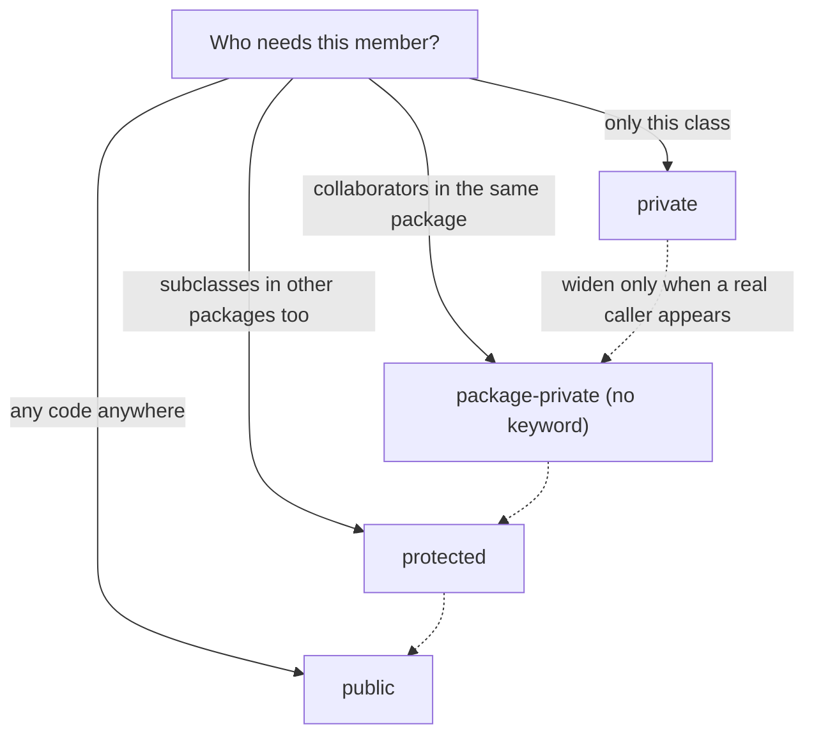

**Encapsulation** means bundling data with the methods that operate on it, and **hiding the internal representation** behind a controlled public interface. Think of a vending machine: you press buttons (the public API), but you can't reach inside and grab the coins (the private state). This lets the class **guarantee its own invariants** — rules that must always hold true.

## Why encapsulate?

```java
class BankAccount {
    public double balance; // ❌ anyone can do account.balance = -1000;
}
```

With a public field, *any* code can corrupt the object. By making state `private` and exposing methods, the class stays in control:

```java
class BankAccount {
    private double balance;

    public void deposit(double amount) {
        if (amount <= 0) throw new IllegalArgumentException("must be positive");
        balance += amount;
    }
    public double getBalance() { return balance; }
}
```

Now the balance can *never* be negative through invalid input, and you can later add logging, validation, or change the internal type without touching callers.

## The four access modifiers

Java has four access levels, controlling who can see a member:

| Modifier | Same class | Same package | Subclass (other package) | Everywhere |
|----------|:----------:|:------------:|:------------------------:|:----------:|
| `private` | ✅ | ❌ | ❌ | ❌ |
| *(default / package-private)* | ✅ | ✅ | ❌ | ❌ |
| `protected` | ✅ | ✅ | ✅ | ❌ |
| `public` | ✅ | ✅ | ✅ | ✅ |

"Default" means **no keyword at all** — visibility limited to the same package.

Choosing a modifier is a decision, not a habit — walk the narrowest path that satisfies the real callers:



```java
public class Widget {
    private int secret;      // only this class
    int packageScoped;       // any class in the same package
    protected int forHeirs;  // package + subclasses
    public int forEveryone;  // unrestricted
}
```

:::tip
Apply the **principle of least privilege**: start with `private` and widen access only when a real need appears. The smaller your public surface, the freer you are to refactor internals later.
:::

## Getters and setters

Accessor methods are the standard way to expose state in a controlled fashion. A **getter** returns a value; a **setter** validates and updates it.

```java
public String getName()            { return name; }
public void setName(String name) {
    this.name = Objects.requireNonNull(name, "name");
}
```

:::gotcha
Getters and setters are *not* automatically good encapsulation. A `setX`/`getX` pair that blindly mirrors a public field adds ceremony without protection. The value of an accessor is the **logic** it can enforce (validation, lazy loading, defensive copying) — not the method itself.
:::

## Defensive copies

Returning or storing a reference to a mutable object silently breaks encapsulation, because the caller can mutate your internal state from the outside:

```java
class Team {
    private final List<String> members;
    Team(List<String> members) {
        this.members = new ArrayList<>(members); // copy IN
    }
    List<String> getMembers() {
        return List.copyOf(members);             // copy OUT (unmodifiable)
    }
}
```

## Building immutable classes

An **immutable** object can never change after construction — like `String` or `Integer`. Immutables are inherently thread-safe, can be freely shared and cached, and make great `Map` keys. The recipe:

1. Make the class `final` (so it can't be subclassed and weakened).
2. Make every field `private final`.
3. Provide **no** setters.
4. Initialise all fields in the constructor.
5. Defensively **copy** any mutable input and never leak internal references.

```java
public final class Money {
    private final long cents;
    private final String currency;

    public Money(long cents, String currency) {
        this.cents = cents;
        this.currency = Objects.requireNonNull(currency);
    }
    public long cents()      { return cents; }
    public String currency() { return currency; }

    // "mutators" return NEW objects instead of changing this one
    public Money plus(Money other) {
        return new Money(this.cents + other.cents, currency);
    }
}
```

:::senior
Immutability is the default that scales. Mutable shared state is the root of most concurrency bugs; immutable objects eliminate the entire class of problem because there is nothing to synchronize. In modern Java, `record` (covered later) gives you a correct immutable class in a single line — but knowing the manual recipe explains exactly what a record generates.
:::

```quiz
title: Check yourself
questions:
  - q: 'A field has **no** access modifier. Who can read it?'
    options:
      - 'Only the declaring class'
      - text: 'Any class in the same package — but not subclasses in other packages'
        correct: true
      - 'Subclasses anywhere, like `protected`'
    explain: 'No keyword = package-private. It is *stricter* than `protected` for cross-package subclasses: `protected` adds subclass access on top of package access, package-private does not.'
  - q: 'Your immutable class stores a `List<String>` passed to the constructor without copying it. What is the risk?'
    options:
      - 'None — the field is `private final`, so it cannot change'
      - text: 'The caller still holds the same list and can mutate your "immutable" state from outside'
        correct: true
      - 'The list will be garbage-collected while you still use it'
    explain: '`final` only fixes the *reference*, not the contents. Without a defensive copy in (`new ArrayList<>(input)`) and an unmodifiable view out (`List.copyOf`), your invariants live at the mercy of every caller.'
  - q: 'Why does the immutability recipe say to make the class `final`?'
    options:
      - '`final` classes are stored in a faster memory region'
      - text: 'A subclass could add mutable state or override accessors, breaking the immutability guarantee for code that handles the supertype'
        correct: true
      - 'Only `final` classes may have `final` fields'
    explain: 'If `Money` is extendable, `EvilMoney extends Money` can add a mutable field or override behaviour, and any code accepting `Money` can receive one. Sealing the class closes that hole (records get this for free — they are implicitly final).'
```

:::key
Encapsulation = hide state (`private`) + expose a controlled API. The four access levels, from most to least restrictive, are `private` → default → `protected` → `public`. Use accessors to *enforce invariants*, defensively copy mutable data crossing the boundary, and prefer immutable classes for safety and simplicity.
:::
