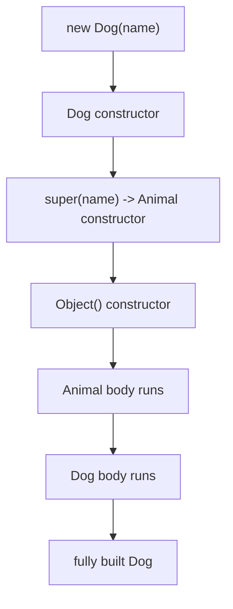

**Inheritance** lets one class acquire the fields and methods of another, then add or refine behaviour. The child is a **subclass**; the parent is a **superclass**. It models an **"is-a"** relationship: a `Dog` *is an* `Animal`, so `Dog` can reuse everything `Animal` already provides.

```java
class Animal {
    protected String name;
    Animal(String name) { this.name = name; }
    void eat() { System.out.println(name + " eats"); }
}

class Dog extends Animal {     // Dog inherits name + eat()
    Dog(String name) { super(name); }
    void bark() { System.out.println(name + " barks"); }
}

Dog d = new Dog("Rex");
d.eat();   // inherited from Animal
d.bark();  // defined in Dog
```

## `super` and constructor chaining

A subclass constructor **must** initialise its superclass first. The call `super(...)` invokes a superclass constructor and **must be the first statement**. If you omit it, the compiler inserts an implicit `super()` — which fails to compile if the parent has no no-arg constructor.



Construction flows **up** to the root, then bodies execute **down**. `super` also accesses a hidden/overridden parent member: `super.eat()` calls the parent's version explicitly.

## `Object` — the universal root

Every class in Java implicitly extends `java.lang.Object`. Even a class with no `extends` clause is a direct subclass of `Object`, which is why *every* object has `toString()`, `equals()`, and `hashCode()` available. This single-root hierarchy is why a `List<Object>` can hold any reference type.

:::note
Java supports only **single inheritance** of classes — a class may `extends` exactly one superclass. Multiple inheritance of *type* is achieved through interfaces (covered later), avoiding the ambiguity that plagues languages allowing multiple class inheritance.
:::

## is-a vs has-a

Choosing the right relationship is a core design skill.

| Relationship | Mechanism | Question to ask | Example |
|--------------|-----------|-----------------|---------|
| **is-a** | inheritance (`extends`) | "Is a B truly a kind of A?" | `SavingsAccount` is-a `Account` |
| **has-a** | composition (a field) | "Does B contain/use an A?" | `Car` has-a `Engine` |

A common mistake is using inheritance for code reuse when the is-a test fails. A `Stack` is *not* a kind of `Vector` even though it could reuse its array — that mis-modelling famously leaks methods (`add(int, e)`) that violate stack semantics.

## `final` classes and methods

`final` blocks extension:

- A `final` **class** cannot be subclassed (e.g. `String`, `Integer`). This guarantees behaviour and enables optimisations.
- A `final` **method** cannot be overridden, locking in critical logic.

```java
public final class Constants { /* nobody can extend me */ }

class Base { public final void critical() { /* can't be changed */ } }
```

## Composition over inheritance

Inheritance is tight coupling: a subclass depends on its parent's *implementation details*, and a parent change can silently break children (the **fragile base class** problem). **Composition** — building behaviour by holding other objects as fields and delegating to them — is usually more flexible.

```java
// Inheritance (rigid): InstrumentedSet IS-A HashSet
class InstrumentedSet<E> extends HashSet<E> { /* overrides break easily */ }

// Composition (flexible): wraps ANY Set and delegates
class InstrumentedSet<E> {
    private final Set<E> delegate;       // HAS-A Set
    private int addCount = 0;
    InstrumentedSet(Set<E> s) { this.delegate = s; }
    boolean add(E e) { addCount++; return delegate.add(e); }
}
```

:::senior
Joshua Bloch's *Effective Java* states the guideline bluntly: **"Favour composition over inheritance."** Inherit only when there's a genuine is-a relationship *and* the superclass was designed and documented for extension. Otherwise compose. Composition also sidesteps the single-inheritance limit — you can hold as many collaborators as you need.
:::

:::gotcha
Calling an **overridable method from a constructor** is dangerous: the subclass override runs *before* the subclass's own fields are initialised, so it sees `null`/zero defaults. Constructors should call only `private`, `static`, or `final` methods.
:::

## Check your understanding

Check the constructor-chaining order and the is-a vs has-a call.

```quiz
title: Inheritance & super
questions:
  - q: 'Using the `Animal`/`Dog` classes above, in what order does code run when `new Dog("Rex")` executes?'
    options:
      - '`Dog` body, then `Animal` body, then `Object`'
      - text: '`Object` constructor, then `Animal` body, then `Dog` body'
        correct: true
      - '`Animal` body, then `Object`, then `Dog` body'
      - 'only the `Dog` body'
    explain: '`super(...)` runs first, so construction chains **up** to `Object`; then the bodies execute **down**: `Object`, then `Animal`, then `Dog`.'
  - q: 'A subclass constructor never calls `super(...)` explicitly, and its superclass declares **only** a constructor that takes arguments (no no-arg constructor). What happens?'
    options:
      - 'The compiler inserts `super()` and it compiles fine'
      - text: 'Compile error — the implicit `super()` matches no constructor'
        correct: true
      - 'It compiles but skips the superclass constructor'
      - 'A `NullPointerException` at runtime'
    explain: 'The compiler inserts an implicit no-arg `super()`. With no matching no-arg superclass constructor, that call fails to compile.'
  - q: 'A `Car` needs an `Engine`. Which models the relationship correctly?'
    options:
      - 'is-a — `class Car extends Engine`'
      - text: 'has-a — an `Engine` field (composition)'
        correct: true
      - 'is-a — `class Car implements Engine`'
      - 'either is equally correct'
    explain: 'A `Car` is not a kind of `Engine`; it **has** one. Model it with composition (an `Engine` field), not inheritance.'
```

:::key
Inheritance (`extends`) models is-a and reuses a superclass; `super(...)` chains constructors and must come first. Every class descends from `Object`, and Java allows only single class inheritance. Use `final` to forbid extension. When in doubt, prefer **composition (has-a) over inheritance** for looser coupling and greater flexibility.
:::
