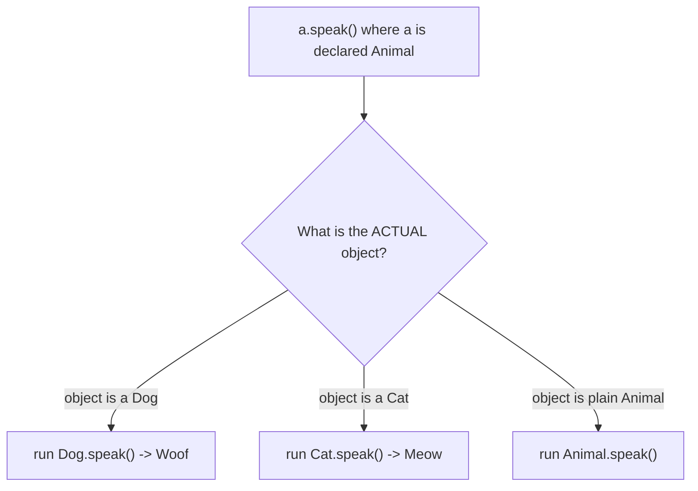

**Polymorphism** ("many forms") lets a single reference type behave differently depending on the actual object behind it. You program against a general type (`Animal`) and Java runs the *specific* object's version of a method (`Dog`'s) at runtime. This is what makes code extensible: add a new subclass and existing code uses it without modification.

```java
Animal a = new Dog("Rex");
a.speak();  // prints "Woof" — Dog's version runs, even though a is typed Animal
```

## Overriding vs overloading

These two are constantly confused — and a classic interview trap.

| | **Overriding** | **Overloading** |
|---|---|---|
| Where | subclass redefines a superclass method | same class, multiple methods, same name |
| Signature | **identical** (same name + params) | **different** parameter lists |
| Return type | same or **covariant** | may differ |
| Resolved | at **runtime** (dynamic) | at **compile time** (static) |
| Relationship | is-a (inheritance) | none required |

```java
class Calculator {
    int add(int a, int b)       { return a + b; }      // overload 1
    double add(double a, double b) { return a + b; }   // overload 2 (diff params)
}

class Animal { String speak() { return "..."; } }
class Dog extends Animal {
    @Override String speak() { return "Woof"; }        // override (same signature)
}
```

## `@Override` — let the compiler check you

The `@Override` annotation tells the compiler "I intend to override a superclass method." If your signature doesn't actually match one (a typo, a wrong parameter type), compilation **fails** instead of silently creating a new, never-called method. Always use it.

:::gotcha
Without `@Override`, `equals(MyClass o)` looks like an override of `Object.equals(Object o)` but is really an **overload** — `Object` never calls it, and collections silently use the default identity `equals`. The annotation catches this instantly.
:::

## Dynamic dispatch (runtime binding)

For overridden instance methods, the JVM selects the implementation based on the **runtime type of the object**, not the compile-time type of the reference. This is **dynamic (late) binding**, implemented via a per-class **virtual method table (vtable)**.



```java
List<Animal> zoo = List.of(new Dog("Rex"), new Cat("Mia"));
for (Animal animal : zoo) {
    System.out.println(animal.speak()); // Woof, then Meow — dispatched per object
}
```

:::note
**Static, private, and final methods**, plus **fields**, are *not* polymorphic — they use **static (compile-time) binding** based on the declared type. A field access like `a.name` reads `Animal`'s field even if the object is a `Dog` that shadows it.
:::

## Covariant return types

An override may **narrow** the return type to a subtype of the original. This lets callers avoid casts.

```java
class Animal { Animal reproduce() { return new Animal(); } }
class Dog extends Animal {
    @Override Dog reproduce() { return new Dog(); } // Dog is covariant with Animal
}
Dog puppy = new Dog().reproduce(); // no cast needed
```

## Upcasting and downcasting

- **Upcasting** — treating a subclass as its superclass. Always safe and implicit.
- **Downcasting** — treating a superclass reference as a subclass. Explicit, and checked at runtime.

```java
Animal a = new Dog("Rex");   // upcast — implicit, safe
Dog d = (Dog) a;             // downcast — explicit; throws ClassCastException if wrong
```

Guard downcasts with `instanceof`. Modern Java's **pattern matching for `instanceof`** (Java 16+) tests and binds in one step:

```java
if (a instanceof Dog dog) {  // checks AND binds 'dog' if true
    dog.bark();
}
```

:::senior
Reaching for `instanceof` + downcast is often a smell that you're re-implementing dispatch by hand. Prefer adding a polymorphic method to the type hierarchy so the JVM does the branching for you. Reserve explicit type checks for boundaries you don't own (deserialization, framework callbacks) or for sealed hierarchies handled by an exhaustive `switch`.
:::

## Check your understanding

Overriding vs overloading and dynamic dispatch — the classic traps.

```quiz
title: Overriding, overloading & dispatch
questions:
  - q: 'Given `class Animal { String speak() { return "..."; } }` and `class Dog extends Animal { @Override String speak() { return "Woof"; } }`, what does `Animal a = new Dog(); System.out.println(a.speak());` print?'
    options:
      - 'It prints `...`'
      - text: 'It prints `Woof`'
        correct: true
      - 'Compile error'
      - 'It prints `Animal`'
    explain: 'Overridden instance methods dispatch on the **runtime type** (`Dog`), not the declared type (`Animal`). That is dynamic dispatch.'
  - q: 'You write `public boolean equals(MyClass o)` — parameter type `MyClass`, not `Object` — and leave off `@Override`. What have you actually created?'
    options:
      - 'A correct override of `Object.equals`'
      - text: 'An overload — a new method the collections never call'
        correct: true
      - 'A compile error'
      - 'Identical behaviour to a proper override'
    explain: 'A different parameter type makes it an **overload**, not an override. `Object.equals(Object)` still uses identity, so `HashMap`/`HashSet` ignore your version. `@Override` would have flagged it.'
  - q: 'Which is resolved at compile time, and which at runtime?'
    options:
      - 'both at runtime'
      - text: 'overloading at compile time; overriding at runtime'
        correct: true
      - 'overriding at compile time; overloading at runtime'
      - 'both at compile time'
    explain: 'Overload selection uses the **static** argument types (compile time); the actual overridden method is chosen by the object at **runtime** (dynamic dispatch).'
```

:::key
Polymorphism = one reference type, many runtime behaviours. **Overriding** is runtime-resolved by the object's actual type (dynamic dispatch); **overloading** is compile-time-resolved by argument types. Use `@Override` to catch mistakes, exploit covariant returns to drop casts, and guard downcasts with pattern-matching `instanceof`.
:::
