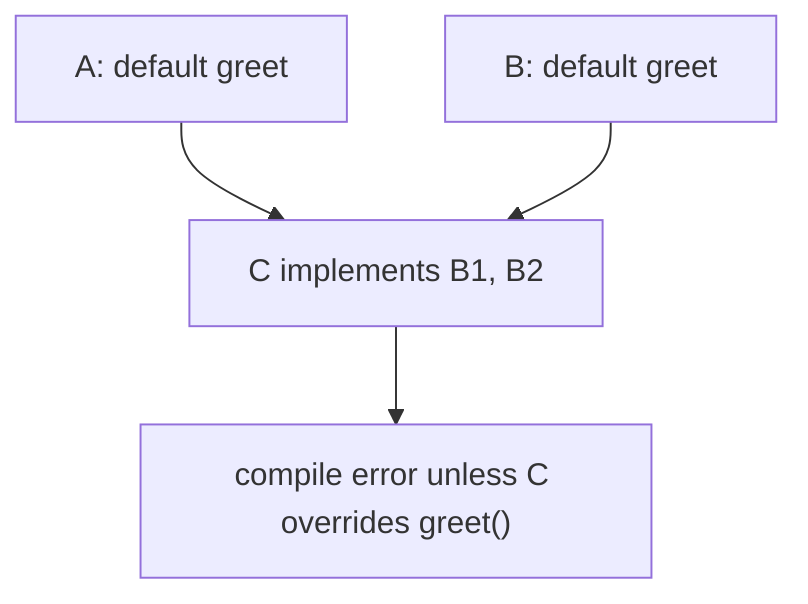

**Abstraction** means exposing *what* a type does while hiding *how*. Java gives you two tools for declaring a contract that subtypes must fulfil: **abstract classes** and **interfaces**.

## Abstract classes

An `abstract` class **cannot be instantiated** directly — it exists to be extended. It may mix concrete methods (shared implementation) with `abstract` methods (no body) that subclasses must implement.

```java
abstract class Shape {
    abstract double area();              // no body — subclasses must supply one

    void describe() {                    // concrete, inherited as-is
        System.out.println("Area = " + area());
    }
}

class Circle extends Shape {
    private final double r;
    Circle(double r) { this.r = r; }
    @Override double area() { return Math.PI * r * r; }
}
// new Shape(); // ❌ compile error — abstract
```

Use an abstract class when subtypes share **state** and **common code**, and there's a real is-a relationship.

## Interfaces

An **interface** is a pure contract: a set of method signatures a class promises to provide via `implements`. A class can implement **many** interfaces, which is how Java achieves multiple inheritance of *type*.

```java
interface Drawable { void draw(); }
interface Clickable { void onClick(); }

class Button implements Drawable, Clickable {
    @Override public void draw()    { /* ... */ }
    @Override public void onClick() { /* ... */ }
}
```

Interface methods are implicitly `public abstract`; fields are implicitly `public static final` constants.

## Default, static, and private interface methods

Since Java 8, interfaces can carry implementation:

- **`default` methods** provide a body, so you can add methods to an interface *without breaking* the thousands of classes already implementing it (this is how `List.sort` was retrofitted onto `List` and `Collection.stream()` onto `Collection`).
- **`static` methods** are utilities namespaced to the interface (`Comparator.naturalOrder()`).
- **`private` methods** (Java 9+) share code between default methods without exposing it.

```java
interface Greeter {
    String name();
    default String greet() { return prefix() + name(); } // default
    private String prefix() { return "Hello, "; }         // private helper
    static Greeter of(String n) { return () -> n; }        // static factory
}
```

## Functional interfaces

An interface with **exactly one abstract method** (a SAM type) is a **functional interface** and can be implemented by a **lambda** or method reference. Annotate it `@FunctionalInterface` so the compiler enforces the single-method rule.

```java
@FunctionalInterface
interface Transformer { int apply(int x); }

Transformer doubler = x -> x * 2;   // lambda implements the SAM
System.out.println(doubler.apply(21)); // 42
```

`java.util.function` ships ready-made ones: `Function`, `Predicate`, `Supplier`, `Consumer`.

## Interface vs abstract class

| Aspect | Interface | Abstract class |
|--------|-----------|----------------|
| Instance state (fields) | ❌ constants only | ✅ instance fields |
| Constructors | ❌ | ✅ |
| Multiple inheritance | ✅ implement many | ❌ extend one |
| Method bodies | `default`/`static`/`private` | any |
| Access modifiers on methods | `public` (effectively) | any |
| Models | a *capability* ("can-do") | a *kind-of* ("is-a") |

:::tip
Rule of thumb: reach for an **interface** by default — it's the more flexible, loosely coupled choice and keeps types open to multiple implementations. Use an **abstract class** only when subtypes must share mutable state or non-trivial constructor logic.
:::

## The diamond problem

If a class implements two interfaces that both provide a `default` method with the **same signature**, the compiler can't choose — and forces *you* to resolve it. You override the method and pick a winner with `Interface.super.method()`.



```java
interface A { default String greet() { return "A"; } }
interface B { default String greet() { return "B"; } }

class C implements A, B {
    @Override public String greet() {
        return A.super.greet(); // explicitly choose A's version
    }
}
```

:::senior
Java sidesteps classic multiple-inheritance ambiguity because interfaces traditionally carried no state — only since `default` methods can a "diamond" occur, and the language *requires* an explicit override rather than guessing. Keep default methods small and stateless; they're meant to ease API evolution, not to smuggle in mix-in implementation hierarchies.
:::

:::gotcha
A `default` method cannot override a method of `Object` (such as `equals`, `hashCode`, or `toString`). The compiler rejects it — those must come from a class.
:::

```quiz
title: Check yourself
questions:
  - q: '`class C implements A, B` where both interfaces declare `default String greet()`. What must C do?'
    options:
      - 'Nothing — Java picks the first interface in the implements clause'
      - text: 'Override `greet()` itself, optionally delegating with `A.super.greet()`'
        correct: true
      - 'Declare itself abstract — the conflict cannot be resolved'
    explain: 'Two inherited defaults with the same signature are a **compile error** until C overrides the method. Inside that override, `A.super.greet()` (not `super.greet()`) picks a specific inherited implementation.'
  - q: 'Why can''t an interface declare `default boolean equals(Object o)`?'
    options:
      - 'Interfaces may not mention `Object` in signatures'
      - text: 'Default methods can never override `Object`''s methods — the compiler rejects it'
        correct: true
      - 'It can — `List` does exactly this'
    explain: '`equals`/`hashCode`/`toString` are always inherited from a class (ultimately `Object`), and class methods always win over defaults. Allowing interface defaults for them would make behaviour depend on which interfaces a class implements — so the language forbids it outright.'
  - q: 'Your subtypes need a shared **mutable field** and a common constructor. Interface or abstract class?'
    options:
      - 'Interface — add the field as a constant'
      - text: 'Abstract class — interfaces cannot hold instance state or constructors'
        correct: true
      - 'Either works equally well'
    explain: 'Interface "fields" are implicitly `public static final` constants — there is no per-instance state and no constructor to initialize it. Shared state and construction logic are exactly the abstract-class use case.'
  - q: 'What makes an interface *functional* (lambda-compatible)?'
    options:
      - 'The `@FunctionalInterface` annotation'
      - text: 'Having exactly one abstract method'
        correct: true
      - 'Having no default or static methods'
    explain: 'The single-abstract-method (SAM) shape is what matters; the annotation only makes the compiler *enforce* it. Default and static methods don''t count — `Comparator` has many, yet is functional because `compare` is its lone abstract method.'
```

:::key
Abstract classes share state and code via single inheritance; interfaces declare capabilities and support multiple inheritance of type. Since Java 8, interfaces carry `default`/`static`/`private` methods for safe API evolution. A single-abstract-method interface is *functional* and lambda-compatible. When two default methods collide (the diamond problem), you must override and disambiguate with `Iface.super.m()`.
:::
