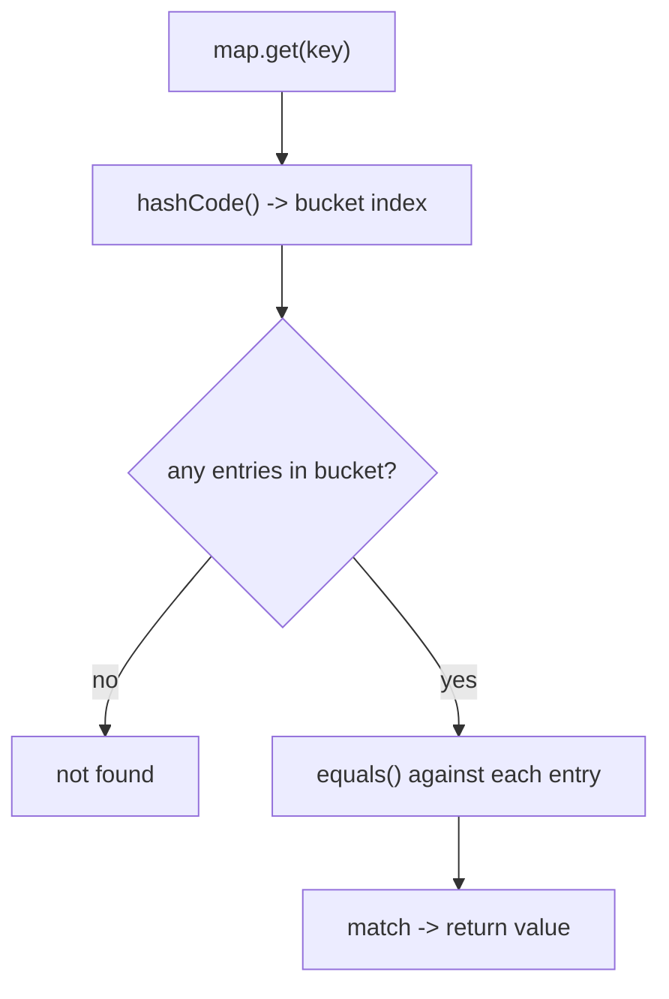

Every class inherits from `java.lang.Object`, so every object ships with a handful of methods. Three matter constantly: `toString()`, `equals()`, and `hashCode()`. Their **default** behaviour is rarely what you want, and overriding them correctly is a rite of passage.

| Method | Default behaviour | You usually override to… |
|--------|-------------------|--------------------------|
| `toString()` | `ClassName@hexHash` | give a readable description |
| `equals(Object)` | identity (`==`) | compare by **value** |
| `hashCode()` | identity-based int | match your `equals` |
| `getClass()` | runtime class | (never override — `final`) |
| `clone()`, `finalize()`, `wait`/`notify` | — | rarely / avoid |

## `toString()`

The default — `Point@1b6d3586` — is useless in logs. Override it to describe the object's state:

```java
@Override public String toString() {
    return "Point[x=" + x + ", y=" + y + "]";
}
```

:::tip
Always override `toString()` on value-like classes. It's invoked automatically by string concatenation, `System.out.println(obj)`, and most logging frameworks — turning cryptic debug output into something readable. (A `record` does this for free.)
:::

## Value equality vs identity

By default `equals` returns `true` only when both references point to the **same object**. For value types you want two *distinct* objects with equal fields to be "equal":

```java
Point a = new Point(1, 2);
Point b = new Point(1, 2);
a == b;        // false — different objects
a.equals(b);   // false WITHOUT an override; should be true for a value type
```

## The equals / hashCode contract

These two methods are bound by a contract the entire collections framework relies on:

1. **Consistent with equals:** if `a.equals(b)`, then `a.hashCode() == b.hashCode()`.
2. `equals` must be **reflexive, symmetric, transitive, consistent**, and `x.equals(null)` is `false`.
3. Unequal objects *may* share a hash code (a collision), but equal objects must **never** differ.



Break rule 1 and a `HashMap`/`HashSet` looks in the wrong bucket — your object effectively *vanishes* from the collection even though you put it there.

## Writing them correctly

Use `java.util.Objects` helpers, which handle nulls and write the boilerplate for you:

```java
import java.util.Objects;

public final class Point {
    private final int x, y;
    public Point(int x, int y) { this.x = x; this.y = y; }

    @Override public boolean equals(Object o) {
        if (this == o) return true;                    // fast path
        if (!(o instanceof Point p)) return false;     // type check + bind
        return x == p.x && y == p.y;                   // compare significant fields
    }

    @Override public int hashCode() {
        return Objects.hash(x, y);                     // combine the SAME fields
    }
}
```

- `Objects.equals(a, b)` is a null-safe field comparison (handy for object fields).
- `Objects.hash(...)` combines fields into a hash. Use the **same fields** in both methods.

:::gotcha
`hashCode()` must derive from the **same fields** as `equals()`, and those fields should be **immutable** (or at least never change while the object is in a hash collection). Mutate a field that participates in the hash after insertion, and the entry becomes unreachable — a subtle, nasty bug.
:::

## `getClass()` vs `instanceof` in equals

How you check the other object's type affects the **symmetry** of equals:

- **`instanceof`** allows a subclass instance to be equal to a superclass instance. Risk: it can break *symmetry* if a subclass adds significant fields (`a.equals(b)` ≠ `b.equals(a)`).
- **`getClass()`** requires the *exact* same class, which is strictly symmetric but means a subclass can never equal its parent.

```java
// Strict variant — both must be the identical class
if (o == null || getClass() != o.getClass()) return false;
```

:::senior
The classic guidance: use `getClass()` when equality must be confined to one exact type, and `instanceof` when you genuinely want subclasses to compare equal — but only if subclasses add *no* significant state. There is no fully satisfying way to extend an instantiable class and add a value component while preserving the equals contract; the pragmatic fix is **composition over inheritance** for value types, or use `final` classes / `record`s, which dodge the dilemma entirely.
:::

## Check your understanding

Make sure the equals/hashCode contract really clicked.

```quiz
title: The equals / hashCode contract
questions:
  - q: 'The contract says: if `a.equals(b)` is `true`, then…'
    options:
      - '`a` and `b` must be the same object'
      - text: '`a.hashCode() == b.hashCode()` must be `true`'
        correct: true
      - '`a.hashCode() != b.hashCode()`'
      - 'nothing is guaranteed about their hash codes'
    explain: 'Equal objects **must** have equal hash codes. (The converse is not required — unequal objects may collide.)'
  - q: 'You override `equals` but forget to override `hashCode`. You put a key in a `HashMap`, then look it up with a different-but-equal key object. What typically happens?'
    options:
      - 'it is always found'
      - text: 'it is usually not found — the lookup hashes to the wrong bucket'
        correct: true
      - 'it throws an exception'
      - 'it works only for `String` keys'
    explain: 'The inherited `hashCode` is identity-based, so two equal objects get different hash codes and land in different buckets — the entry effectively vanishes from the map.'
  - q: '`a.hashCode() == b.hashCode()` is `true`. Does that guarantee `a.equals(b)`?'
    options:
      - 'yes, always'
      - text: 'no — equal hash codes can just be a collision'
        correct: true
      - 'only for `String`s'
      - 'only inside a `HashMap`'
    explain: 'Hash codes can collide, so equal hashes do **not** imply equality. A `HashMap` still confirms with `equals()` after matching the bucket.'
```

:::key
Override `toString` for readable output, and override `equals` and `hashCode` **together** using the **same immutable fields**. The contract: equal objects must have equal hash codes, or hash-based collections break. Lean on `Objects.equals`/`Objects.hash`, choose `getClass()` (strict) vs `instanceof` (permits subclasses) deliberately — or let a `record` generate all of it.
:::
