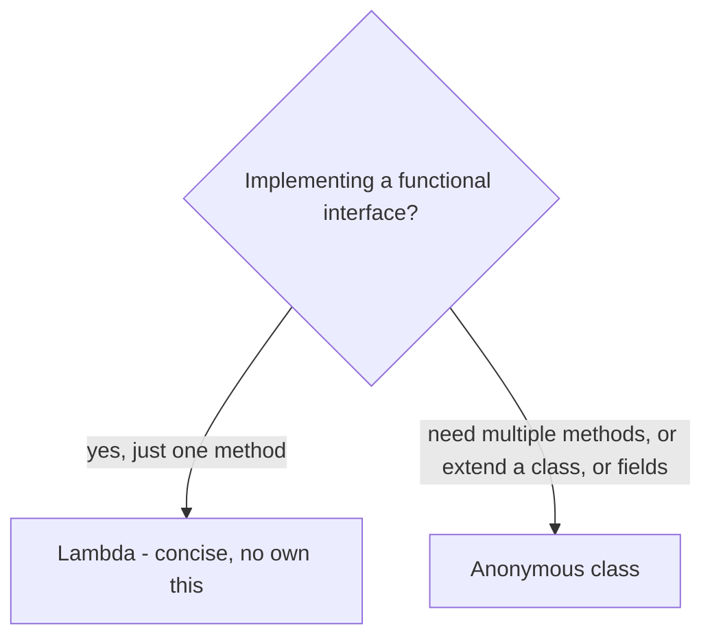

Java lets you declare a class **inside** another class or method. Nesting expresses tight coupling, limits scope, and keeps helper types close to where they're used. There are four flavours, and the key distinction is whether the nested class holds a hidden reference to an *enclosing instance*.

| Kind | Declared | `static`? | Holds outer instance? |
|------|----------|-----------|-----------------------|
| **Static nested** | inside class | yes | ❌ no |
| **Inner (non-static)** | inside class | no | ✅ yes |
| **Local** | inside a method | n/a | ✅ (in instance context) |
| **Anonymous** | inline expression | n/a | ✅ |

## Static nested class

A `static` nested class is just a top-level class scoped inside another for organisation. It has **no** link to an instance of the outer class and can be created independently.

```java
class Outer {
    static class Builder {        // no Outer instance needed
        String build() { return "built"; }
    }
}
Outer.Builder b = new Outer.Builder();
```

## Inner (non-static) class

A non-`static` nested class is an **inner class**. Each instance is implicitly tied to an instance of the enclosing class and can access its private members directly. It cannot exist without an outer object.

```java
class Outer {
    private int value = 42;
    class Inner {
        int read() { return value; } // accesses Outer's private field
    }
}
Outer outer = new Outer();
Outer.Inner inner = outer.new Inner(); // note the outer.new syntax
```

:::gotcha
An inner class instance **silently retains a reference to its enclosing instance**. If the inner object outlives the outer (e.g. stored in a long-lived collection or listener), it keeps the whole outer object alive — a classic **memory leak**. If the nested class doesn't need the outer instance, make it `static`.
:::

## Local class

A class declared **inside a method**. It's visible only within that method and can capture the method's variables (see below). Useful for a one-off helper that needs a name and possibly multiple methods.

```java
List<String> sortedCopy(List<String> in) {
    class ByLength implements Comparator<String> {
        public int compare(String a, String b) { return a.length() - b.length(); }
    }
    var out = new ArrayList<>(in);
    out.sort(new ByLength());
    return out;
}
```

## Anonymous class

An anonymous class implements an interface or extends a class **and instantiates it in a single expression**, with no name. It's the pre-Java-8 way to write a quick one-off implementation.

```java
Runnable r = new Runnable() {        // anonymous class implementing Runnable
    @Override public void run() { System.out.println("running"); }
};
```

## Capturing effectively-final variables

Local and anonymous classes (and lambdas) can use local variables from the enclosing method — but only if those variables are **`final` or *effectively final*** (assigned once and never changed). The value is *captured* (copied) when the class instance is created, so allowing reassignment would create confusing inconsistency between the captured copy and the original.

```java
void demo() {
    int count = 10;            // effectively final — never reassigned
    Runnable r = () -> System.out.println(count); // ✅ captures 10
    // count = 11;             // ❌ would make capture illegal above
}
```

:::note
This is why people "cheat" with a single-element array or an `AtomicInteger` to mutate captured state — the *reference* stays final while its contents change. Prefer redesigning to avoid mutable capture where possible.
:::

## Lambda vs anonymous class

Since Java 8, a **lambda** is the concise replacement for an anonymous class that implements a **functional interface** (one abstract method).

```java
// Anonymous class — verbose
button.addListener(new Listener() {
    @Override public void onClick() { handle(); }
});
// Lambda — same thing
button.addListener(() -> handle());
```

They differ in more than syntax:



- A lambda has **no `this` of its own** — `this` refers to the *enclosing* instance. An anonymous class's `this` refers to the anonymous object itself.
- A lambda generates no extra `.class` file and is implemented via `invokedynamic`, making it lighter weight.
- A lambda can only implement a **single-method** interface; anonymous classes can have multiple methods, instance fields, and can extend a class.

:::senior
Use a **lambda** for short, stateless functional-interface implementations (the overwhelmingly common case). Reach for an **anonymous class** when you need state, multiple methods, or to subclass — and a **named (static nested or top-level) class** once the logic is reused or complex enough to deserve testing and a name. Default to `static` nesting to avoid accidental outer-instance capture.
:::

:::key
Four nesting forms: **static nested** (no outer link), **inner** (holds an outer instance — leak risk), **local** (method-scoped), and **anonymous** (inline, nameless). Captured locals must be effectively final. Prefer a **lambda** over an anonymous class for single-method interfaces, and prefer `static` nesting unless you truly need the enclosing instance.
:::
