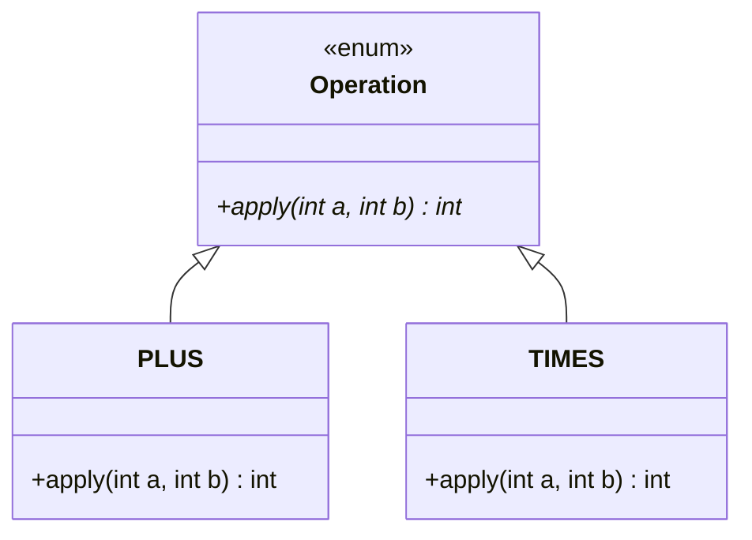

An **enum** defines a fixed set of named constants as a full-fledged type. Unlike `public static final int` constants, enums are **type-safe** (you can't pass the wrong constant), self-describing in output, and usable in `switch`. Each constant is a singleton instance of the enum type.

```java
enum Day { MONDAY, TUESDAY, WEDNESDAY, THURSDAY, FRIDAY, SATURDAY, SUNDAY }

Day today = Day.FRIDAY;
if (today == Day.FRIDAY) System.out.println("TGIF"); // == is safe; each is a singleton
```

## Fields, constructors, and methods

Enums are classes, so each constant can carry data supplied through a **private constructor**. Constructors are *never* called with `new` — the constants invoke them.

```java
enum Planet {
    EARTH(5.976e24, 6.378e6),
    MARS(6.421e23, 3.397e6);          // each constant passes constructor args

    private final double mass, radius; // immutable per-constant data
    Planet(double mass, double radius) {
        this.mass = mass;
        this.radius = radius;
    }
    double surfaceGravity() {
        return 6.67e-11 * mass / (radius * radius);
    }
}
double g = Planet.EARTH.surfaceGravity();
```

## Constant-specific (abstract) methods

A constant can **override** behaviour, giving each its own implementation — a clean alternative to a `switch` over the enum. Declare an `abstract` method and let every constant supply a body.

```java
enum Operation {
    PLUS  { public int apply(int a, int b) { return a + b; } },
    TIMES { public int apply(int a, int b) { return a * b; } };

    public abstract int apply(int a, int b);
}
int result = Operation.TIMES.apply(6, 7); // 42
```

Under the hood, each constant with a body compiles to its own **anonymous subclass** of the enum — `Operation` is effectively a tiny sealed hierarchy:



:::senior
Constant-specific methods keep behaviour *next to* the constant it belongs to, so adding a new constant forces you to supply its behaviour (the compiler complains otherwise). Compare that to a `switch` scattered across the codebase that silently falls through to a default when you add a value. This "make illegal states unrepresentable" pattern is a hallmark of good enum design.
:::

## Built-in methods: values, valueOf, ordinal

Every enum gets these for free from `java.lang.Enum`:

| Method | Returns |
|--------|---------|
| `values()` | array of all constants, in declaration order |
| `valueOf("NAME")` | the constant with that exact name (throws if none) |
| `name()` | the constant's identifier as a `String` |
| `ordinal()` | zero-based position in declaration order |

```java
for (Day d : Day.values()) System.out.println(d);
Day mon = Day.valueOf("MONDAY");
int pos = Day.WEDNESDAY.ordinal(); // 2
```

:::gotcha
Never persist or rely on `ordinal()` as a stored identifier. Reordering or inserting a constant shifts every ordinal, silently corrupting saved data. If you need a stable numeric code, store an explicit field (`Day(int code)`) instead.
:::

## EnumSet and EnumMap

The collections framework provides high-performance, enum-specialised implementations. Prefer them over `HashSet`/`HashMap` whenever the keys are enum constants.

```java
import java.util.*;

EnumSet<Day> weekend = EnumSet.of(Day.SATURDAY, Day.SUNDAY); // bit-vector internally
EnumMap<Day, String> plan = new EnumMap<>(Day.class);
plan.put(Day.MONDAY, "gym");
```

`EnumSet` is implemented as a compact **bit vector** (a single `long` for enums with ≤64 constants), making membership operations extremely fast and memory-cheap. `EnumMap` is backed by a plain array indexed by `ordinal()`, so it's faster and more compact than a hash map.

## The enum singleton idiom

A single-constant enum is the most robust way to implement a **singleton** in Java. The JVM guarantees exactly one instance, and — unlike a hand-written singleton — it's automatically **thread-safe** and **serialization-safe** (no extra instance can be created via reflection or deserialization).

```java
public enum Registry {
    INSTANCE;                       // the one and only instance

    private final Map<String, Object> data = new HashMap<>();
    public void put(String k, Object v) { data.put(k, v); }
    public Object get(String k)         { return data.get(k); }
}
Registry.INSTANCE.put("key", 123);
```

:::tip
*Effective Java* calls a single-element enum "the best way to implement a singleton." It sidesteps the subtle bugs (double-checked locking, reflection attacks, broken `readResolve`) that plague the classic private-constructor approach.
:::

```quiz
title: Check yourself
questions:
  - q: 'A database stores `status.ordinal()`. Six months later someone inserts a new constant in the middle of the enum. Result?'
    options:
      - 'Nothing — ordinals are assigned once and never change'
      - text: 'Every stored value after the insertion point now maps to the wrong constant'
        correct: true
      - 'A runtime exception the first time `values()` is called'
    explain: '`ordinal()` is just declaration position. Reordering or inserting constants shifts it silently — existing rows keep their old numbers but those numbers now name different constants. Persist an explicit code field or `name()` instead.'
  - q: 'What does `Day.valueOf("monday")` do (constant is declared `MONDAY`)?'
    options:
      - 'Returns `Day.MONDAY` — lookup is case-insensitive'
      - text: 'Throws `IllegalArgumentException` — the name must match exactly'
        correct: true
      - 'Returns `null`'
    explain: '`valueOf` requires the exact identifier. For lenient parsing, write your own lookup (e.g. uppercase the input first, or keep a `Map<String, Day>`).'
  - q: 'Why is comparing enums with `==` safe, when it is a bug for `String` or `Integer`?'
    options:
      - 'The compiler rewrites `==` to `.equals()` for enum operands'
      - text: 'Each constant is a JVM-guaranteed singleton, so reference equality *is* value equality'
        correct: true
      - 'It is not safe — always use `.equals()` on enums too'
    explain: 'The JVM creates exactly one instance per constant per class loader, so two references to `Day.FRIDAY` are always the same object. `==` is even preferable: it''s null-safe (no NPE) and compile-time type-checked against comparing different enum types.'
  - q: 'Why is `EnumSet` dramatically faster and smaller than `HashSet` for enum elements?'
    options:
      - 'It caches hash codes of the constants'
      - text: 'It stores membership as a bit vector — one bit per constant, a single `long` for up to 64 constants'
        correct: true
      - 'It keeps elements sorted in a balanced tree'
    explain: 'Membership tests, unions, and intersections become single bitwise operations. `EnumMap` plays the same trick with an array indexed by `ordinal()`. Prefer them whenever keys/elements are enums.'
```

:::key
Enums are type-safe constant *classes*: give them `private` constructors, fields, and methods, including constant-specific overrides of `abstract` methods. Use `values()`/`valueOf()`/`name()` freely but avoid persisting `ordinal()`. Reach for `EnumSet`/`EnumMap` for fast enum-keyed collections, and use a single-constant enum for a bullet-proof singleton.
:::
