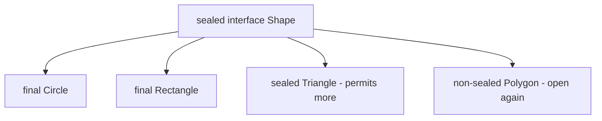

Java 16 (records) and Java 17 (sealed types) added two features that transform how you model data. Together they let you express **algebraic data types** — a closed set of shapes, each carrying immutable data — and handle them with **exhaustive `switch`**.

## Records: data carriers in one line

A **record** is a transparent, immutable class for holding data. You declare its **components**, and the compiler generates the constructor, `private final` fields, accessors, and value-based `equals`/`hashCode`/`toString`.

```java
public record Point(int x, int y) { }

Point p = new Point(1, 2);
p.x();                    // accessor (note: x(), not getX())
p.equals(new Point(1, 2)); // true — value equality, generated
p.toString();             // "Point[x=1, y=2]" — generated
```

That single line replaces ~40 lines of boilerplate. Records are **implicitly `final`**, cannot extend another class (they already extend `java.lang.Record`), but **can implement interfaces**.

## Canonical and compact constructors

The auto-generated constructor matching the components is the **canonical constructor**. To validate or normalise without restating every field, use the **compact constructor** — no parameter list, and the components are assigned for you afterward:

```java
public record Range(int low, int high) {
    public Range {                        // compact canonical constructor
        if (low > high)
            throw new IllegalArgumentException("low > high");
        // 'low' and 'high' are implicitly assigned after this block
    }
}
```

:::gotcha
Records are **shallowly** immutable. A `record Team(List<String> members)` still lets callers mutate the list they passed in (or the one they get back). For true immutability, defensively copy in a compact constructor: `members = List.copyOf(members);`.
:::

## When to use a record

| Use a record when… | Use a regular class when… |
|--------------------|---------------------------|
| The object is a transparent carrier of its data | You need to hide/abstract the representation |
| Value equality is desired | Identity equality matters |
| The data is immutable | Fields must be mutable |
| You want zero boilerplate | You need inheritance or mutable lifecycle |

Records are ideal for DTOs, map keys, multiple return values, query results, and domain values like `Money` or `Coordinate`.

:::tip
You can declare a **local record** inside a method — perfect for a throwaway tuple while streaming, e.g. pairing an item with a computed score before sorting.
:::

## Sealed classes and interfaces

A **sealed** type restricts *which* classes may extend or implement it via a `permits` clause. This creates a **closed hierarchy** the compiler fully understands.

```java
public sealed interface Shape permits Circle, Rectangle, Triangle { }

public record Circle(double radius)             implements Shape { }
public record Rectangle(double w, double h)     implements Shape { }
public record Triangle(double base, double height) implements Shape { }
```

Every permitted subtype must itself be `final`, `sealed`, or `non-sealed` (explicitly reopening the hierarchy):



If permitted subtypes live in the same file, the `permits` clause can be omitted — the compiler infers it.

## Synergy: exhaustive switch + pattern matching

The payoff comes when sealed types meet **switch pattern matching** (Java 21). Because the compiler knows the *complete* set of subtypes, a `switch` covering all of them needs **no `default`** — and if you later add a permitted subtype, the switch **fails to compile** until you handle it.

```java
double area(Shape s) {
    return switch (s) {                       // exhaustive — no default needed
        case Circle c    -> Math.PI * c.radius() * c.radius();
        case Rectangle r -> r.w() * r.h();
        case Triangle t  -> 0.5 * t.base() * t.height();
    };
}
```

Combined with **record deconstruction patterns**, you can destructure components inline:

```java
case Rectangle(double w, double h) -> w * h; // bind components directly
```

:::senior
Sealed hierarchies of records give Java algebraic data types — the closed sum-of-products model functional languages use. The compiler-enforced exhaustiveness is the real win: it converts "did I handle every case?" from a runtime hope into a **compile-time guarantee**, eliminating an entire category of bugs as the model evolves. This pairing (sealed + records + switch patterns) is the modern idiom for modelling state machines, ASTs, and command/result types.
:::

```quiz
title: Check yourself
questions:
  - q: 'For `record Point(int x, int y)`, how do you read the x component?'
    options:
      - '`p.getX()`'
      - text: '`p.x()`'
        correct: true
      - '`p.x` — records expose public fields'
    explain: 'Record accessors are named exactly after the component — no `get` prefix. The fields themselves are `private final`; only the generated accessor methods are public.'
  - q: '`record Team(List<String> members)` — is a Team instance deeply immutable?'
    options:
      - 'Yes — all record state is immutable by definition'
      - text: 'No — the reference is final, but the list contents can still be mutated by anyone holding it'
        correct: true
      - 'No, but the JVM throws on mutation attempts'
    explain: 'Records are **shallowly** immutable: components can''t be reassigned, but a mutable component object is still mutable. Fix it in the compact constructor: `members = List.copyOf(members);` — which also copies defensively against the caller''s original list.'
  - q: 'A `switch` over a sealed interface covers all permitted subtypes with no `default`. Someone adds a new permitted record. What happens?'
    options:
      - 'The switch throws `MatchException` at runtime for the new type'
      - text: 'Every such switch **fails to compile** until the new case is handled'
        correct: true
      - 'Nothing — switches always need a default branch'
    explain: 'That is the whole point of sealing: the compiler knows the complete set of subtypes, so exhaustiveness is checked at compile time. Adding a `default` branch would silently swallow future subtypes — omit it to keep the safety net.'
  - q: 'Which is true of every record?'
    options:
      - 'It can extend an abstract base class for shared logic'
      - text: 'It is implicitly final and cannot be extended, but may implement interfaces'
        correct: true
      - 'It allows mutable fields if they are private'
    explain: 'A record already extends `java.lang.Record`, and Java has single class inheritance — so no other superclass, ever. It''s implicitly final, its components are final, but implementing interfaces (including sealed ones) is exactly how records slot into data hierarchies.'
```

:::key
**Records** are concise, immutable, value-based data carriers — components in, generated constructor/accessors/`equals`/`hashCode`/`toString` out; validate via a compact constructor and defensively copy mutable components. **Sealed** types close a hierarchy with `permits`, and pairing them with record patterns enables **exhaustive `switch`** that the compiler verifies — turning data modelling into a safety net.
:::
