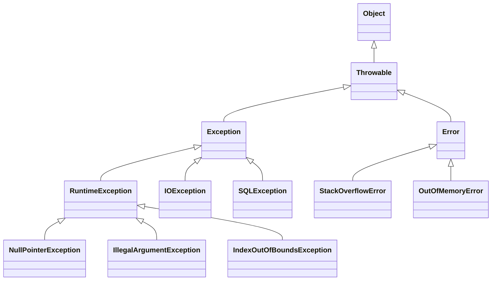

An **exception** is an object that captures an abnormal event — a missing file, a null dereference, arithmetic that divides by zero. When such an event occurs, the JVM (or your own code) *throws* an exception object, and control jumps to the nearest matching handler. Every one of these objects descends from a single root class, `Throwable`, and knowing that family tree tells you what you can catch, what you must declare, and what you should leave well alone.

## Only Throwable can be thrown

`throw` and `catch` work exclusively with `Throwable` and its subclasses — that is literally a rule the compiler enforces. `Throwable` has two direct children that split the world in half:



- **`Error`** — serious failures *external to your logic*: the JVM is out of memory, the stack overflowed, a class failed to link. You are not expected to catch or recover from these.
- **`Exception`** — conditions an application might reasonably want to handle. This is the branch you work with daily.
- **`RuntimeException`** — a special sub-branch of `Exception` reserved for programming mistakes (bad arguments, null access, invalid casts).

## Checked vs unchecked

This is the distinction interviewers probe and the one the compiler actually acts on.

| | Checked | Unchecked |
|---|---|---|
| **Type** | `Exception` minus the `RuntimeException` subtree | `RuntimeException` and `Error` (+ subclasses) |
| **Compiler rule** | *Handle-or-declare*: must `catch` it or list it in `throws` | No requirement |
| **Signals** | Recoverable, expected external failures | Programming bugs / fatal conditions |
| **Examples** | `IOException`, `SQLException` | `NullPointerException`, `OutOfMemoryError` |

The **handle-or-declare** rule means the method below will not compile unless you either wrap the call in `try/catch` or add `throws IOException` to the signature:

```java
void read(Path p) throws IOException {   // declared
    Files.readString(p);                 // can throw the checked IOException
}
```

A `RuntimeException` carries no such obligation — you *may* catch it, but the compiler never forces you to.

:::gotcha
"Unchecked" is about *compiler enforcement*, not about whether the failure can occur. A `NullPointerException` is every bit as real as an `IOException` — the compiler simply trusts you to prevent it rather than declare it.
:::

## Common built-in exceptions

| Exception | Branch | Typical cause |
|---|---|---|
| `IOException` | checked | File / network I/O failed |
| `SQLException` | checked | Database error |
| `InterruptedException` | checked | Thread interrupted while waiting |
| `NullPointerException` | unchecked | Calling a member on `null` |
| `IllegalArgumentException` | unchecked | Caller passed an invalid value |
| `IllegalStateException` | unchecked | Object used at the wrong time |
| `IndexOutOfBoundsException` | unchecked | Bad array / list index |
| `ClassCastException` | unchecked | Invalid reference cast |
| `ArithmeticException` | unchecked | Integer division by zero |
| `OutOfMemoryError` | error | Heap exhausted |
| `StackOverflowError` | error | Infinite / too-deep recursion |

:::tip
`NumberFormatException` extends `IllegalArgumentException`, and `FileNotFoundException` extends `IOException`. Because `catch` matches subclasses too, ordering matters — always catch the most specific type first.
:::

:::senior
Since Java 14 (on by default from 15, JEP 358), the JVM produces **Helpful NullPointerExceptions** that name the exact expression that was null — `Cannot invoke "String.length()" because "name" is null` — instead of just a line number. It is one of the highest-value modern diagnostics and worth enabling everywhere it isn't already.
:::

:::key
`Throwable` splits into `Error` (don't catch) and `Exception`. Within `Exception`, the `RuntimeException` subtree is **unchecked** (compiler-optional, for bugs); everything else is **checked** (handle-or-declare, for recoverable failures).
:::
