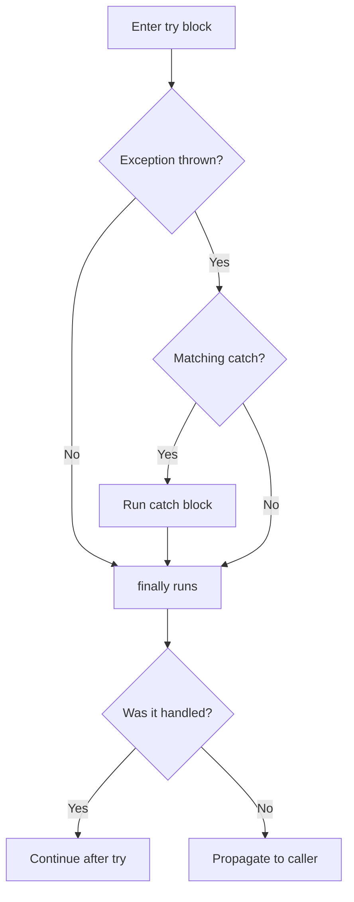

When code throws, the JVM unwinds the call stack looking for a `catch` block whose type matches. The `try` statement is how you install those handlers and guarantee that cleanup runs.

## try / catch

A `try` block wraps risky code; each `catch` names a `Throwable` type it can handle. Catch blocks are tested **top to bottom**, and a block matches the thrown type *or any subclass* — so order from most specific to most general.

```java
try {
    int[] a = new int[2];
    a[5] = 1;                                 // throws ArrayIndexOutOfBoundsException
} catch (ArrayIndexOutOfBoundsException e) {  // specific first
    System.out.println("bad index: " + e.getMessage());
} catch (RuntimeException e) {                // broader fallback
    System.out.println("other runtime problem");
}
```



:::gotcha
Listing a superclass before its subclass is a **compile error**: `catch (Exception e)` placed before `catch (IOException e)` makes the second block unreachable, and the compiler rejects it.
:::

## Multi-catch

When several exception types need identical handling, combine them with `|` (Java 7+). The catch parameter is implicitly `final`, and the alternatives may **not** be subclasses of one another.

```java
try {
    risky();
} catch (IOException | SQLException e) {   // one block, two types
    log.error("I/O or DB failure", e);
    throw new ServiceException(e);
}
```

## finally

A `finally` block runs **no matter what** — after the `try` completes normally, after a `catch` handles an exception, or while an exception propagates out unhandled. It is where you release things that are not `AutoCloseable`.

It even runs when the `try` or `catch` block executes `return`, `break`, or `continue`. The only things that skip it are `System.exit()`, a JVM crash, or the thread being killed.

### The return-in-finally trap

A `return` (or `throw`) inside `finally` **overrides** whatever the `try` block was returning or throwing — silently swallowing exceptions and clobbering results.

```java
int broken() {
    try {
        return 1;          // evaluated...
    } finally {
        return 2;          // ...but this wins. Method returns 2.
    }
}
```

:::gotcha
Never `return` or `throw` from a `finally` block. It discards an exception that is already in flight and makes control flow almost impossible to reason about. Most linters flag it as a hard error.
:::

## try-with-resources

Manually closing resources in `finally` is verbose and bug-prone. If a resource implements **`AutoCloseable`** (whose sole method is `close()`), declare it in the `try` header and the compiler generates the close logic for you:

```java
try (var in = Files.newInputStream(src);
     var out = Files.newOutputStream(dst)) {
    in.transferTo(out);
}   // out.close() then in.close() are called automatically
```

Key semantics:

- Resources are closed **in reverse order** of declaration.
- `close()` runs **before** any `catch` / `finally` of the same statement.
- Since Java 9 you may list an **already-declared effectively-final variable** in the header.

### Suppressed exceptions

What if the `try` body throws *and* `close()` also throws? Without try-with-resources, the close failure would mask the original. The language solves this: the body's exception propagates as the **primary**, and the close exception is attached as a **suppressed** exception.

```java
try (var r = new FlakyResource()) {
    throw new IllegalStateException("primary");
} catch (Exception e) {
    for (Throwable s : e.getSuppressed()) {   // close()'s exception lives here
        System.out.println("suppressed: " + s);
    }
}
```

:::senior
`AutoCloseable.close()` declares `throws Exception`, but `java.io.Closeable.close()` narrows that to `IOException` — prefer implementing `Closeable` for I/O types so callers aren't forced to handle a too-broad `Exception`. Suppression also flows the *opposite* way from a naive hand-written `finally` (which masks the original), which is exactly why try-with-resources should be your default for anything closable.
:::

## Check yourself

```quiz
title: 'try / catch / finally & resources'
questions:
  - q: 'What does this return? `int f() { try { return 1; } finally { return 2; } }`'
    options:
      - text: '`2` — a `return` in `finally` overrides the value the `try` block was returning.'
        correct: true
      - '`1` — the `try` runs first, so it wins.'
      - 'It throws an exception.'
      - 'It does not compile.'
    explain: 'A `return` (or `throw`) in `finally` replaces whatever the `try`/`catch` was returning or throwing — even an in-flight exception. Never `return` from `finally`.'
  - q: 'In `try (var a = open(); var b = open()) { ... }`, in what order are the resources closed?'
    options:
      - text: '`b` then `a` — reverse order of declaration.'
        correct: true
      - '`a` then `b` — declaration order.'
      - 'Unspecified / arbitrary order.'
      - 'Only the last one (`b`) is closed.'
    explain: 'Resources close in **reverse** order of declaration, and the close calls run *before* any `catch`/`finally` of the same statement.'
  - q: 'The `try` body throws, and `close()` *also* throws. Which exception reaches the caller?'
    options:
      - text: 'The body throws the **primary**; the `close()` exception is attached via `getSuppressed()`.'
        correct: true
      - 'The `close()` exception; the original is lost.'
      - 'Both propagate at the same time.'
      - 'Whichever has the deeper stack trace.'
    explain: 'The body exception propagates as primary; the close failure is recorded as **suppressed**. A hand-written `finally` would instead let `close()` mask the original failure.'
```

:::key
Catch specific types first; use `|` to merge identical handlers. `finally` always runs — never `return` from it. For anything `AutoCloseable`, prefer try-with-resources: it closes in reverse order and preserves the original failure via `getSuppressed()`.
:::
