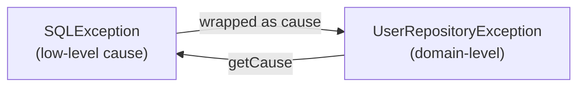

Catching exceptions is only half the story. Real programs also *raise* them — to signal that a method cannot fulfil its contract — and frequently define their own exception types to express domain-specific failures clearly.

## throw vs throws

They look alike but do opposite jobs:

| Keyword | Where | Purpose |
|---|---|---|
| `throw` | inside a method body | **Raises** an exception object right now |
| `throws` | in a method signature | **Declares** that the method may emit a checked exception |

```java
BigDecimal withdraw(BigDecimal amount) throws InsufficientFundsException { // declares
    if (amount.signum() <= 0) {
        throw new IllegalArgumentException("amount must be positive");      // raises (unchecked)
    }
    if (amount.compareTo(balance) > 0) {
        throw new InsufficientFundsException(amount.subtract(balance));     // raises (checked)
    }
    return balance = balance.subtract(amount);
}
```

You only need `throws` for **checked** exceptions — unchecked ones may be thrown freely without being declared.

## Designing a custom exception

A custom exception is just a class extending `Exception` (checked) or `RuntimeException` (unchecked). Two design rules pay off:

1. **Mirror the standard constructors** so callers can pass a message and a cause.
2. **Carry structured context** as fields, not just a string — the handler can then react programmatically.

```java
public class InsufficientFundsException extends Exception {
    private final BigDecimal shortfall;

    public InsufficientFundsException(BigDecimal shortfall) {
        super("Short by " + shortfall);
        this.shortfall = shortfall;
    }

    public InsufficientFundsException(String message, Throwable cause) {
        super(message, cause);
        this.shortfall = null;
    }

    public BigDecimal getShortfall() { return shortfall; }
}
```

:::tip
`Throwable` defines five constructors: `()`, `(String)`, `(String, Throwable)`, `(Throwable)`, and a protected four-arg `(String, Throwable, boolean, boolean)` (since Java 7). Expose the ones that make sense for your type — at minimum a message constructor and a `(message, cause)` constructor so chaining always works.
:::

## Exception chaining (wrapping)

Low-level code throws low-level exceptions (`SQLException`, `IOException`). Letting those leak out of a repository or service couples every caller to your implementation. Instead, **wrap** them in a domain exception and pass the original as the **cause**:

```java
try {
    return jdbc.query(sql);
} catch (SQLException e) {
    throw new UserRepositoryException("Failed to load users", e); // e becomes the cause
}
```

The cause is preserved and retrievable via `getCause()`. When printed, the stack trace shows the full chain:

```text
UserRepositoryException: Failed to load users
    at UserRepo.findAll(UserRepo.java:42)
Caused by: java.sql.SQLException: connection reset
    at ...
```



:::gotcha
The most damaging mistake is throwing a **new** exception inside a `catch` without passing the original — `throw new UserRepositoryException("failed");`. You have just deleted the stack trace and root cause: the "Caused by" line vanishes and debugging becomes guesswork. Always forward the caught exception as the cause.
:::

## Checked or unchecked?

| Choose **checked** when… | Choose **unchecked** when… |
|---|---|
| The caller can realistically recover | The failure is a programming bug |
| The condition is expected, part of the contract | The condition "should never happen" |
| You want the compiler to force handling | You want clean signatures without `throws` clutter |

```java
// Bug — caller cannot recover, shouldn't be forced to catch:
class ConfigKeyMissingException extends RuntimeException { /* ... */ }

// Recoverable — caller may retry or fall back:
class ServiceUnavailableException extends Exception { /* ... */ }
```

:::senior
Modern frameworks (Spring, JPA, most HTTP clients) lean heavily toward **unchecked** exceptions. Checked exceptions don't compose through lambdas and `Stream` pipelines — a `Function` can't throw a checked exception — so libraries built on functional APIs almost always use `RuntimeException` subclasses. Reserve checked exceptions for genuinely recoverable, expected outcomes at a module boundary.
:::

:::key
`throw` raises, `throws` declares (checked only). Give custom exceptions a `(message, cause)` constructor and meaningful fields. When catching a low-level exception and rethrowing your own, **always pass the original as the cause** — losing it destroys the stack trace.
:::
