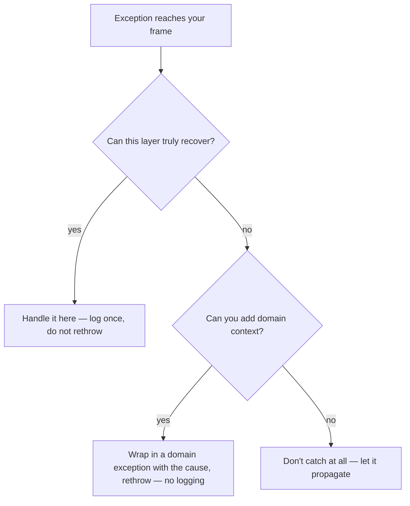

Exceptions are easy to use badly. The practices below separate code that helps you debug at 3 a.m. from code that hides the very information you need.

## Never swallow an exception

An empty `catch` block is where bugs go to hide. The program limps on in a corrupt state and you get no clue why.

```java
try {
    save(order);
} catch (IOException e) {
    // nothing here — the failure vanishes silently
}
```

At minimum, log it *with the stack trace*; better, handle it or let it propagate. If you genuinely expect and can ignore a failure, say so with a comment and log at `debug`.

## Fail fast

Validate inputs and invariants at the **top** of a method and throw immediately. A failure at the point of the bad input is far easier to diagnose than a `NullPointerException` ten frames later.

```java
void connect(String host, int port) {
    Objects.requireNonNull(host, "host");                 // NPE here, with a clear message
    if (port < 1 || port > 65535)
        throw new IllegalArgumentException("port out of range: " + port);
    // ...
}
```

## Catch specifically, not generically

Catching `Exception`, `Throwable`, or `RuntimeException` sweeps up failures you never intended to handle — including bugs you would rather see crash loudly.

| Anti-pattern | Why it hurts | Do instead |
|---|---|---|
| `catch (Exception e)` everywhere | Hides unexpected bugs | Catch the specific type you can handle |
| Empty catch block | Silent data corruption | Log, handle, or propagate |
| `catch` + log + rethrow | Duplicate traces in logs | Log **or** rethrow, not both |
| Exceptions for normal flow | Slow and unreadable | Use conditionals / `Optional` |
| Swallowing `InterruptedException` | Breaks cancellation | Restore the flag (below) |

```java
try {
    queue.take();
} catch (InterruptedException e) {
    Thread.currentThread().interrupt();   // restore the interrupt status
    throw new CancellationException();
}
```

## Log or rethrow — not both

If you log an exception *and* rethrow it, every layer logs the same trace and your logs fill with duplicates of one failure. Decide ownership: **handle it here** (and log), **or** propagate it to a layer that will. Log once, at the boundary where the decision is final — a request handler, a job runner, a thread's uncaught-exception handler.

Every `catch` block is really a three-way decision:



:::gotcha
`log.error("failed: " + e)` discards the stack trace — string concatenation keeps only `e.toString()`. Pass the exception as the **last argument** instead: `log.error("failed", e)`. This is one of the most common logging bugs in real codebases.
:::

## Exceptions are not control flow

Using exceptions to implement ordinary logic — throwing to break a loop, or catching `NumberFormatException` to test whether a string is a number — is an anti-pattern on two counts: it is slow, and it obscures intent.

```java
// Anti-pattern: an exception drives the happy path
try {
    return Integer.parseInt(s);
} catch (NumberFormatException e) {
    return 0;
}
```

For *expected* "absence" or "not found", prefer a return value that models it: an `Optional<T>`, a sentinel, or a dedicated result type. Reserve exceptions for the genuinely exceptional.

```java
Optional<User> findUser(String id);   // absence is normal — no exception needed
```

## What exceptions actually cost

Throwing is not free. The expense is dominated by **stack-trace capture**: the `Throwable` constructor calls `fillInStackTrace()`, a native walk of the entire call stack. The `throw` / `catch` jump itself is cheap; building the trace is what hurts in a hot loop.

:::senior
For the rare case of an exception used as a fast control-flow signal (e.g. a parser's internal short-circuit), you can suppress the costly trace. Use the protected four-arg constructor `Throwable(message, cause, enableSuppression, writableStackTrace)` with `writableStackTrace = false`, or override `fillInStackTrace()` to return `this`, and reuse a singleton instance.

```java
class Signal extends RuntimeException {
    Signal() { super(null, null, false, false); } // no stack trace captured
}
```

A stackless exception throws in nanoseconds — but you lose all debugging context, so use it only for deliberate signals, never for real errors.
:::

```quiz
title: Check yourself
questions:
  - q: 'What is wrong with `log.error("save failed: " + e);`?'
    options:
      - 'Nothing — the exception is logged'
      - text: 'String concatenation keeps only `e.toString()` — the stack trace is silently discarded'
        correct: true
      - 'It logs at the wrong level; exceptions must use `warn`'
    explain: 'Loggers only capture the trace when the throwable is passed as its own (last) argument: `log.error("save failed", e)`. The concatenation bug is endemic in real codebases and turns incidents into guesswork.'
  - q: 'You catch `InterruptedException` from `queue.take()` and cannot rethrow it. What must you do?'
    options:
      - 'Nothing — catching it clears the condition safely'
      - text: 'Call `Thread.currentThread().interrupt()` to restore the interrupt flag'
        correct: true
      - 'Call `Thread.interrupted()` to confirm the interrupt'
    explain: 'The JVM **clears** the interrupt flag when it throws `InterruptedException`. Swallowing it makes the thread deaf to cancellation; re-setting the flag lets outer loops and frameworks see the request. (`Thread.interrupted()` would *clear* it again — the opposite of what you want.)'
  - q: 'What dominates the runtime cost of `throw new SomeException()`?'
    options:
      - 'The non-local jump to the catch handler'
      - text: 'Capturing the stack trace in the `Throwable` constructor'
        correct: true
      - 'Heap allocation of the exception object'
    explain: '`fillInStackTrace()` walks every frame of the call stack at construction time — that is the expensive part, and it happens even if no one ever prints the trace. The jump and the allocation are comparatively trivial.'
  - q: 'Why is "catch, log, and rethrow" at every layer an anti-pattern?'
    options:
      - 'Rethrowing resets the stack trace each time'
      - text: 'The same failure gets logged repeatedly, drowning the signal in duplicates'
        correct: true
      - 'It leaks memory — each log call retains the exception'
    explain: 'One failure should appear in the logs exactly once, at the layer that owns the decision. Rethrowing does *not* reset the trace (that only happens if you construct a new exception without the cause) — the damage here is duplicate noise.'
```

:::key
Fail fast, catch the narrowest type you can handle, and never swallow. Log **or** rethrow — and always pass the exception object, not its `toString()`. Model expected absence with `Optional` / result types rather than exceptions, and remember the real cost of throwing is the stack-trace capture.
:::
