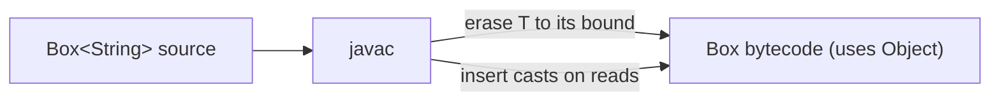

Java generics are a **compile-time fiction**. The compiler uses them to check your code, then *erases* them so the bytecode looks almost like pre-generics Java. This keeps the JVM simple and lets generic code link against old libraries — but it imposes real limits you must know for interviews.

## How erasure works

At compile time `javac`:

1. Type-checks every use of generics.
2. Replaces each type parameter with its **bound** — unbounded `T` becomes `Object`; `T extends Number` becomes `Number`.
3. Inserts **casts** wherever you read a generic value.

```java
class Box<T> { T value; T get() { return value; } }
// erases, roughly, to:
class Box { Object value; Object get() { return value; } }
```

The consequence: every instantiation shares **one** runtime class.

```java
List<String>  a = new ArrayList<>();
List<Integer> b = new ArrayList<>();
a.getClass() == b.getClass(); // true — both are just ArrayList at runtime
```



## Bridge methods

Erasure can break polymorphism, so the compiler patches it with synthetic **bridge methods**. Consider implementing `Comparable<T>`:

```java
class Money implements Comparable<Money> {
    public int compareTo(Money other) { return 0; }
}
```

The interface erases to `compareTo(Object)`, but your method is `compareTo(Money)` — so it would no longer override anything. To restore the override the compiler generates:

```java
public int compareTo(Object o) { return compareTo((Money) o); } // synthetic bridge
```

You never write these, but you will see them in stack traces and via reflection (`Method.isBridge()`).

## What you cannot do

Because the type is gone at runtime, these all fail to compile:

| Illegal | Why | Workaround |
|---------|-----|-----------|
| `new T()` | no constructor is known after erasure | pass a `Supplier<T>`, or a `Class<T>` and call `newInstance()` |
| `new T[n]` | cannot create an array of an erased type | `(T[]) new Object[n]` (with `@SuppressWarnings`) or `Array.newInstance` |
| `x instanceof List<String>` | runtime has no `<String>` | test `x instanceof List<?>` |
| `T.class` | no class literal for a type variable | accept a `Class<T>` token |
| `static T field;` | a type parameter belongs to an *instance* | make the *method* generic instead |
| `catch (T e)` | exception types must be reifiable | catch a concrete exception type |

```java
class Factory<T> {
    // static T shared;   // compile error: cannot make a static reference to T
    T make(Class<T> type) throws Exception {
        return type.getDeclaredConstructor().newInstance(); // the Class<T> token trick
    }
}
```

## Reifiable vs non-reifiable types

A **reifiable** type is one whose type information is fully present at runtime. Reifiable: primitives, non-generic classes (`String`), raw types (`List`), unbounded wildcards (`List<?>`), and arrays of these. **Non-reifiable**: `List<String>`, `Map<K,V>`, and `T` itself — their parameters are erased.

This is precisely why generic array creation (`new List<String>[10]`) is banned: arrays are reifiable and check their element type at runtime, but `List<String>` is non-reifiable, so such an array could not enforce its own contents.

## Heap pollution and `@SafeVarargs`

**Heap pollution** is when a variable of a parameterized type points to an object of the wrong type — usually entering through an unchecked operation. Generic **varargs** are a classic source, because `T... args` secretly creates a `T[]`:

```java
static void leak(List<String>... lists) {  // really List[] under the hood
    Object[] arr = lists;       // legal: arrays are covariant
    arr[0] = List.of(42);       // heap pollution — a List<Integer> stored as List<String>
    String s = lists[0].get(0); // ClassCastException at runtime
}
```

The compiler warns on every generic-varargs method. If your method is **provably safe** — it only reads the array and never stores it or lets a reference escape — annotate it with `@SafeVarargs` to silence the warning at the declaration *and* for callers:

```java
@SafeVarargs
static <T> List<T> listOf(T... items) {   // only reads items — safe
    return new ArrayList<>(Arrays.asList(items));
}
```

:::gotcha
`@SafeVarargs` is a **promise, not a check** — the compiler does not verify safety. Add it only when the method never writes to the varargs array nor lets a reference to it escape. It applies to `static`, `final`, and (since Java 9) `private` methods — ones that cannot be overridden into unsafety.
:::

:::senior
Erasure is the price of Java 5's backward compatibility: generic code links against pre-generic libraries because, in bytecode, `List<String>` simply *is* `List`. The alternative — **reified** generics (as in C#) — keeps type information at runtime but breaks that compatibility. When you genuinely need the runtime type, pass an explicit `Class<T>` **type token**, the pattern behind `EnumMap`, `Collections.checkedList`, and Spring's `ResolvableType`.
:::

:::note
You can still recover *some* generic information through reflection: `Method.getGenericReturnType()` and `getGenericParameterTypes()` expose the signatures stored in class metadata, even though individual instances carry none.
:::

:::key
Generics are erased to their bound (or `Object`) at compile time, so at runtime there is no `T`: you cannot do `new T()`, `new T[]`, or `instanceof List<String>`. The compiler hides this with casts and bridge methods. Reifiable types keep their info while parameterized ones do not — which is why generic varargs risk heap pollution and may need `@SafeVarargs`.
:::
