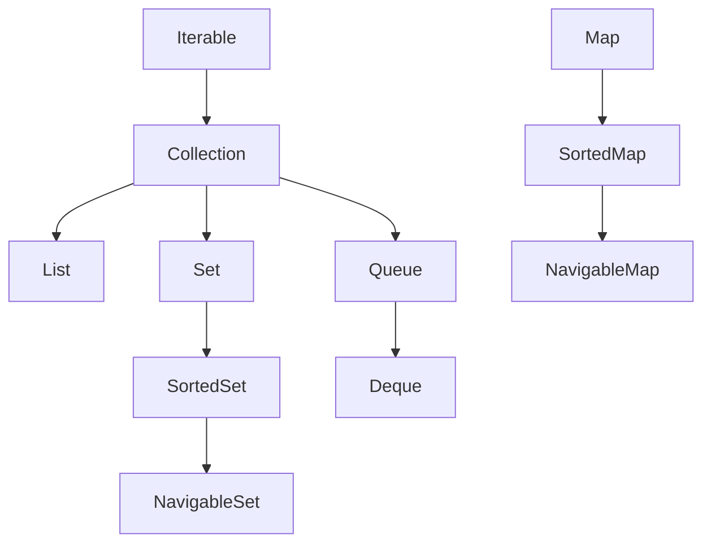

The **Java Collections Framework** (JCF, in `java.util`) is a unified family of interfaces and ready-made implementations for storing and manipulating groups of objects. Instead of hand-rolling data structures, you pick a battle-tested implementation and program against a small, stable set of interfaces.

## The interface hierarchy

Two root interfaces anchor everything: **`Iterable`** (everything you can loop over) and **`Map`** (key–value pairs). Crucially, **`Map` is *not* a `Collection`** — it lives in a parallel hierarchy.



Each interface captures a *contract*, not a data structure:

| Interface | Contract |
|-----------|----------|
| `List` | Ordered, indexed, **duplicates allowed** |
| `Set` | **No duplicates**; optional ordering |
| `Queue` | Holding area, usually FIFO |
| `Deque` | Double-ended queue (also a stack) |
| `Map` | Unique keys → values |

## Interfaces vs implementations

The golden rule: **declare variables with the interface type, instantiate the concrete class.** This lets you swap implementations without touching the rest of your code.

```java
List<String> names = new ArrayList<>();   // not ArrayList<String> names
Map<String, Integer> scores = new HashMap<>();
Set<Long> ids = new HashSet<>();
```

If profiling later demands a different structure, `new ArrayList<>()` becomes `new LinkedList<>()` (or a `HashMap` becomes a `TreeMap`) and *nothing else changes*. Method parameters and return types should likewise be interfaces (`List`, not `ArrayList`), so callers aren't coupled to your choice.

## What every Collection can do

`Collection` itself defines the operations all three branches share: `add`, `remove`, `contains`, `size`, `isEmpty`, `clear`, `iterator`, `stream`, plus bulk versions (`addAll`, `removeAll`, `retainAll`). Two details are worth knowing cold:

- **`contains`/`remove` use `equals()`**, not `==` — which is why storing objects with a broken `equals` corrupts every collection they touch.
- Many operations are **optional**: an implementation may throw `UnsupportedOperationException` instead of supporting mutation. That's not an error in your JDK — it's the documented mechanism behind immutable collections (`List.of(...)`) and read-only views (`Collections.unmodifiableList`). The type system won't warn you; only the docs (and runtime) will.

## Sequenced collections (Java 21)

Java 21 retrofitted the hierarchy with **`SequencedCollection`** — a unified interface for anything with a defined *encounter order* (`List`, `Deque`, `LinkedHashSet`). It finally gives one spelling for "first" and "last" instead of six implementation-specific ones:

```java
SequencedCollection<String> seq = new LinkedHashSet<>(List.of("a", "b", "c"));
seq.getFirst();    // "a"
seq.getLast();     // "c"
seq.addFirst("z"); // now [z, a, b, c]
seq.reversed();    // a reversed *view*, cheap to create
```

`SequencedMap` (implemented by `LinkedHashMap` and `TreeMap`) adds the analogous `firstEntry`, `lastEntry`, `pollFirstEntry`, and `reversed()`. Plain `HashSet`/`HashMap` do **not** implement the sequenced interfaces — they have no defined order to expose.

## Generics give compile-time type safety

Collections are **generic**: `List<String>` is a list that the compiler guarantees holds only `String`s. No casts, no `ClassCastException` at runtime.

```java
List<String> words = new ArrayList<>();   // diamond <> infers the type
words.add("hello");
String first = words.get(0);              // no cast needed
// words.add(42);                         // compile error
```

For flexible APIs, use **bounded wildcards** (the *PECS* rule — Producer `extends`, Consumer `super`):

```java
double sum(List<? extends Number> nums) { /* read Numbers out */ }
void fill(List<? super Integer> dst)    { dst.add(1); /* write Integers in */ }
```

## Factory methods and immutability (Java 9+)

The static factory methods build compact **immutable** collections in one line:

```java
List<String> colors = List.of("red", "green", "blue");
Set<Integer> primes  = Set.of(2, 3, 5, 7);
Map<String, Integer> ages = Map.of("Ada", 36, "Alan", 41);
```

These are unmodifiable *and* reject `null` elements. Any mutation throws:

```java
colors.add("yellow");   // UnsupportedOperationException at runtime
```

:::gotcha
`List.of(...)` is fully immutable, but the older `Arrays.asList(...)` is a **fixed-size view** over an array — you *can* call `set()` but `add()`/`remove()` throw `UnsupportedOperationException`, and it permits `null`. They are not interchangeable.
:::

:::senior
Return *interface* types and **defensive copies** from public APIs. `List.copyOf(internal)` gives callers an immutable snapshot, so they can't mutate your object's internals. Immutability also makes collections safe to share across threads without locking.
:::

To go the other way, wrap a mutable collection in an unmodifiable **view** with `Collections.unmodifiableList(...)` — but note the underlying list can still change beneath the view, whereas `List.copyOf` is a true snapshot.

## A first taste of the workhorses

| Need | Default choice |
|------|----------------|
| Ordered, indexable list | `ArrayList` |
| Fast lookup by key | `HashMap` |
| Unique elements | `HashSet` |
| Queue or stack | `ArrayDeque` |

```quiz
title: Check yourself
questions:
  - q: 'Is `Map<K, V>` a subtype of `Collection`?'
    options:
      - 'Yes — everything in `java.util` extends Collection'
      - text: 'No — Map heads its own parallel hierarchy; only its views (`keySet`, `values`, `entrySet`) are Collections'
        correct: true
      - 'Yes, via `Iterable`'
    explain: 'A Map holds *pairs*, which doesn''t fit Collection''s single-element contract (what would `add(E)` take?). You bridge the two worlds through the view methods: `map.entrySet()` IS a `Set<Map.Entry<K, V>>`.'
  - q: 'What''s the practical difference between `Arrays.asList(arr)` and `List.of(arr)`?'
    options:
      - 'None — `List.of` is just the newer name'
      - text: '`Arrays.asList` is a fixed-size **view** (set allowed, add/remove throw, nulls OK); `List.of` is fully immutable and rejects nulls'
        correct: true
      - '`Arrays.asList` copies the array; `List.of` wraps it'
    explain: '`Arrays.asList` writes through to the underlying array — `list.set(0, x)` changes `arr[0]`. `List.of` copies and freezes. Passing a null element to `List.of` throws NPE immediately.'
  - q: 'Calling `add` on the result of `Collections.unmodifiableList(inner)` throws. Can the list''s contents still change?'
    options:
      - 'No — unmodifiable means frozen forever'
      - text: 'Yes — it is only a read-only *view*; mutations to the backing `inner` list show through it'
        correct: true
      - 'Only if the view is re-created'
    explain: 'The view blocks writes *through itself*, nothing more. For a true snapshot nobody can change, use `List.copyOf(inner)`. This view-vs-snapshot distinction is a favourite interview probe.'
```

:::key
`Map` is **not** a `Collection`. Everything else descends from `Iterable` → `Collection`. Code to the interface, instantiate the implementation, and reach for `List.of`/`Map.of` when you want cheap, safe, immutable data. Since Java 21, `SequencedCollection`/`SequencedMap` give ordered collections a common `getFirst`/`getLast`/`reversed()` API.
:::
