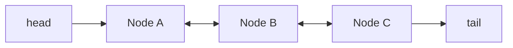

A `List` is an **ordered, indexed** collection that allows duplicates. The two general-purpose implementations make opposite internal trade-offs.

## ArrayList — a growable array

`ArrayList` stores elements in a contiguous backing array (`Object[]`). Index access is a single pointer-offset calculation, so `get(i)` and `set(i)` are **O(1)**.

```java
List<String> list = new ArrayList<>();  // backing array allocated lazily
list.add("a");                          // amortized O(1)
String x = list.get(0);                 // O(1) random access
```

When the array fills up, `ArrayList` **resizes**: it allocates a new array (HotSpot grows by ~1.5×, `newCap = oldCap + (oldCap >> 1)`) and copies everything over. A single `add` that triggers resize is O(n), but resizes get rarer as the list grows, so appends average out to **amortized O(1)**.

```java
// If you know the size up front, pre-size to avoid repeated resizes:
List<Integer> nums = new ArrayList<>(10_000);
```

Inserting or removing in the *middle* must shift every later element, so `add(i, e)` and `remove(i)` are **O(n)**.

## LinkedList — doubly-linked nodes

`LinkedList` is a chain of **nodes**, each holding the element plus `prev`/`next` references. It implements both `List` *and* `Deque`.



Because it tracks both ends, adding or removing at the **head or tail is O(1)** — no shifting, no resizing. But there is no index arithmetic: `get(i)` must walk the chain from the nearer end, so it is **O(n)**.

```java
LinkedList<Integer> dq = new LinkedList<>();
dq.addFirst(1);   // O(1)
dq.addLast(2);    // O(1)
dq.get(500);      // O(n) — walks the list
```

## Big-O comparison

| Operation | ArrayList | LinkedList |
|-----------|-----------|------------|
| `get(i)` / `set(i)` | **O(1)** | O(n) |
| `add` at end | O(1) amortized | **O(1)** |
| `addFirst` / `removeFirst` | O(n) | **O(1)** |
| `add(i, e)` / `remove(i)` | O(n) | O(n)¹ |
| `contains` / `indexOf` | O(n) | O(n) |
| Memory per element | low (one reference) | high (node: 2 refs + header) |

¹ The *traversal* to reach index `i` is O(n); the link splice itself is O(1).

:::gotcha
Indexing a `LinkedList` in a loop is an **accidental O(n²)** trap — each `get(i)` re-walks the chain:
```java
for (int i = 0; i < linked.size(); i++) sum += linked.get(i);  // O(n²)!
```
Use an enhanced `for` / iterator instead, which advances node-by-node in O(n) total.
:::

## The `remove` overload trap

`List` declares **two** removes: `remove(int index)` and `remove(Object o)`. With a `List<Integer>` both are applicable — and Java picks the **more specific** primitive overload, which is almost never what you meant:

```java
List<Integer> nums = new ArrayList<>(List.of(10, 20, 30));
nums.remove(1);              // removes INDEX 1 → [10, 30]  (the value 20 is gone!)
nums.remove(Integer.valueOf(30)); // removes the VALUE 30 → [10]
```

The same overload pair also explains why `remove(Object)` returns `boolean` (was it present?) while `remove(int)` returns the **removed element**.

## When to use which

- **`ArrayList`** — your default for almost everything: indexed access, iteration, and appends.
- **`LinkedList`** — only when you constantly insert/remove at *both ends* and never index by position.

:::senior
In practice `ArrayList` wins even where `LinkedList` looks better on paper. Arrays are **cache-friendly** (contiguous memory), while each `LinkedList` node is a separate heap object causing cache misses and ~3× the memory overhead. If you need a queue or stack, prefer **`ArrayDeque`** over `LinkedList` — it's faster and leaner. `LinkedList` is rarely the right answer in modern Java.
:::

## Check yourself

```quiz
title: List internals
questions:
  - q: 'For a `List<Integer> nums`, what does `nums.remove(1)` do?'
    options:
      - text: 'Removes the element at **index 1**'
        correct: true
      - 'Removes the value `1`'
      - 'Throws because the call is ambiguous'
    explain: 'With a primitive `int` literal the compiler binds to the more specific `remove(int index)` overload, so it removes *by index*. To delete the value, call `nums.remove(Integer.valueOf(1))`.'
  - q: 'Why is `for (int i = 0; i < list.size(); i++) sum += list.get(i);` a trap on a `LinkedList`?'
    options:
      - text: 'Each `get(i)` walks the chain from an end, making the loop O(n²)'
        correct: true
      - '`size()` is O(n) on a LinkedList'
      - 'It throws `ConcurrentModificationException`'
    explain: 'A LinkedList has no index arithmetic, so every `get(i)` is O(n) and the loop is O(n²). Use an enhanced-for / iterator, which advances node-by-node in O(n) total.'
  - q: 'You need a stack or queue. What is the modern default implementation?'
    options:
      - text: '`ArrayDeque` — a contiguous circular array, faster and leaner than `LinkedList`'
        correct: true
      - '`LinkedList`, because O(1) at the ends beats an array'
      - '`java.util.Stack`, the purpose-built class'
    explain: 'ArrayDeque gives O(1) amortized ends with excellent cache locality. LinkedList allocates a node per element (~3× memory, cache misses); `Stack` extends `Vector` and is needlessly synchronized.'
```

:::key
`ArrayList` = fast random access (O(1) `get`), O(1) amortized append, O(n) middle inserts. `LinkedList` = O(1) at the ends, O(n) indexing. Default to `ArrayList`; reach for `ArrayDeque` (not `LinkedList`) when you need end-operations.
:::

## Compare them side by side

````tabs
tabs:
  - label: ArrayList
    body: |
      A **contiguous array** of references — cache-friendly, O(1) random access.
      ```java
      List<String> list = new ArrayList<>();
      list.add("a");          // O(1) amortized append
      String x = list.get(0); // O(1) random access
      list.add(0, "z");       // O(n) — shifts every element right
      ```
  - label: LinkedList
    body: |
      A **doubly-linked** chain of node objects — O(1) at the ends, O(n) to index.
      ```java
      Deque<String> dq = new LinkedList<>();
      dq.addFirst("a");       // O(1)
      dq.addLast("b");        // O(1)
      dq.get(500);            // O(n) — pointer-chases from an end
      ```
  - label: Rule of thumb
    body: |
      **Default to `ArrayList`.** Need fast ends (queue / stack / deque)? Reach for
      **`ArrayDeque`**, not `LinkedList` — it's faster *and* leaner.
````
