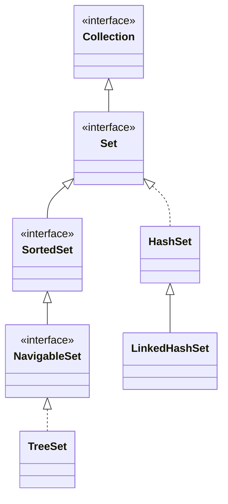

A `Set` models a mathematical set: **no duplicate elements**. Adding an element that's already present is a no-op, and `add` returns `false`.

```java
Set<String> tags = new HashSet<>();
tags.add("java");
boolean added = tags.add("java");   // false — already present
System.out.println(tags.size());    // 1
```

## Uniqueness depends on equals() and hashCode()

A `Set` decides "is this a duplicate?" using your objects' `equals()` (and, for hash-based sets, `hashCode()`). If you store custom types, you **must** override both consistently or deduplication silently breaks.

```java
record Point(int x, int y) {}   // records auto-generate equals + hashCode
Set<Point> seen = new HashSet<>();
seen.add(new Point(1, 2));
seen.contains(new Point(1, 2));  // true — value equality
```

:::gotcha
Mutate a field that participates in `hashCode()` *after* inserting into a `HashSet`, and the element becomes unreachable — it lands in the wrong bucket, so `contains()` returns `false` even though it's in the set. **Store immutable objects** (like `record`s) in hash-based sets.
:::

## The three implementations

```java
Set<String> a = new HashSet<>();        // no order, fastest
Set<String> b = new LinkedHashSet<>();  // insertion order
Set<String> c = new TreeSet<>();        // sorted order
```

The three implementations sit at different points in the `Set` interface hierarchy — hash-based, hash-plus-order, and tree-based:



- **`HashSet`** is backed by a `HashMap` (elements are keys; values are a shared dummy object). Operations are **O(1)** on average but iteration order is unspecified and can change.
- **`LinkedHashSet`** extends `HashSet` and threads a doubly-linked list through the entries, so it iterates in **insertion order** at a small memory cost — ideal for *deduplicating while preserving order*.
- **`TreeSet`** is backed by a red-black tree (`TreeMap`). It keeps elements **sorted** and offers **O(log n)** operations plus the rich `NavigableSet` API.

```java
NavigableSet<Integer> ts = new TreeSet<>(List.of(10, 20, 30, 40));
ts.first();        // 10
ts.last();         // 40
ts.floor(25);      // 20  — greatest ≤ 25
ts.ceiling(25);    // 30  — smallest ≥ 25
ts.headSet(30);    // [10, 20]
ts.descendingSet();// [40, 30, 20, 10]
```

## Comparison

| Feature | `HashSet` | `LinkedHashSet` | `TreeSet` |
|---------|-----------|-----------------|-----------|
| Iteration order | none | insertion | **sorted** |
| Backed by | `HashMap` | `LinkedHashMap` | red-black tree |
| `add` / `contains` / `remove` | **O(1)** avg | O(1) avg | O(log n) |
| `null` element | one allowed | one allowed | **not allowed**¹ |
| Extra API | — | — | `NavigableSet` |

¹ Natural-ordering `TreeSet` throws `NullPointerException` on `add(null)` because it must call `compareTo`.

:::senior
`TreeSet` orders by **natural ordering** (`Comparable`) unless you pass a `Comparator`. The comparator you choose *defines equality* for the set: if `compare` returns `0`, the element is a duplicate — independent of `equals()`. A case-insensitive comparator, for example, treats `"Java"` and `"java"` as the same element. This is a frequent source of subtle bugs when a comparator is inconsistent with `equals`.
:::

## Choosing

- Need raw membership speed, order irrelevant → **`HashSet`**.
- Need to remember insertion order (e.g. unique items in arrival sequence) → **`LinkedHashSet`**.
- Need sorted iteration or range queries (`floor`, `ceiling`, `subSet`) → **`TreeSet`**.

## Check your understanding

```quiz
questions:
  - q: 'Which methods does a `HashSet` use to decide whether an element is a duplicate?'
    options:
      - '`compareTo` only'
      - text: '`hashCode()` to find the bucket, then `equals()` to confirm'
        correct: true
      - '`==` reference identity'
      - '`toString()`'
    explain: 'A `HashSet` hashes to a bucket via `hashCode()`, then walks that bucket comparing with `equals()`. Override both consistently or deduplication silently breaks.'
  - q: 'A `TreeSet` is built with a case-insensitive `Comparator`. You add `"Java"` and then `"java"`. What is the final size?'
    options:
      - '`2`'
      - text: '`1`'
        correct: true
      - '`0`'
      - 'It throws an exception'
    explain: 'A `TreeSet` judges duplicates by its comparator (or `compareTo`), not by `equals`. When `compare` returns `0` the element counts as already present, so `"java"` is rejected.'
  - q: 'You put a mutable object into a `HashSet`, then mutate a field that its `hashCode()` reads. What is the likely result?'
    options:
      - 'The set re-indexes the element automatically'
      - text: '`contains()` may now return `false` even though the object is still in the set'
        correct: true
      - 'The element is removed'
      - 'A `ConcurrentModificationException` is thrown'
    explain: 'The node stays in its original bucket, but lookups now hash to a different bucket, so the element becomes unreachable. Store immutable elements (such as records) in hash-based sets.'
```

:::key
All `Set`s forbid duplicates, judged by `equals`/`hashCode` (or a `TreeSet`'s comparator). `HashSet` = O(1) unordered, `LinkedHashSet` = O(1) insertion-ordered, `TreeSet` = O(log n) sorted with navigation. Use immutable elements in hash-based sets.
:::
