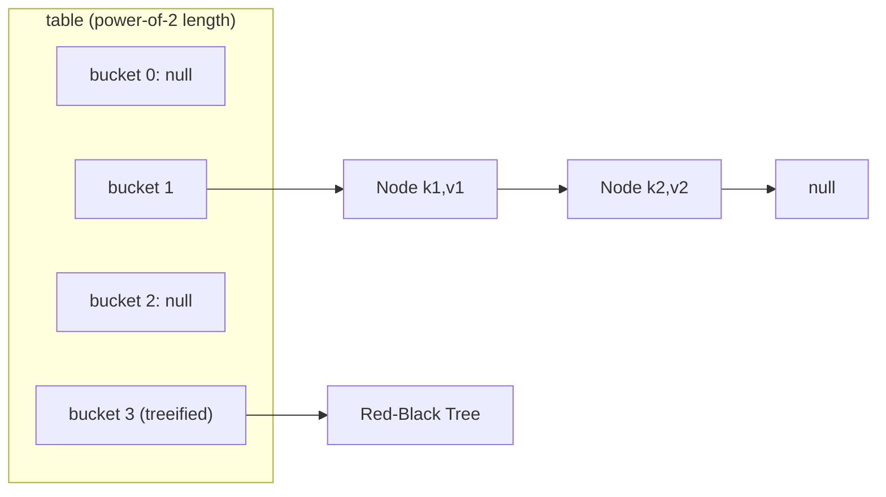

A `Map<K, V>` stores **unique keys** mapped to values. It is the most-used non-`List` collection and a perennial interview topic.

## Core operations

```java
Map<String, Integer> m = new HashMap<>();
m.put("a", 1);
m.getOrDefault("z", 0);             // 0 — no NPE for a missing key
m.putIfAbsent("a", 99);             // keeps 1
m.computeIfAbsent("list", k -> 0);  // lazily initialize
m.merge("a", 10, Integer::sum);     // a -> 11  (great for counting)
```

`computeIfAbsent` and `merge` replace the old "get-check-put" boilerplate and are the idiomatic way to build frequency maps and multimaps. Iterate with `entrySet()` to read key and value together in one pass:

```java
for (Map.Entry<String, Integer> e : m.entrySet())
    System.out.println(e.getKey() + "=" + e.getValue());
```

## HashMap internals

A `HashMap` is an **array of buckets** (the `table`), whose length is always a **power of two** (default 16).

**1. Hashing.** The key's `hashCode()` is *spread* so high bits influence the low bits used for indexing — cheap insurance against poor hash functions:

```java
static int hash(Object key) {
    int h;
    return (key == null) ? 0 : (h = key.hashCode()) ^ (h >>> 16);
}
```

**2. Indexing.** The bucket index is `(table.length - 1) & hash`. Because the length is a power of two, this masking is equivalent to (but far faster than) modulo.

**3. Collisions.** Keys landing in the same bucket form a **linked list** of nodes. Lookup walks the list, comparing with `equals()`.



**4. Treeification.** When one bucket's chain reaches **8 nodes** (`TREEIFY_THRESHOLD`) *and* the table has at least **64 slots** (`MIN_TREEIFY_CAPACITY`), that bucket converts from a linked list to a **red-black tree**, cutting worst-case lookup from O(n) to **O(log n)**. If the table is smaller than 64, the map **resizes instead** of treeifying. A tree shrinks back to a list at 6 nodes (`UNTREEIFY_THRESHOLD`).

**5. Load factor & resize.** The **load factor** (default **0.75**) bounds fullness. When `size > capacity × loadFactor`, the table **doubles** and every entry is **rehashed** into the larger table. 0.75 is the sweet spot between wasted space and collision frequency. Since Java 8, rehashing is cheap: each entry either stays at index `i` or moves to `i + oldCapacity`, decided by one bit.

| Constant | Value | Meaning |
|----------|-------|---------|
| default capacity | 16 | initial bucket count |
| load factor | 0.75 | resize trigger |
| `TREEIFY_THRESHOLD` | 8 | list → tree |
| `MIN_TREEIFY_CAPACITY` | 64 | min table size to treeify |
| `UNTREEIFY_THRESHOLD` | 6 | tree → list |

:::senior
If you know the final size, pre-size the map to avoid repeated rehashing: `new HashMap<>((int)(expected / 0.75f) + 1)`. The `+1` and division ensure the threshold isn't crossed during the inserts.
:::

## TreeMap and LinkedHashMap

- **`TreeMap`** — a red-black tree keyed in **sorted order** (`Comparable` or a `Comparator`). All operations are **O(log n)**, and it implements `NavigableMap` (`firstKey`, `floorKey`, `ceilingEntry`, `subMap`).
- **`LinkedHashMap`** — a `HashMap` that threads a linked list through entries to preserve **insertion order**. Construct it with `accessOrder = true` and override `removeEldestEntry` to get a fixed-size **LRU cache**:

```java
class LRUCache<K, V> extends LinkedHashMap<K, V> {
    private final int cap;
    LRUCache(int cap) { super(16, 0.75f, true); this.cap = cap; } // access-order
    @Override protected boolean removeEldestEntry(Map.Entry<K, V> e) {
        return size() > cap;   // evict least-recently-used
    }
}
```

## Null handling

| Map | `null` key | `null` value |
|-----|-----------|--------------|
| `HashMap` / `LinkedHashMap` | one allowed (bucket 0) | allowed |
| `TreeMap` | **no** (natural ordering) | allowed |
| `Hashtable` / `ConcurrentHashMap` | **no** | **no** |

:::gotcha
`HashMap` is **not thread-safe**. Concurrent writes can corrupt the table or, in older JDKs, spin forever during resize. For shared state use `ConcurrentHashMap` (which also forbids `null` keys/values). And never use a **mutable key** whose `hashCode` can change after insertion — the entry becomes unreachable.
:::

## Check your understanding

```quiz
questions:
  - q: 'How does `HashMap` turn a spread hash into a bucket index?'
    options:
      - '`hash % table.length`'
      - text: '`(table.length - 1) & hash`'
        correct: true
      - '`hash & table.length`'
      - '`hash >>> 16`'
    explain: 'Because the table length is a power of two, `(length - 1) & hash` equals modulo but is far faster. The spread `h ^ (h >>> 16)` first mixes high bits into the low bits used here.'
  - q: 'A single bucket reaches 8 chained nodes, but the table has only 32 slots. What does `HashMap` do?'
    options:
      - 'Treeifies that bucket into a red-black tree'
      - text: 'Resizes the table instead of treeifying'
        correct: true
      - 'Throws an exception'
      - 'Nothing until the chain reaches 64'
    explain: 'Treeification needs `TREEIFY_THRESHOLD` (8) AND a table of at least `MIN_TREEIFY_CAPACITY` (64). Below 64 slots the map resizes instead, which usually disperses the collision.'
  - q: 'With default capacity 16 and load factor 0.75, after how many entries does the table resize?'
    options:
      - '`8`'
      - text: '`12`'
        correct: true
      - '`16`'
      - '`24`'
    explain: 'Resize triggers when `size > capacity * loadFactor = 16 * 0.75 = 12`. The table then doubles to 32 and entries are rehashed (each stays at `i` or moves to `i + oldCapacity`).'
```

## Watch a put pick its bucket

```walkthrough
title: 'HashMap.put — hashing keys into an 8-bucket table'
code: |
  int hash  = spread(key.hashCode());     // h ^ (h >>> 16)
  int index = (table.length - 1) & hash;  // power-of-two mask
  if (table[index] == null)
      table[index] = new Node(hash, key, value);
  else
      appendOrReplace(table[index], key); // walk chain, compare equals()
steps:
  - text: 'Empty table — `length = 8`, so the index mask is `length - 1 = 7` (the low 3 bits of the hash).'
    array: ['·', '·', '·', '·', '·', '·', '·', '·']
    line: 2
  - text: 'put("cat", …): say its spread hash is **10**. `index = 7 & 10 = 2`. Bucket 2 is empty, so drop the node straight in.'
    array: ['·', '·', 'cat', '·', '·', '·', '·', '·']
    highlight: [2]
    pointers: { 2: 'idx 2' }
    line: 4
  - text: 'put("dog", …): spread hash **18**. `index = 7 & 18 = 2` again — a **collision**. Walk the chain; `equals()` shows a new key, so append.'
    array: ['·', '·', 'cat→dog', '·', '·', '·', '·', '·']
    highlight: [2]
    pointers: { 2: 'collision' }
    line: 6
  - text: 'put("fox", …): spread hash **5**. `index = 7 & 5 = 5`. Bucket 5 is empty, so place it — no collision.'
    array: ['·', '·', 'cat→dog', '·', '·', 'fox', '·', '·']
    highlight: [5]
    pointers: { 5: 'idx 5' }
    line: 4
```

:::key
`HashMap` = array of buckets, index via spread `hashCode`, collisions chain into lists that **treeify at 8 (table ≥ 64)**, resize doubles at **0.75** load. `TreeMap` = O(log n) sorted; `LinkedHashMap` = ordered + the basis for LRU caches. Only `HashMap`/`LinkedHashMap` accept a `null` key.
:::
