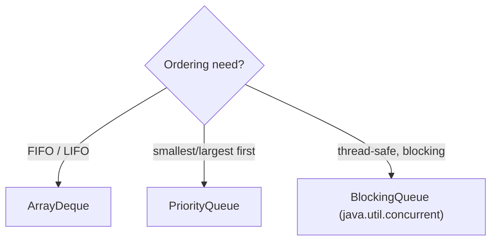

A `Queue` is a collection designed for **holding elements before processing**, typically FIFO (first-in, first-out). A `Deque` ("deck", double-ended queue) allows insertion and removal at *both* ends, so it serves as both a queue **and** a stack.

## Two method styles: throw vs. return

Every queue operation comes in two flavours — one that **throws** on failure and one that **returns a special value**. Prefer the returning forms (`offer`/`poll`/`peek`) so empty/full conditions don't become exceptions.

| Action | Throws on failure | Returns special value |
|--------|-------------------|-----------------------|
| Insert | `add(e)` | `offer(e)` → `false` |
| Remove head | `remove()` | `poll()` → `null` |
| Examine head | `element()` | `peek()` → `null` |

```java
Queue<String> q = new ArrayDeque<>();
q.offer("a"); q.offer("b");
q.peek();   // "a"  — look, don't remove
q.poll();   // "a"  — remove and return head
q.poll();   // "b"
q.poll();   // null — empty, no exception
```

## ArrayDeque — the all-purpose choice

`ArrayDeque` is a **resizable circular array**. It's the recommended implementation for both queues and stacks. As a **queue**, add at the tail and remove from the head:

```java
Deque<Integer> queue = new ArrayDeque<>();
queue.offerLast(1);   // enqueue at tail
queue.pollFirst();    // dequeue from head
```

As a **stack** (LIFO), use `push`/`pop`/`peek`, which operate on the *head*:

```java
Deque<Integer> stack = new ArrayDeque<>();
stack.push(1);  stack.push(2);
stack.pop();    // 2  (last in, first out)
stack.peek();   // 1
```

All these end-operations are **amortized O(1)**.

:::senior
Avoid the legacy `java.util.Stack` — it extends `Vector`, so every method is **synchronized** (pointless overhead in single-threaded code) and it iterates bottom-to-top, the opposite of stack order. Also avoid `LinkedList` as a queue: `ArrayDeque` is faster and uses far less memory (a packed array vs. a node object per element). **`ArrayDeque` is the modern default for both stacks and queues.**
:::

## PriorityQueue — a binary heap

`PriorityQueue` is **not** FIFO. It's a **binary min-heap** stored in an array: the head is always the *smallest* element by natural ordering (or by a supplied `Comparator`). It's how you implement "process the most important item next".

```java
PriorityQueue<Integer> pq = new PriorityQueue<>();   // min-heap
pq.offer(5); pq.offer(1); pq.offer(3);
pq.poll();   // 1  — always the minimum
pq.poll();   // 3

// Max-heap via reverse comparator:
PriorityQueue<Integer> max = new PriorityQueue<>(Comparator.reverseOrder());
```

Complexity: `offer` and `poll` are **O(log n)** (sift up/down the heap); `peek` is **O(1)**; `contains`/arbitrary `remove` are **O(n)**.

:::gotcha
A `PriorityQueue` is only ordered at the **head**. Iterating it (via `for-each`, `toString`, or streams) yields elements in **heap-array order, not sorted order**. To drain in sorted order you must repeatedly `poll()`. Also, `ArrayDeque` and `PriorityQueue` both **reject `null`** (`null` is the sentinel for "empty").
:::

## Picking a queue



For producer–consumer hand-off across threads, reach into `java.util.concurrent` for a `BlockingQueue` (e.g. `ArrayBlockingQueue`, `LinkedBlockingQueue`) rather than synchronizing an `ArrayDeque` by hand.

## Check yourself

```quiz
title: Queues & deques
questions:
  - q: 'You iterate a `PriorityQueue` with a for-each loop. In what order do elements come out?'
    options:
      - text: 'Heap-array order — **not** sorted; only the head is guaranteed to be the minimum'
        correct: true
      - 'Fully sorted ascending'
      - 'Insertion order (FIFO)'
    explain: 'A PriorityQueue only keeps its head ordered. Iteration exposes the raw binary-heap array, which is not sorted. To drain in sorted order you must repeatedly `poll()`.'
  - q: 'Why prefer `offer`/`poll`/`peek` over `add`/`remove`/`element`?'
    options:
      - text: 'They signal failure by returning a special value (`false`/`null`) instead of throwing'
        correct: true
      - 'They are O(1) while the others are O(n)'
      - 'They are thread-safe'
    explain: 'The two families differ only in failure behaviour: `add`/`remove`/`element` throw on a full/empty queue, while `offer`/`poll`/`peek` return `false`/`null`, so ordinary empty/full conditions do not become exceptions.'
  - q: 'On an `ArrayDeque` used as a stack, which end do `push` and `pop` operate on?'
    options:
      - text: 'The **head** — `push` adds first, `pop` removes first, giving LIFO'
        correct: true
      - 'The tail, like enqueue/dequeue'
      - 'A random end depending on capacity'
    explain: '`push`/`pop`/`peek` all work on the head (last-in-first-out). Used as a queue you instead add at the tail and remove from the head. All are amortized O(1).'
```

:::key
Use `offer`/`poll`/`peek` (they return rather than throw). **`ArrayDeque`** is the go-to for both queues (FIFO) and stacks (LIFO) — never `Stack` or `LinkedList`. **`PriorityQueue`** is a binary heap: O(log n) insert/remove, O(1) peek of the min, and *not* sorted on iteration.
:::
