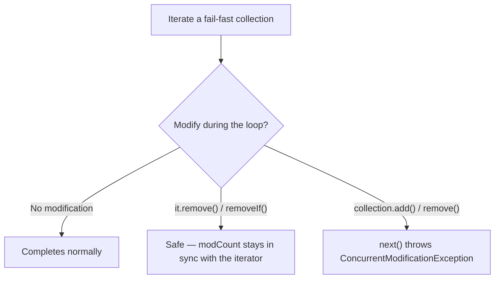

Iteration and ordering are the two cross-cutting concerns that touch every collection. This page covers how to traverse safely and how to define order.

## Iterator and ListIterator

The enhanced `for` loop is sugar over **`Iterator`**, which every `Collection` provides via `iterator()`:

```java
Iterator<String> it = list.iterator();
while (it.hasNext()) {
    String s = it.next();
    if (s.isBlank()) it.remove();   // the ONLY safe way to remove mid-iteration
}
```

`List` additionally offers **`ListIterator`** — bidirectional, with `hasPrevious()`/`previous()`, plus `set(e)` and `add(e)` to modify the list *during* traversal.

```java
ListIterator<String> li = list.listIterator();
while (li.hasNext()) {
    if (li.next().equals("old")) li.set("new");   // replace in place
}
```

## Fail-fast and ConcurrentModificationException

Most `java.util` collections are **fail-fast**: they track a `modCount`, and if the collection is *structurally modified* during iteration by anything other than the iterator itself, the next `next()` throws `ConcurrentModificationException` (CME).

```java
for (String s : list) {
    if (s.isBlank()) list.remove(s);   // 💥 ConcurrentModificationException
}
```

The fix is `it.remove()`, or better, the declarative `removeIf`:

```java
list.removeIf(String::isBlank);   // safe, concise, O(n)
```

:::gotcha
Fail-fast is **best-effort, not a guarantee** — never write logic that *depends* on catching a CME. It's a debugging aid for spotting bugs, not a concurrency control mechanism. For genuine concurrent iteration, use **fail-safe** collections: `CopyOnWriteArrayList` or `ConcurrentHashMap`, whose iterators are weakly consistent and never throw CME.
:::

What the iterator does at each step decides whether you get a clean pass or a CME:



## Comparable — natural ordering

A class implements **`Comparable<T>`** to declare its single, intrinsic *natural ordering* via `compareTo`, which returns a negative number, zero, or a positive number:

```java
record Person(String name, int age) implements Comparable<Person> {
    public int compareTo(Person o) {
        return Integer.compare(this.age, o.age);   // by age, ascending
    }
}
Collections.sort(people);   // uses compareTo
```

`TreeSet`, `TreeMap`, and `Collections.sort`/`List.sort(null)` all rely on natural ordering.

:::senior
Never implement `compareTo` with `a - b` for `int`s — subtraction **overflows** for large or negative values and silently returns the wrong sign. Always use `Integer.compare(a, b)` (and `Long.compare`, `Double.compare`). Also keep `compareTo` **consistent with `equals`**: if it isn't, sorted collections behave "strangely" because they judge equality by `compareTo == 0`, not `equals`.
:::

## Comparator — external, composable ordering

A **`Comparator<T>`** defines ordering *outside* the class, so you can have many orderings and sort types you don't own. The factory and combinator methods make this fluent:

```java
people.sort(
    Comparator.comparing(Person::name)            // primary: name
              .thenComparing(Person::age)          // tie-break: age
              .reversed()                          // flip the whole thing
);

// Numeric and null-friendly variants:
Comparator.comparingInt(Person::age);              // avoids boxing
Comparator.comparing(Person::name,
                     Comparator.nullsFirst(Comparator.naturalOrder()));
```

| | `Comparable` | `Comparator` |
|--|--------------|--------------|
| Lives | inside the class | outside, standalone |
| Method | `compareTo(T)` | `compare(T, T)` |
| Orderings per type | one (natural) | many |
| Sort call | `list.sort(null)` | `list.sort(cmp)` |

## Check yourself

```quiz
title: Iteration & ordering
questions:
  - q: 'What is the correct way to remove elements while iterating a non-concurrent `List`?'
    options:
      - text: '`it.remove()` via an explicit `Iterator`, or `list.removeIf(pred)`'
        correct: true
      - '`list.remove(x)` inside an enhanced-for loop'
      - 'Wrap the loop in `try/catch (ConcurrentModificationException)`'
    explain: 'Structurally modifying the collection directly during iteration bumps `modCount`, so the next `next()` throws `ConcurrentModificationException`. Only `Iterator.remove()` (or the declarative `removeIf`) keeps the iterator in sync.'
  - q: 'Can you rely on catching `ConcurrentModificationException` to detect concurrent modification?'
    options:
      - text: 'No — fail-fast is best-effort, a debugging aid, not a guarantee'
        correct: true
      - 'Yes, it is thrown deterministically on every concurrent modification'
      - 'Yes, but only for `ArrayList`'
    explain: 'Fail-fast checks `modCount` on a best-effort basis and may miss some modifications, so never build logic around catching a CME. For genuine concurrent iteration use fail-safe collections like `CopyOnWriteArrayList` or `ConcurrentHashMap`.'
  - q: 'Why is `return a - b;` a buggy `compareTo` for `int` fields?'
    options:
      - text: 'Subtraction can **overflow** for large or negative values and return the wrong sign'
        correct: true
      - 'It is merely slower than `Integer.compare`'
      - 'It returns a `long`, not an `int`'
    explain: 'For instance `Integer.MIN_VALUE - 1` overflows and flips sign, silently corrupting the order. Always use `Integer.compare(a, b)` (and `Long.compare`, `Double.compare`).'
```

:::key
Modify a collection mid-loop only through `it.remove()` or `removeIf` — direct mutation throws `ConcurrentModificationException`. Use **`Comparable`** for a type's one natural order and **`Comparator`** (with `comparing`/`thenComparing`/`reversed`) for everything else. Compare with `Integer.compare`, never subtraction.
:::
