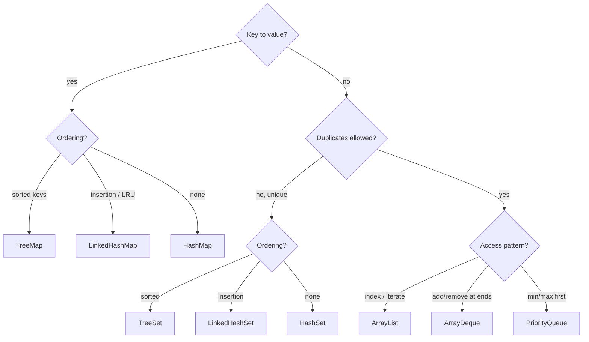

Picking a collection comes down to three questions: **What's the shape of the data** (pairs, unique items, or a sequence)? **Do you need ordering**? And **what operations dominate** your hot path? This page distils all of it.

## Decision guide



## Master Big-O cheat-sheet

Hash-based bounds are **average case**; collisions can degrade them, though treeified `HashMap` buckets cap the worst case at O(log n).

| Collection | Add / Put | Remove | Get / Contains | Ordered? | Notes |
|------------|-----------|--------|----------------|----------|-------|
| `ArrayList` | O(1)* end | O(n) | **O(1)** by index | insertion | random access king |
| `LinkedList` | **O(1)** ends | O(1) ends | O(n) | insertion | rarely worth it |
| `ArrayDeque` | **O(1)*** ends | O(1)* ends | O(1) peek ends | insertion | best stack/queue |
| `HashSet` | **O(1)** | O(1) | **O(1)** | none | unique elements |
| `LinkedHashSet` | O(1) | O(1) | O(1) | insertion | unique + order |
| `TreeSet` | O(log n) | O(log n) | O(log n) | **sorted** | `NavigableSet` |
| `HashMap` | **O(1)** | O(1) | **O(1)** | none | default map |
| `LinkedHashMap` | O(1) | O(1) | O(1) | insert/access | LRU base |
| `TreeMap` | O(log n) | O(log n) | O(log n) | **sorted** | `NavigableMap` |
| `PriorityQueue` | O(log n) | O(log n)† | O(1) peek min | heap-only | `contains` O(n) |

\* amortized (resize/doubling).  † O(log n) for the head; arbitrary `remove(o)` is O(n).

## Memory considerations

Asymptotics aren't everything — **constant factors and memory layout** often decide the real winner.

- **`ArrayList`** — most compact growable structure: a contiguous array of references with low per-element overhead. Contiguity gives excellent **cache locality**. It may over-allocate up to ~50% headroom after a resize; call `trimToSize()` if that matters.
- **`LinkedList`** — every element is a separate heap `Node` (~24 bytes: two link references + the item reference + object header) scattered across memory → cache misses. Heaviest per element.
- **`HashMap` / `HashSet`** — a bucket array plus a `Node` object per entry, and the 0.75 load factor leaves ~25% of slots empty by design. Roomy but fast.
- **`TreeMap` / `TreeSet`** — each entry carries `key`, `value`, and three links (`left`, `right`, `parent`) plus a colour bit. Heavier than a hash node, but gives ordering.
- **`ArrayDeque` / `PriorityQueue`** — array-backed and compact, similar footprint to `ArrayList`.

:::senior
**Default to `ArrayList`, `HashMap`, `HashSet`, and `ArrayDeque`** — they cover the vast majority of cases with the best constant factors. Only upgrade to a sorted (`Tree*`) or ordered (`Linked*`) structure when you have a concrete requirement for it. And **measure before optimizing**: cache effects mean an `ArrayList` frequently beats a "theoretically faster" `LinkedList` even for inserts.
:::

:::gotcha
`HashMap`/`HashSet` iteration order is **unspecified and may change** between JDK versions or after a resize — never rely on it. If a test or feature depends on order, use `LinkedHashMap`/`LinkedHashSet` (insertion) or a `Tree*` (sorted). Likewise, `LinkedList` is almost never the right pick; reach for `ArrayList` (sequence) or `ArrayDeque` (ends).
:::

:::key
Match the collection to data shape (pairs → `Map`, unique → `Set`, sequence → `List`/`Deque`) and ordering need. Default to **`ArrayList` / `HashMap` / `HashSet` / `ArrayDeque`**; pay the O(log n) of `Tree*` only for sorting, and the extra memory of `Linked*` only for order. Memory layout and constant factors decide ties — so profile.
:::

## Drill the Big-O

```flashcards
title: Big-O quick recall
cards:
  - front: '`ArrayList.get(i)`'
    back: '**O(1)** — direct array index.'
  - front: '`LinkedList.get(i)`'
    back: '**O(n)** — walk the nodes from an end.'
  - front: '`HashMap.get(key)`'
    back: '**O(1)** average; **O(log n)** if that bucket has treeified.'
  - front: '`TreeMap.get(key)`'
    back: '**O(log n)** — balanced red-black tree, kept sorted.'
  - front: '`ArrayDeque` push / pop at an end'
    back: '**O(1)** amortized — the go-to stack and queue.'
  - front: '`PriorityQueue`: peek vs poll'
    back: 'peek **O(1)**; poll / offer **O(log n)** — a binary heap.'
```
