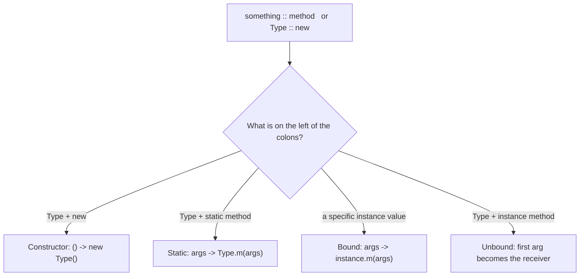

When a lambda does nothing but call an existing method, a **method reference** says the same thing more clearly. The `::` operator names a method without invoking it, and the compiler wires its parameters to a functional interface for you.

```java
list.forEach(s -> System.out.println(s));  // lambda
list.forEach(System.out::println);          // method reference — identical behavior
```

A method reference is **only** legal where a lambda would be: the target type must be a functional interface, and the referenced method's signature must be *compatible* with that interface's abstract method.

## The four kinds

There are exactly four forms, distinguished by **what is on the left of `::`** and whether the receiver is fixed or supplied as an argument.

| Kind | Syntax | Equivalent lambda | Example |
|------|--------|-------------------|---------|
| Static | `Type::staticMethod` | `(a, b) -> Type.staticMethod(a, b)` | `Integer::parseInt` |
| Bound instance | `instance::method` | `(args) -> instance.method(args)` | `System.out::println` |
| Unbound instance | `Type::instanceMethod` | `(obj, args) -> obj.instanceMethod(args)` | `String::toUpperCase` |
| Constructor | `Type::new` | `(args) -> new Type(args)` | `ArrayList::new` |

The kind is decided entirely by what sits to the **left** of `::`:



### 1. Static method reference

References a `static` method. Each lambda parameter becomes an argument to the method.

```java
Function<String, Integer> parse = Integer::parseInt;
// equals: s -> Integer.parseInt(s)
int n = parse.apply("42");
```

### 2. Bound instance reference

The receiver object is **already chosen** ("bound") and captured when the reference is created. The lambda parameters become the method's arguments.

```java
String prefix = "LOG: ";
Predicate<String> startsWithLog = prefix::startsWith;  // 'prefix' is the receiver
// equals: s -> prefix.startsWith(s)

Consumer<String> log = System.out::println;            // 'System.out' is the receiver
// equals: s -> System.out.println(s)
```

### 3. Unbound instance reference

Written as `Type::instanceMethod`, but there is **no fixed receiver**. Instead, the **first lambda parameter becomes the receiver**, and any remaining parameters become arguments. This is the form that trips people up.

```java
Function<String, String> upper = String::toUpperCase;
// equals: s -> s.toUpperCase()    -- 's' is the receiver, not an argument

BiFunction<String, String, Boolean> eq = String::equals;
// equals: (a, b) -> a.equals(b)   -- 'a' is the receiver, 'b' the argument

people.sort(Comparator.comparing(Person::name));   // p -> p.name()
```

### 4. Constructor reference

`Type::new` refers to a constructor; parameters select the overload by arity and type.

```java
Supplier<List<String>>        newList = ArrayList::new;     // () -> new ArrayList<>()
Function<Integer, List<String>> sized = ArrayList::new;     // n -> new ArrayList<>(n)
people.stream().map(Person::new);                            // name -> new Person(name)

IntFunction<int[]> makeArray = int[]::new;                   // n -> new int[n]
String[] arr = stream.toArray(String[]::new);                // array constructor reference
```

## Bound vs unbound: the key distinction

`str::length` and `String::length` look almost identical but are different kinds:

```java
String str = "hello";
Supplier<Integer>          bound   = str::length;    // () -> str.length()  → always 5
Function<String, Integer>  unbound = String::length; // s -> s.length()     → length of any String
```

The **bound** form captures `str` and takes no argument. The **unbound** form takes the string *as* its argument. The compiler picks the kind from the target functional interface's arity.

:::gotcha
When a class has both a static method and an instance method of the same name, `Type::method` can be ambiguous between the *static* and *unbound instance* forms, and the code won't compile. Rename or fall back to an explicit lambda to disambiguate.
:::

:::senior
Method references aren't always "cleaner." `Person::new` hides which constructor is chosen, and `this::handle` quietly captures `this` — extending the lifetime of the enclosing object, which can cause subtle leaks in listeners or callbacks. Prefer a reference when it reads as a noun ("the parse function"); prefer a lambda when the *transformation* is the point, e.g. `x -> x * 2`.
:::

## Check yourself

```quiz
title: Method references
questions:
  - q: '`String::length` is which kind of method reference?'
    options:
      - text: 'Unbound instance — the first parameter *becomes* the receiver: `s -> s.length()`'
        correct: true
      - 'Bound instance — the receiver is fixed'
      - 'Static'
    explain: 'Written `Type::instanceMethod`, it has no fixed receiver; the first argument is the object the method runs on. `str::length` for a specific instance would instead be the *bound* form, `() -> str.length()`.'
  - q: 'Assigned to a `Supplier<List<String>>`, what does `ArrayList::new` desugar to?'
    options:
      - text: '`() -> new ArrayList<>()`'
        correct: true
      - '`n -> new ArrayList<>(n)`'
      - '`list -> list.clone()`'
    explain: 'A constructor reference selects the overload by the target interface''s arity. A `Supplier` takes no arguments, so it maps to the no-arg constructor; a `Function<Integer, List>` would map to `n -> new ArrayList<>(n)`.'
  - q: 'When can `Type::method` fail to compile as a method reference?'
    options:
      - text: 'When the class has both a static and an instance method of that name — static vs unbound is ambiguous'
        correct: true
      - 'Whenever the method is `private`'
      - 'Whenever the method returns `void`'
    explain: 'If both a static `method(...)` and an instance `method(...)` fit, the compiler cannot choose between the static and unbound-instance interpretations. Disambiguate by writing an explicit lambda.'
```

:::key
Four kinds: **static** (`Type::m`), **bound** (`obj::m`, receiver fixed), **unbound** (`Type::m`, first arg becomes the receiver), and **constructor** (`Type::new`). Every method reference desugars to a lambda — when in doubt, write out the lambda and check the parameter mapping.
:::
