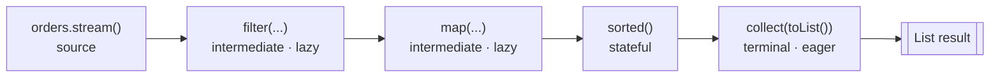

A **stream** is a sequence of elements supporting functional-style, pipelined operations. Critically, it is **not** a data structure — it stores nothing. It pulls elements from a *source*, runs them through a chain of operations, and produces a result. This lets you express *what* you want declaratively instead of writing imperative loops.

```java
int total = orders.stream()                  // source
    .filter(o -> o.status() == PAID)         // intermediate
    .mapToInt(Order::amount)                 // intermediate
    .sum();                                   // terminal
```

## Stream sources

You can build a stream from almost anything:

```java
list.stream();                          // any Collection
Arrays.stream(array);                   // an array
Stream.of("a", "b", "c");               // explicit values
IntStream.rangeClosed(1, 100);          // a numeric range
Stream.iterate(1, n -> n * 2);          // infinite: 1, 2, 4, 8, ...
Stream.generate(Math::random);          // infinite supplier
"a,b,c".chars();                        // IntStream of characters
Files.lines(path);                      // lines of a file (lazy I/O)
```

## Intermediate vs terminal operations

Every pipeline is **source → zero or more intermediate ops → exactly one terminal op**.

- **Intermediate operations** return a new `Stream` and are **lazy** — they only describe work. Examples: `map`, `filter`, `sorted`, `distinct`, `limit`, `skip`, `flatMap`, `peek`.
- **Terminal operations** produce a result or side effect and **trigger execution**. After a terminal op the stream is consumed and cannot be reused. Examples: `collect`, `forEach`, `reduce`, `count`, `anyMatch`, `findFirst`, `toArray`, `min`/`max`.



`flatMap` deserves special mention: it maps each element to a *stream* and flattens the results into one, perfect for nested structures.

```java
List<List<Integer>> nested = List.of(List.of(1, 2), List.of(3, 4));
List<Integer> flat = nested.stream()
    .flatMap(List::stream)               // Stream<List<Integer>> -> Stream<Integer>
    .toList();                            // [1, 2, 3, 4]
```

## Laziness: nothing happens until the terminal op

Intermediate operations build a plan but do **no work** until a terminal operation runs. With no terminal op, even side effects never fire:

```java
Stream.of("a", "b", "c")
      .peek(System.out::println);   // prints NOTHING — no terminal operation
```

Laziness also means elements are processed **one at a time, vertically** through the pipeline rather than one operation at a time across the whole collection. Each element flows `filter → map → collect` before the next begins — which is what makes short-circuiting possible.

## Short-circuiting

A short-circuiting operation can finish **without examining every element**, which is the only way to work with infinite streams.

- Short-circuiting **terminal** ops: `anyMatch`, `allMatch`, `noneMatch`, `findFirst`, `findAny`.
- Short-circuiting **intermediate** ops: `limit`, `takeWhile` (Java 9+).

```java
Optional<Integer> firstBig = Stream.iterate(1, n -> n + 1) // infinite!
    .map(n -> n * n)
    .filter(n -> n > 1000)
    .findFirst();                  // stops at 1024 — terminates fine
```

:::gotcha
`Stream.iterate(0, n -> n + 1).forEach(System.out::println)` never ends — `forEach` is **not** short-circuiting. Always pair an infinite source with `limit`, `takeWhile`, or a short-circuiting terminal op.
:::

## Stateless vs stateful operations

- **Stateless** ops (`map`, `filter`, `flatMap`, `peek`) process each element independently — no memory of what came before. They parallelize trivially.
- **Stateful** ops (`sorted`, `distinct`, `limit`, `skip`) may need to see other elements — even **buffer the entire stream** — before emitting. `sorted` must consume everything before it can emit the smallest element.

```java
stream.distinct()   // must remember every element seen so far
      .sorted()     // must buffer ALL elements before emitting any
      .limit(10);
```

:::senior
Stateful operations are where performance and correctness bite. `sorted()` on an **infinite** stream hangs forever (it can never finish buffering). In parallel pipelines, stateful ops force synchronization barriers and buffering that often erase the speedup. A good rule: keep pipelines stateless where you can, and place `limit`/`filter` *before* expensive `map`s so fewer elements reach them.
:::

## Check your understanding

```quiz
questions:
  - q: 'A pipeline has `filter` and `map` but no terminal operation. What runs?'
    options:
      - 'The whole pipeline runs eagerly'
      - text: 'Nothing — intermediate ops are lazy and do no work until a terminal op'
        correct: true
      - 'It fails to compile'
      - 'It throws `IllegalStateException`'
    explain: 'Intermediate ops only build a plan. Without a terminal op even a `peek` side effect never fires.'
  - q: 'Which operation can finish **without examining every element** (short-circuiting)?'
    options:
      - '`forEach`'
      - '`map`'
      - text: '`findFirst`'
        correct: true
      - '`sorted`'
    explain: 'Short-circuiting ops are `findFirst`, `findAny`, `anyMatch`, `allMatch`, `noneMatch` (terminal) and `limit`, `takeWhile` (intermediate). They make infinite streams usable. `forEach` is not one of them.'
  - q: 'Why does `sorted()` never terminate on an infinite stream?'
    options:
      - 'It is short-circuiting'
      - text: 'It is a stateful op that must buffer every element before it can emit any'
        correct: true
      - 'It is lazy'
      - 'It is stateless'
    explain: 'A stateful op like `sorted` cannot emit the smallest element until it has seen them all, so on an infinite source it buffers forever. Put `limit` before it.'
```

## Loop vs Stream, side by side

````tabs
tabs:
  - label: Imperative loop
    body: |
      An explicit accumulator, control flow, and mutation — you spell out *how*.
      ```java
      int total = 0;
      for (Order o : orders) {
          if (o.status() == PAID) {
              total += o.amount();
          }
      }
      ```
  - label: Stream pipeline
    body: |
      Declarative — you describe *what* you want. The steps fuse into a single pass,
      and you parallelize by swapping `stream()` for `parallelStream()`.
      ```java
      int total = orders.stream()
          .filter(o -> o.status() == PAID)
          .mapToInt(Order::amount)
          .sum();
      ```
````

:::key
A stream pipeline is **source → lazy intermediate ops → one eager terminal op**. Nothing runs until the terminal op; elements flow through one at a time, enabling **short-circuiting** (`limit`, `findFirst`, `anyMatch`). Distinguish **stateless** ops (`map`, `filter`) from **stateful** ones (`sorted`, `distinct`) — the latter may buffer everything and never terminate on infinite streams.
:::
