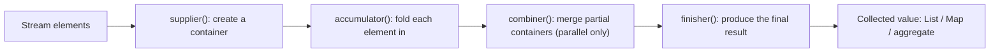

`collect` is the most powerful terminal operation: it performs a **mutable reduction**, folding stream elements into a container described by a `Collector`. The `Collectors` factory class supplies dozens of ready-made recipes.

Under the hood a `Collector` is four functions the pipeline applies in order — this is what every `collect` call does on your behalf:



## Into a collection

```java
List<String> list = stream.collect(Collectors.toList());   // implementation-unspecified List
Set<String>  set  = stream.collect(Collectors.toSet());
List<String> imm  = stream.collect(Collectors.toUnmodifiableList()); // Java 10+
```

:::tip
Since Java 16, `stream.toList()` is a shorter way to get an **unmodifiable** list directly on `Stream`, no `Collectors` needed. Note it differs from `Collectors.toList()`, whose result is mutable but of unspecified type.
:::

## Into a map (mind the merge function)

`toMap` needs a key mapper and a value mapper. If two elements map to the **same key**, the two-argument form throws `IllegalStateException` — supply a **merge function** as the third argument to resolve collisions.

```java
// duplicate keys -> IllegalStateException
Map<Character, Integer> bad = words.stream()
    .collect(Collectors.toMap(w -> w.charAt(0), String::length));

// merge function keeps the longer value
Map<Character, Integer> ok = words.stream()
    .collect(Collectors.toMap(w -> w.charAt(0), String::length, Integer::max));
```

A fourth argument lets you choose the map type, e.g. `TreeMap::new`.

## Joining strings

```java
String csv = names.stream().collect(Collectors.joining());            // "AdaBenCal"
String csv2 = names.stream().collect(Collectors.joining(", "));        // "Ada, Ben, Cal"
String csv3 = names.stream().collect(Collectors.joining(", ", "[", "]")); // "[Ada, Ben, Cal]"
```

## groupingBy with downstream collectors

`groupingBy` is a SQL `GROUP BY` for streams. Alone it produces `Map<K, List<T>>`; pass a **downstream collector** to aggregate each group into something else.

```java
// Map<Dept, List<Employee>>
var byDept = emps.stream().collect(Collectors.groupingBy(Employee::dept));

// Map<Dept, Long> — count per group
var countByDept = emps.stream()
    .collect(Collectors.groupingBy(Employee::dept, Collectors.counting()));

// Map<Dept, Double> — average salary per group
var avgByDept = emps.stream()
    .collect(Collectors.groupingBy(Employee::dept,
             Collectors.averagingDouble(Employee::salary)));

// Map<Dept, List<String>> — collect just names, via a mapping downstream
var namesByDept = emps.stream()
    .collect(Collectors.groupingBy(Employee::dept,
             Collectors.mapping(Employee::name, Collectors.toList())));

// nested grouping + a TreeMap factory (3-arg form)
var byDeptThenCity = emps.stream()
    .collect(Collectors.groupingBy(Employee::dept, TreeMap::new,
             Collectors.groupingBy(Employee::city)));
```

## partitioningBy

A specialization of grouping on a **boolean** predicate. It always returns a map with **both** `true` and `false` keys present (even if one is empty) — unlike `groupingBy`, which omits absent keys.

```java
Map<Boolean, List<Integer>> parts = IntStream.rangeClosed(1, 10).boxed()
    .collect(Collectors.partitioningBy(n -> n % 2 == 0));
// {false=[1,3,5,7,9], true=[2,4,6,8,10]}
```

## Numeric aggregates

| Collector | Result |
|-----------|--------|
| `counting()` | `Long` count |
| `summingInt(fn)` / `summingDouble` | sum |
| `averagingInt(fn)` / `averagingDouble` | `Double` average |
| `summarizingInt(fn)` | `IntSummaryStatistics` (count, sum, min, max, avg) |
| `minBy(cmp)` / `maxBy(cmp)` | `Optional<T>` |
| `reducing(...)` | general-purpose fold |

```java
IntSummaryStatistics stats = emps.stream()
    .collect(Collectors.summarizingInt(Employee::age));
System.out.println(stats.getAverage() + " " + stats.getMax());
```

## Collectors.teeing (Java 12+)

`teeing` runs **two** collectors over the same stream in a single pass, then merges their results — ideal for "I need an average *and* a count" without iterating twice.

```java
record Stats(double avg, long count) {}

Stats result = emps.stream().collect(Collectors.teeing(
    Collectors.averagingDouble(Employee::salary),   // collector 1
    Collectors.counting(),                           // collector 2
    Stats::new));                                    // merge the two results
```

:::senior
Composing collectors (`groupingBy` + `mapping` + `filtering` + `teeing`) lets you build report-shaped results in **one pass** over the data — far cheaper than several separate streams. `Collectors.filtering` (Java 9) is preferable to a `filter()` before `groupingBy` when you want empty groups preserved, because the upstream `filter` would drop the key entirely.
:::

:::gotcha
The `List` from `Collectors.toList()` has an **unspecified type and mutability** — never cast it to `ArrayList` or assume it's modifiable. If you need a guarantee, use `toCollection(ArrayList::new)` for mutable or `toUnmodifiableList()` / `Stream.toList()` for immutable.
:::

## Check yourself

```quiz
title: Collectors
questions:
  - q: 'Two stream elements map to the same key with `Collectors.toMap(keyFn, valFn)`. What happens?'
    options:
      - text: 'It throws `IllegalStateException` — supply a merge function to resolve collisions'
        correct: true
      - 'The second value silently overwrites the first'
      - 'Both values are kept in a list'
    explain: 'The two-argument `toMap` has no collision policy, so a duplicate key throws `IllegalStateException`. Pass a third merge-function argument, e.g. `(a, b) -> a` or `Integer::max`, to decide the winner.'
  - q: 'How does `partitioningBy(pred)` differ from `groupingBy` over a boolean?'
    options:
      - text: 'It always returns a map with **both** `true` and `false` keys, even when one group is empty'
        correct: true
      - 'It returns a `List`, not a `Map`'
      - 'It can only partition numbers'
    explain: '`partitioningBy` guarantees both boolean keys are present (an empty group maps to an empty list), whereas `groupingBy` omits any key that no element produced.'
  - q: 'What does `groupingBy(Employee::dept, counting())` produce?'
    options:
      - text: '`Map<Dept, Long>` — the count of employees per department'
        correct: true
      - '`Map<Dept, List<Employee>>`'
      - '`Map<Dept, Employee>`'
    explain: 'The downstream collector `counting()` aggregates each group instead of listing elements, turning `Map<Dept, List<Employee>>` into `Map<Dept, Long>`. Downstream collectors (`counting`, `mapping`, `averagingDouble`) are how you shape each group.'
```

:::key
`collect` does mutable reduction. Know `toList`/`toSet`/`toMap` (with a **merge function** for duplicate keys), `joining`, and especially `groupingBy` with **downstream collectors** (`counting`, `averagingDouble`, `mapping`). `partitioningBy` always yields both boolean keys; `teeing` runs two collectors in one pass.
:::
