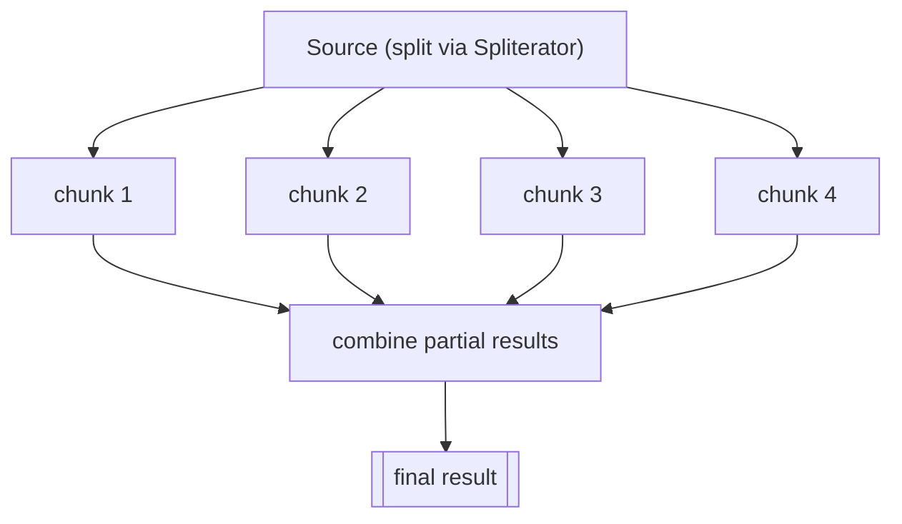

A parallel stream splits its source into chunks, processes them on multiple threads, and combines the partial results. Switching is a one-word change — but doing it *correctly and beneficially* is where the real knowledge lives.

```java
long count = orders.parallelStream()        // or: orders.stream().parallel()
    .filter(Order::isPaid)
    .count();
```

## Where the threads come from

By default, parallel streams run on the **common ForkJoinPool** (`ForkJoinPool.commonPool()`), a JVM-wide shared pool. Its parallelism is `Runtime.getRuntime().availableProcessors() - 1` (the calling thread also helps), so on an 8-core machine you get ~8 workers total. The framework recursively **splits** the source via a `Spliterator`, runs leaves in parallel, and **joins** results back up.



## When parallelism helps — and when it hurts

Parallelism has real overhead: splitting, thread hand-off, and merging. It pays off only when there's enough work to amortize that cost. A useful heuristic is **N × Q** — the number of elements (N) times the cost per element (Q) — should be large (think tens of thousands of element-operations).

| Helps | Hurts |
|-------|-------|
| Large N (10k+ elements) | Small collections |
| Expensive per-element work (Q high) | Trivial work (sum, identity) |
| Cheaply splittable sources: `ArrayList`, arrays, `IntStream.range` | Poorly splittable: `LinkedList`, `Stream.iterate`, `BufferedReader.lines` |
| CPU-bound, no shared state | Blocking I/O, shared mutable state, ordered output |

```java
// Good fit: many elements, real work per element, array-backed source
double[] data = ...;                 // millions of doubles
double sum = Arrays.stream(data).parallel()
    .map(Math::sqrt)                 // non-trivial Q
    .sum();
```

## Ordering

Most streams have an **encounter order**. Parallelism still respects it where it matters:

- `forEachOrdered` and `collect(toList())` preserve encounter order; plain `forEach` does **not** and may print in any order.
- `findFirst` must respect order (more constraining), while `findAny` is free to return any matched element — cheaper in parallel.
- Calling `unordered()` on a stream lets the framework drop the ordering constraint, which can speed up `distinct`, `limit`, and `skip`.

```java
list.parallelStream().forEach(System.out::println);        // arbitrary order
list.parallelStream().forEachOrdered(System.out::println); // encounter order, but serialized output
```

## Thread-safety requirements

Every lambda in a parallel pipeline runs on multiple threads simultaneously, so they must be:

- **Stateless** — no reliance on mutable external state that changes during execution.
- **Non-interfering** — must not modify the stream's source while it runs.
- **Associative** (for `reduce`) and side-effect-free.

```java
// BROKEN: ArrayList is not thread-safe — corrupted list or exceptions
List<Integer> out = new ArrayList<>();
nums.parallelStream().forEach(out::add);      // DATA RACE

// CORRECT: let collect handle the merge safely
List<Integer> safe = nums.parallelStream().collect(Collectors.toList());
```

:::gotcha
`reduce` requires an **associative** accumulator and an **identity** element. Subtraction isn't associative, so `reduce(0, (a, b) -> a - b)` gives different answers serially vs in parallel — a bug that hides until you flip `parallel()`. Likewise a non-identity seed (e.g. `reduce(10, Integer::sum)`) is added once *per chunk* in parallel, inflating the result.
:::

:::senior
Never run **blocking I/O** (HTTP, JDBC) on a parallel stream: it borrows the **common pool**, which is shared by the whole JVM (and by `CompletableFuture`). A few blocked tasks starve everything else. If you must, isolate the work by submitting the pipeline to a dedicated `ForkJoinPool`: `myPool.submit(() -> stream.parallel()...).get();`. Better still, use a proper async/executor framework for I/O, and reserve parallel streams for CPU-bound, in-memory number crunching. And always **measure** — naive `parallel()` frequently runs *slower* than sequential.
:::

:::key
`parallel()` farms work out to the shared **common ForkJoinPool** via splitting and joining. It helps only when **N × Q is large** and the source splits cheaply (arrays, `ArrayList`, ranges). Keep lambdas **stateless, non-interfering, and associative**, use `collect`/`forEachOrdered` instead of mutating shared state, never block on the common pool, and **benchmark** before trusting the speedup.
:::
