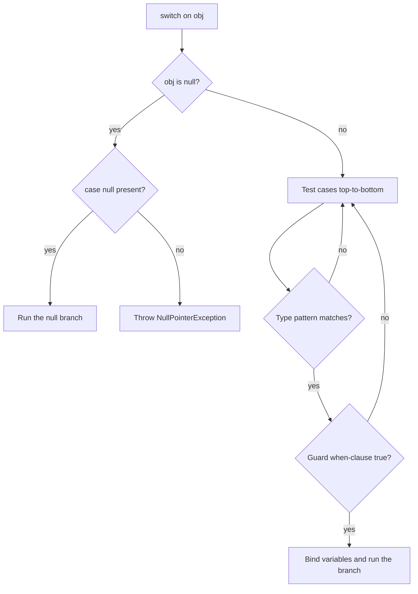

**Pattern matching** lets you test the *shape* of a value and bind its parts to variables in a single, type-safe step. It evolved across several releases — `instanceof` patterns (Java 16), then type, guarded, and record patterns in `switch` (Java 21) — and together they replace piles of `instanceof`-cast-assign boilerplate.

| Pattern | Example | Final since |
|---------|---------|-------------|
| Type pattern (`instanceof`) | `obj instanceof String s` | 16 |
| Type pattern in `switch` | `case String s ->` | 21 |
| Guarded pattern | `case Integer i when i > 0 ->` | 21 |
| Record pattern | `case Point(int x, int y) ->` | 21 |

## `instanceof` patterns

The pattern variable `s` is tested, cast, and bound at once:

```java
Object obj = fetch();

// Old: test, cast, assign
if (obj instanceof String) {
    String s = (String) obj;
    System.out.println(s.length());
}

// Pattern: one step
if (obj instanceof String s) {
    System.out.println(s.length()); // s is already a String
}
```

`s` is in scope exactly where the compiler can *prove* the test passed — this is **flow scoping**:

```java
if (obj instanceof String s && s.length() > 3) { ... } // s usable after &&
if (!(obj instanceof String s)) return;
System.out.println(s.length());   // s in scope: we only reach here on a match
```

## Type patterns in `switch`

A `switch` can match on type, and each `case` introduces its own pattern variable:

```java
static String format(Object obj) {
    return switch (obj) {
        case Integer i -> "int " + i;
        case Long l    -> "long " + l;
        case String s  -> "string of length " + s.length();
        case int[] arr -> arr.length + " ints";
        default        -> "unknown";
    };
}
```

## Guarded patterns with `when`

A `when` clause adds a boolean guard that further refines a case:

```java
static String classify(Object obj) {
    return switch (obj) {
        case Integer i when i < 0  -> "negative";
        case Integer i when i == 0 -> "zero";
        case Integer i             -> "positive";
        case String s when s.isBlank() -> "blank";
        case String s              -> "text: " + s;
        default                    -> "other";
    };
}
```

:::gotcha
Order matters. A guarded case must come **before** the broader one for the same type. Put `case Integer i ->` before `case Integer i when i < 0 ->` and the guarded case is **unreachable** — the compiler rejects it.
:::

## Record patterns (deconstruction)

A record pattern destructures a record into its components — and patterns **nest**:

```java
record Point(int x, int y) {}
record Line(Point start, Point end) {}

static String describe(Object obj) {
    return switch (obj) {
        case Point(int x, int y) -> "Point(%d, %d)".formatted(x, y);
        case Line(Point(var x1, var y1), Point(var x2, var y2)) ->
            "Line (%d,%d)->(%d,%d)".formatted(x1, y1, x2, y2);
        default -> "?";
    };
}
```

Use `var` to let the compiler infer a component's type. Record patterns work with `instanceof` too:

```java
if (obj instanceof Point(int x, int y)) {
    System.out.println(x + y);
}
```

## Null handling in switch

Historically a `switch` throws `NullPointerException` if the selector is `null`. A pattern switch can match it explicitly:

```java
static String test(String s) {
    return switch (s) {
        case null       -> "was null";
        case "hi"       -> "greeting";
        case String str -> "other: " + str;
    };
}
```

You can fold null into the default with `case null, default -> ...`.

:::gotcha
If you do **not** write `case null`, a null selector still throws `NullPointerException` — the backward-compatible behavior. A type pattern like `case String s` never matches `null`.
:::

Putting it together, a pattern `switch` dispatches like this — null first, then each case top-to-bottom, then its guard:



## Sealed types enable exhaustive switches

A `sealed` type enumerates all its permitted subtypes, so the compiler knows the complete set of possibilities:

```java
sealed interface Shape permits Circle, Square, Rectangle {}
record Circle(double radius)         implements Shape {}
record Square(double side)           implements Shape {}
record Rectangle(double w, double h) implements Shape {}

static double area(Shape shape) {
    return switch (shape) {            // no default needed
        case Circle(double r)              -> Math.PI * r * r;
        case Square(double s)              -> s * s;
        case Rectangle(double w, double h) -> w * h;
    };
}
```

Because the switch covers every permitted subtype, it is **exhaustive** and needs no `default`. Add a new `permits` type and forget to handle it, and the switch **fails to compile** — a bug caught at build time instead of in production.

:::senior
Sealed types + record patterns + exhaustive switch give Java algebraic-data-type-style modeling. This is the modern replacement for the Visitor pattern: instead of spreading behavior across `accept`/`visit` methods, you write one switch the compiler keeps honest. Deliberately **omit `default`** on a sealed switch so every new variant surfaces as a compile error.
:::

## Check yourself

```quiz
title: 'Pattern matching'
questions:
  - q: 'In `if (obj instanceof String s) { ... }`, what is `s` inside the block?'
    options:
      - text: 'A `String`, already cast and bound — in scope wherever the compiler can prove the test passed (flow scoping).'
        correct: true
      - 'Still an `Object`; you must cast it before use.'
      - 'A new, empty `String`.'
      - 'In scope everywhere in the method, even where the test fails.'
    explain: 'The type pattern tests, casts, and binds in one step. `s` is in scope exactly where the match is proven true.'
  - q: 'A pattern `switch` lists `case Integer i ->` *before* `case Integer i when i < 0 ->`. What happens?'
    options:
      - text: 'Compile error — the guarded case is unreachable because the broader case already matches every `Integer`.'
        correct: true
      - 'It compiles; the guarded case is tried first at runtime.'
      - 'A warning, but it compiles and runs.'
      - 'The guarded case silently shadows the broader one.'
    explain: 'A guarded case must come **before** the broader, unguarded case for the same type — otherwise it is unreachable and the compiler rejects it.'
  - q: 'Why does a `switch` over a `sealed` type need no `default`?'
    options:
      - text: 'The compiler knows every permitted subtype, so handling them all makes the switch exhaustive.'
        correct: true
      - 'Because a `switch` never requires a `default`.'
      - 'Because sealed types cannot be `null`.'
      - 'Because the JVM inserts a hidden default at runtime.'
    explain: 'A sealed type enumerates its permitted subtypes, so covering each one is exhaustive. Deliberately omitting `default` turns any new, unhandled subtype into a compile error.'
```

:::key
- `instanceof`/`switch` patterns test type **and** bind a variable in one step (flow scoping).
- `when` adds a guard; always order guarded cases before broader ones.
- Record patterns deconstruct (and nest); `var` infers component types.
- `case null` is the only way a switch matches `null` — otherwise it throws.
- A switch over a `sealed` type is exhaustive: no `default`, and new subtypes become compile errors.
:::
