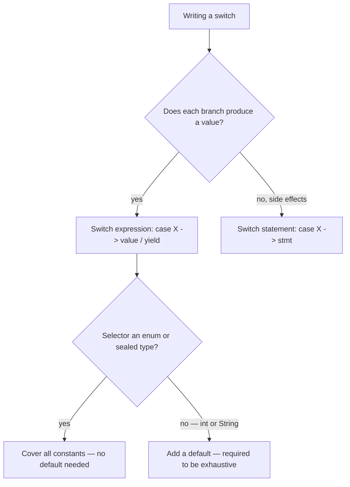

Before Java 14, `switch` was only a **statement**: it performed side effects, demanded `break` after every branch, and silently fell through when you forgot one. The **switch expression** (final in Java 14) turns `switch` into something that *produces a value*.

## Arrow labels

```java
enum Day { MON, TUE, WED, THU, FRI, SAT, SUN }

int letters = switch (day) {
    case MON, FRI, SUN -> 6;
    case TUE           -> 7;
    case THU, SAT      -> 8;
    case WED           -> 9;
};
```

Three things changed:

- The whole `switch (...) { ... }` **returns a value**, assigned to `letters`.
- Each `case ... ->` runs only its right-hand side — **no fall-through, no `break`**.
- Commas put **multiple labels** on a single branch.

## No fall-through

The arrow form eliminates a classic bug. The old colon form falls through unless you `break`:

```java
// Old statement — falls through, prints BOTH lines for MON
switch (day) {
    case MON:
        System.out.println("start of week");
        // forgot break!
    case TUE:
        System.out.println("tuesday");
        break;
}
```

With `->`, only the matching branch executes — that mistake becomes impossible.

## `yield` for blocks

When a branch needs more than one statement, use a block and `yield` its result:

```java
int score = switch (grade) {
    case 'A' -> 100;
    case 'B' -> 85;
    default  -> {
        log("unexpected grade " + grade);
        yield 0;
    }
};
```

`yield` is to a switch expression what `return` is to a method — it supplies the branch's value. The older colon syntax can yield too:

```java
int score = switch (grade) {
    case 'A': yield 100;
    default:  yield 0;
};
```

:::gotcha
Inside a switch **expression** you cannot `return`, `break`, or `continue` out of it — that's a compile error. Use `yield` to produce the value. A `return` in the block above would try to return from the entire enclosing method.
:::

## Statement vs expression

|  | Switch **statement** | Switch **expression** |
|--|----------------------|------------------------|
| Produces a value? | No | **Yes** |
| Typical use | Side effects | Assign / return a value |
| Fall-through | Yes (colon form) | No (arrow form) |
| Must be exhaustive? | No | **Yes** |
| Exit a branch | `break` | `yield` |

Arrow labels are also allowed in plain statements (you just don't yield a value):

```java
switch (status) {
    case ACTIVE   -> start();
    case INACTIVE -> stop();
}
```

The choice between the two forms — and whether you need a `default` — follows from two questions:



## Exhaustiveness

A switch **expression** must handle every possible input — the compiler enforces it. For an `enum`, covering **all constants** is enough; no `default` is required:

```java
String label = switch (day) {
    case MON, TUE, WED, THU, FRI -> "weekday";
    case SAT, SUN                -> "weekend";
};   // exhaustive — every Day constant is covered
```

For open-ended types like `int` or `String` you must add a `default`.

:::senior
Omitting `default` on an exhaustive enum switch is a feature, not laziness: add a new constant and the switch **fails to compile** until you handle it. (If the enum gains a constant but this class isn't recompiled, the hidden default the compiler inserted throws at runtime rather than silently choosing a wrong branch.) Combine switch expressions with `sealed` types and pattern matching for fully type-checked, total logic.
:::

:::tip
Reach for a switch *expression* whenever each branch's job is to compute one value. Assigning the whole `switch` to a variable — or returning it directly — is clearer and safer than mutating a variable inside a statement.
:::

## Check yourself

```quiz
title: Switch expressions
questions:
  - q: 'With arrow labels (`case X -> ...`), when does control fall through to the next case?'
    options:
      - text: 'Never — each arrow branch runs alone, no `break` needed'
        correct: true
      - 'Always, unless you add `break`'
      - 'Only for `String` selectors'
    explain: 'The arrow form eliminates fall-through entirely, killing the classic forgotten-`break` bug. Only the old colon form (`case X:`) falls through unless you `break`.'
  - q: 'Inside a block branch of a switch **expression**, how do you supply the branch''s value?'
    options:
      - text: '`yield value;`'
        correct: true
      - '`return value;`'
      - '`break value;`'
    explain: '`yield` is to a switch expression what `return` is to a method. A `return` inside would try to return from the *enclosing method* — a compile error in this context.'
  - q: 'Why does a switch **expression** over an `enum` covering every constant need no `default`?'
    options:
      - text: 'Covering all constants is already exhaustive; omitting `default` also turns a *new* constant into a compile error'
        correct: true
      - 'Switch expressions never require a default'
      - 'The JVM inserts a hidden default at runtime'
    explain: 'A switch expression must be exhaustive, and all enum constants covered = exhaustive. Deliberately leaving off `default` means adding a constant later fails to compile until you handle it — a safety feature, not laziness.'
```

:::key
- Arrow labels (`case X ->`) run one branch only — **no fall-through, no `break`**.
- Comma-separate multiple labels; use `yield` (not `return`) to emit a value from a block.
- A switch **expression** returns a value and must be **exhaustive**; a statement need not be.
- Covering all enum constants makes a switch exhaustive without a `default`.
:::
